```python
import pandas as pd
import numpy as np
import matplotlib.pyplot as plt
import seaborn as sns
import scipy.stats as stats
from sklearn.preprocessing import LabelEncoder
import os

# Set style for plots
plt.style.use('ggplot')
sns.set(font_scale=1.2)

# Create output directory for plots
os.makedirs('plots', exist_ok=True)

# Load the dataset
df = pd.read_csv('student_depression_dataset.csv')

# Basic info and statistical summary
print("Dataset Shape:", df.shape)
print("\nData Types:")
print(df.dtypes)

# Check for missing values
print("\nMissing Values:")
print(df.isnull().sum())

# Identify variable types
numeric_cols = df.select_dtypes(include=['int64', 'float64']).columns.tolist()
if 'id' in numeric_cols:
    numeric_cols.remove('id')  # Removing ID as per instructions
    
categorical_cols = df.select_dtypes(include=['object', 'category']).columns.tolist()

print("\nNumeric columns:", numeric_cols)
print("\nCategorical columns:", categorical_cols)

# Function to identify data type
def identify_variable_type(col):
    if df[col].dtype == 'object':
        unique_values = df[col].nunique()
        if unique_values == 2:
            return "Binary"
        elif unique_values <= 10:
            return "Nominal" if not all(df[col].dropna().astype(str).str.isnumeric()) else "Ordinal"
        else:
            return "Nominal"
    else:  # numeric
        unique_values = df[col].nunique()
        if unique_values == 2:
            return "Binary"
        elif unique_values <= 10:
            return "Ordinal" if col not in ['id'] else "ID"
        else:
            return "Numeric (Continuous)"

# Identify variable types
print("\nVariable Types:")
for col in df.columns:
    if col != 'id':  # Skip id column
        print(f"{col}: {identify_variable_type(col)}")

# Calculate statistics for numeric variables
def calculate_statistics(df, column):
    if column in df.columns and column != 'id':
        data = df[column].dropna()
        
        if pd.api.types.is_numeric_dtype(data):
            # Calculate statistics
            mean = data.mean()
            median = data.median()
            mode = data.mode()[0]
            midrange = (data.max() + data.min()) / 2
            q1 = data.quantile(0.25)
            q3 = data.quantile(0.75)
            min_val = data.min()
            max_val = data.max()
            
            print(f"\nStatistics for {column}:")
            print(f"Mean: {mean}")
            print(f"Median: {median}")
            print(f"Mode: {mode}")
            print(f"Midrange: {midrange}")
            print(f"Five Number Summary:")
            print(f"  Minimum: {min_val}")
            print(f"  Q1: {q1}")
            print(f"  Median: {median}")
            print(f"  Q3: {q3}")
            print(f"  Maximum: {max_val}")
            
            return {
                'mean': mean,
                'median': median,
                'mode': mode,
                'midrange': midrange,
                'min': min_val,
                'q1': q1,
                'q3': q3,
                'max': max_val
            }
        else:
            print(f"\n{column} is not numeric, skipping statistics.")
            return None
    else:
        print(f"\n{column} not found in dataset or is ID column.")
        return None

# Create the 10 required plots
def create_plots(df):
    # 1. Histogram for a numeric column
    plt.figure(figsize=(10, 6))
    numeric_col = numeric_cols[0] if numeric_cols else None
    if numeric_col:
        sns.histplot(df[numeric_col], kde=True)
        plt.title(f'Histogram of {numeric_col}')
        plt.xlabel(numeric_col)
        plt.ylabel('Frequency')
        plt.tight_layout()
        plt.savefig(f'plots/1_histogram_{numeric_col}.png')
        plt.close()
        print(f"1. Created histogram for {numeric_col}")
    
    # 2. Box Plot for numeric columns
    if len(numeric_cols) > 0:
        plt.figure(figsize=(12, 6))
        sns.boxplot(data=df[numeric_cols[:5]])  # Limit to first 5 numeric columns
        plt.title('Box Plot of Numeric Variables')
        plt.ylabel('Value')
        plt.tight_layout()
        plt.savefig('plots/2_boxplot.png')
        plt.close()
        print("2. Created box plot for numeric variables")
    
    # 3. QQ Plot for a numeric column
    if numeric_col:
        plt.figure(figsize=(8, 8))
        stats.probplot(df[numeric_col].dropna(), dist="norm", plot=plt)
        plt.title(f'Q-Q Plot of {numeric_col}')
        plt.tight_layout()
        plt.savefig(f'plots/3_qqplot_{numeric_col}.png')
        plt.close()
        print(f"3. Created QQ Plot for {numeric_col}")
    
    # 4. Correlation Heatmap for numeric columns
    if len(numeric_cols) > 1:
        plt.figure(figsize=(12, 10))
        corr = df[numeric_cols].corr()
        mask = np.triu(np.ones_like(corr, dtype=bool))
        sns.heatmap(corr, mask=mask, annot=True, cmap='coolwarm', linewidths=0.5)
        plt.title('Correlation Heatmap of Numeric Variables')
        plt.tight_layout()
        plt.savefig('plots/4_correlation_heatmap.png')
        plt.close()
        print("4. Created correlation heatmap")
    
    # 5. Scatter Plot between two numeric columns
    if len(numeric_cols) >= 2:
        plt.figure(figsize=(10, 6))
        sns.scatterplot(x=df[numeric_cols[0]], y=df[numeric_cols[1]])
        plt.title(f'Scatter Plot: {numeric_cols[0]} vs {numeric_cols[1]}')
        plt.xlabel(numeric_cols[0])
        plt.ylabel(numeric_cols[1])
        plt.tight_layout()
        plt.savefig(f'plots/5_scatterplot.png')
        plt.close()
        print(f"5. Created scatter plot between {numeric_cols[0]} and {numeric_cols[1]}")
    
    # 6. Bar Chart for a categorical column
    cat_col = categorical_cols[0] if categorical_cols else None
    if cat_col:
        plt.figure(figsize=(12, 6))
        counts = df[cat_col].value_counts().sort_values(ascending=False)
        sns.barplot(x=counts.index, y=counts.values)
        plt.title(f'Bar Chart of {cat_col}')
        plt.xlabel(cat_col)
        plt.ylabel('Count')
        plt.xticks(rotation=45)
        plt.tight_layout()
        plt.savefig(f'plots/6_barchart_{cat_col}.png')
        plt.close()
        print(f"6. Created bar chart for {cat_col}")
    
    # 7. Pie Chart for a categorical column
    if cat_col:
        plt.figure(figsize=(10, 10))
        df[cat_col].value_counts().plot.pie(autopct='%1.1f%%')
        plt.title(f'Pie Chart of {cat_col}')
        plt.ylabel('')
        plt.tight_layout()
        plt.savefig(f'plots/7_piechart_{cat_col}.png')
        plt.close()
        print(f"7. Created pie chart for {cat_col}")
    
    # 8. Violin Plot for a numeric column grouped by a categorical column
    if numeric_col and cat_col and df[cat_col].nunique() <= 10:
        plt.figure(figsize=(12, 6))
        sns.violinplot(x=cat_col, y=numeric_col, data=df)
        plt.title(f'Violin Plot of {numeric_col} by {cat_col}')
        plt.xlabel(cat_col)
        plt.ylabel(numeric_col)
        plt.xticks(rotation=45)
        plt.tight_layout()
        plt.savefig(f'plots/8_violinplot.png')
        plt.close()
        print(f"8. Created violin plot for {numeric_col} by {cat_col}")
    
    # 9. Quantile Plot (Empirical CDF)
    if numeric_col:
        plt.figure(figsize=(10, 6))
        sorted_data = np.sort(df[numeric_col].dropna())
        y = np.arange(1, len(sorted_data) + 1) / len(sorted_data)
        plt.plot(sorted_data, y, marker='.', linestyle='none')
        plt.title(f'Quantile Plot (Empirical CDF) of {numeric_col}')
        plt.xlabel(numeric_col)
        plt.ylabel('Cumulative Probability')
        plt.grid(True)
        plt.tight_layout()
        plt.savefig(f'plots/9_quantile_plot_{numeric_col}.png')
        plt.close()
        print(f"9. Created quantile plot for {numeric_col}")
    
    # 10. Pair Plot for multiple numeric columns
    if len(numeric_cols) >= 3:
        plt.figure(figsize=(16, 12))
        sns.pairplot(df[numeric_cols[:4]], height=2.5)  # Limit to first 4 columns
        plt.suptitle('Pair Plot of Numeric Variables', y=1.02)
        plt.tight_layout()
        plt.savefig('plots/10_pairplot.png')
        plt.close()
        print("10. Created pair plot for numeric variables")

# Calculate statistics for all numeric columns
for col in numeric_cols:
    calculate_statistics(df, col)

# Generate the plots
create_plots(df)

print("\nAnalysis complete. All plots have been saved to the 'plots' directory.") 
```

    Dataset Shape: (27901, 18)
    
    Data Types:
    id                                         int64
    Gender                                    object
    Age                                      float64
    City                                      object
    Profession                                object
    Academic Pressure                        float64
    Work Pressure                            float64
    CGPA                                     float64
    Study Satisfaction                       float64
    Job Satisfaction                         float64
    Sleep Duration                            object
    Dietary Habits                            object
    Degree                                    object
    Have you ever had suicidal thoughts ?     object
    Work/Study Hours                         float64
    Financial Stress                          object
    Family History of Mental Illness          object
    Depression                                 int64
    dtype: object
    
    Missing Values:
    id                                       0
    Gender                                   0
    Age                                      0
    City                                     0
    Profession                               0
    Academic Pressure                        0
    Work Pressure                            0
    CGPA                                     0
    Study Satisfaction                       0
    Job Satisfaction                         0
    Sleep Duration                           0
    Dietary Habits                           0
    Degree                                   0
    Have you ever had suicidal thoughts ?    0
    Work/Study Hours                         0
    Financial Stress                         0
    Family History of Mental Illness         0
    Depression                               0
    dtype: int64
    
    Numeric columns: ['Age', 'Academic Pressure', 'Work Pressure', 'CGPA', 'Study Satisfaction', 'Job Satisfaction', 'Work/Study Hours', 'Depression']
    
    Categorical columns: ['Gender', 'City', 'Profession', 'Sleep Duration', 'Dietary Habits', 'Degree', 'Have you ever had suicidal thoughts ?', 'Financial Stress', 'Family History of Mental Illness']
    
    Variable Types:
    Gender: Binary
    Age: Numeric (Continuous)
    City: Nominal
    Profession: Nominal
    Academic Pressure: Ordinal
    Work Pressure: Ordinal
    CGPA: Numeric (Continuous)
    Study Satisfaction: Ordinal
    Job Satisfaction: Ordinal
    Sleep Duration: Nominal
    Dietary Habits: Nominal
    Degree: Nominal
    Have you ever had suicidal thoughts ?: Binary
    Work/Study Hours: Numeric (Continuous)
    Financial Stress: Nominal
    Family History of Mental Illness: Binary
    Depression: Binary
    
    Statistics for Age:
    Mean: 25.82230027597577
    Median: 25.0
    Mode: 24.0
    Midrange: 38.5
    Five Number Summary:
      Minimum: 18.0
      Q1: 21.0
      Median: 25.0
      Q3: 30.0
      Maximum: 59.0
    
    Statistics for Academic Pressure:
    Mean: 3.1412135765743163
    Median: 3.0
    Mode: 3.0
    Midrange: 2.5
    Five Number Summary:
      Minimum: 0.0
      Q1: 2.0
      Median: 3.0
      Q3: 4.0
      Maximum: 5.0
    
    Statistics for Work Pressure:
    Mean: 0.00043009211139385684
    Median: 0.0
    Mode: 0.0
    Midrange: 2.5
    Five Number Summary:
      Minimum: 0.0
      Q1: 0.0
      Median: 0.0
      Q3: 0.0
      Maximum: 5.0
    
    Statistics for CGPA:
    Mean: 7.65610417189348
    Median: 7.77
    Mode: 8.04
    Midrange: 5.0
    Five Number Summary:
      Minimum: 0.0
      Q1: 6.29
      Median: 7.77
      Q3: 8.92
      Maximum: 10.0
    
    Statistics for Study Satisfaction:
    Mean: 2.943837138453819
    Median: 3.0
    Mode: 4.0
    Midrange: 2.5
    Five Number Summary:
      Minimum: 0.0
      Q1: 2.0
      Median: 3.0
      Q3: 4.0
      Maximum: 5.0
    
    Statistics for Job Satisfaction:
    Mean: 0.0006809791763736067
    Median: 0.0
    Mode: 0.0
    Midrange: 2.0
    Five Number Summary:
      Minimum: 0.0
      Q1: 0.0
      Median: 0.0
      Q3: 0.0
      Maximum: 4.0
    
    Statistics for Work/Study Hours:
    Mean: 7.156983620658758
    Median: 8.0
    Mode: 10.0
    Midrange: 6.0
    Five Number Summary:
      Minimum: 0.0
      Q1: 4.0
      Median: 8.0
      Q3: 10.0
      Maximum: 12.0
    
    Statistics for Depression:
    Mean: 0.5854987276441704
    Median: 1.0
    Mode: 1
    Midrange: 0.5
    Five Number Summary:
      Minimum: 0
      Q1: 0.0
      Median: 1.0
      Q3: 1.0
      Maximum: 1
    1. Created histogram for Age
    

    C:\Users\asus\AppData\Local\Packages\PythonSoftwareFoundation.Python.3.13_qbz5n2kfra8p0\LocalCache\local-packages\Python313\site-packages\seaborn\_base.py:949: FutureWarning: When grouping with a length-1 list-like, you will need to pass a length-1 tuple to get_group in a future version of pandas. Pass `(name,)` instead of `name` to silence this warning.
      data_subset = grouped_data.get_group(pd_key)
    C:\Users\asus\AppData\Local\Packages\PythonSoftwareFoundation.Python.3.13_qbz5n2kfra8p0\LocalCache\local-packages\Python313\site-packages\seaborn\categorical.py:640: FutureWarning: SeriesGroupBy.grouper is deprecated and will be removed in a future version of pandas.
      positions = grouped.grouper.result_index.to_numpy(dtype=float)
    C:\Users\asus\AppData\Local\Packages\PythonSoftwareFoundation.Python.3.13_qbz5n2kfra8p0\LocalCache\local-packages\Python313\site-packages\seaborn\_base.py:949: FutureWarning: When grouping with a length-1 list-like, you will need to pass a length-1 tuple to get_group in a future version of pandas. Pass `(name,)` instead of `name` to silence this warning.
      data_subset = grouped_data.get_group(pd_key)
    C:\Users\asus\AppData\Local\Packages\PythonSoftwareFoundation.Python.3.13_qbz5n2kfra8p0\LocalCache\local-packages\Python313\site-packages\seaborn\categorical.py:640: FutureWarning: SeriesGroupBy.grouper is deprecated and will be removed in a future version of pandas.
      positions = grouped.grouper.result_index.to_numpy(dtype=float)
    C:\Users\asus\AppData\Local\Packages\PythonSoftwareFoundation.Python.3.13_qbz5n2kfra8p0\LocalCache\local-packages\Python313\site-packages\seaborn\_base.py:949: FutureWarning: When grouping with a length-1 list-like, you will need to pass a length-1 tuple to get_group in a future version of pandas. Pass `(name,)` instead of `name` to silence this warning.
      data_subset = grouped_data.get_group(pd_key)
    C:\Users\asus\AppData\Local\Packages\PythonSoftwareFoundation.Python.3.13_qbz5n2kfra8p0\LocalCache\local-packages\Python313\site-packages\seaborn\categorical.py:640: FutureWarning: SeriesGroupBy.grouper is deprecated and will be removed in a future version of pandas.
      positions = grouped.grouper.result_index.to_numpy(dtype=float)
    C:\Users\asus\AppData\Local\Packages\PythonSoftwareFoundation.Python.3.13_qbz5n2kfra8p0\LocalCache\local-packages\Python313\site-packages\seaborn\_base.py:949: FutureWarning: When grouping with a length-1 list-like, you will need to pass a length-1 tuple to get_group in a future version of pandas. Pass `(name,)` instead of `name` to silence this warning.
      data_subset = grouped_data.get_group(pd_key)
    C:\Users\asus\AppData\Local\Packages\PythonSoftwareFoundation.Python.3.13_qbz5n2kfra8p0\LocalCache\local-packages\Python313\site-packages\seaborn\categorical.py:640: FutureWarning: SeriesGroupBy.grouper is deprecated and will be removed in a future version of pandas.
      positions = grouped.grouper.result_index.to_numpy(dtype=float)
    C:\Users\asus\AppData\Local\Packages\PythonSoftwareFoundation.Python.3.13_qbz5n2kfra8p0\LocalCache\local-packages\Python313\site-packages\seaborn\_base.py:949: FutureWarning: When grouping with a length-1 list-like, you will need to pass a length-1 tuple to get_group in a future version of pandas. Pass `(name,)` instead of `name` to silence this warning.
      data_subset = grouped_data.get_group(pd_key)
    C:\Users\asus\AppData\Local\Packages\PythonSoftwareFoundation.Python.3.13_qbz5n2kfra8p0\LocalCache\local-packages\Python313\site-packages\seaborn\categorical.py:640: FutureWarning: SeriesGroupBy.grouper is deprecated and will be removed in a future version of pandas.
      positions = grouped.grouper.result_index.to_numpy(dtype=float)
    

    2. Created box plot for numeric variables
    3. Created QQ Plot for Age
    4. Created correlation heatmap
    5. Created scatter plot between Age and Academic Pressure
    6. Created bar chart for Gender
    7. Created pie chart for Gender
    

    C:\Users\asus\AppData\Local\Packages\PythonSoftwareFoundation.Python.3.13_qbz5n2kfra8p0\LocalCache\local-packages\Python313\site-packages\seaborn\_base.py:949: FutureWarning: When grouping with a length-1 list-like, you will need to pass a length-1 tuple to get_group in a future version of pandas. Pass `(name,)` instead of `name` to silence this warning.
      data_subset = grouped_data.get_group(pd_key)
    C:\Users\asus\AppData\Local\Packages\PythonSoftwareFoundation.Python.3.13_qbz5n2kfra8p0\LocalCache\local-packages\Python313\site-packages\seaborn\_base.py:949: FutureWarning: When grouping with a length-1 list-like, you will need to pass a length-1 tuple to get_group in a future version of pandas. Pass `(name,)` instead of `name` to silence this warning.
      data_subset = grouped_data.get_group(pd_key)
    

    8. Created violin plot for Age by Gender
    9. Created quantile plot for Age
    10. Created pair plot for numeric variables
    
    Analysis complete. All plots have been saved to the 'plots' directory.
    


    <Figure size 1600x1200 with 0 Axes>


# تحلیل داده‌های افسردگی دانشجویان
## گزارش تحلیل آماری و نمودارهای دیداری

### مقدمه
این گزارش، نتایج تحلیل مجموعه داده مربوط به افسردگی دانشجویان را ارائه می‌دهد. داده‌های مورد بررسی شامل ۲۷،۹۰۱ رکورد با ۱۸ متغیر است که عوامل مختلف مرتبط با سلامت روان و افسردگی دانشجویان را نشان می‌دهد.

### کد آماده‌سازی محیط و بارگذاری داده‌ها

```python
import pandas as pd
import numpy as np
import matplotlib.pyplot as plt
import seaborn as sns
import scipy.stats as stats
from sklearn.preprocessing import LabelEncoder
import os

# تنظیم استایل برای نمودارها
plt.style.use('ggplot')
sns.set(font_scale=1.2)

# ایجاد پوشه برای ذخیره نمودارها
os.makedirs('plots', exist_ok=True)

# بارگذاری مجموعه داده
df = pd.read_csv('student_depression_dataset.csv')

# اطلاعات پایه و خلاصه آماری
print("Dataset Shape:", df.shape)
print("\nData Types:")
print(df.dtypes)

# بررسی مقادیر گمشده
print("\nMissing Values:")
print(df.isnull().sum())
```

این کد کتابخانه‌های مورد نیاز را وارد می‌کند و پوشه‌ای برای ذخیره نمودارها ایجاد می‌کند. سپس مجموعه داده را بارگذاری کرده و اطلاعات اولیه مانند ابعاد، انواع داده‌ها، و مقادیر گمشده را نمایش می‌دهد.

### شناسایی نوع متغیرها

```python
# شناسایی متغیرهای عددی و کیفی
numeric_cols = df.select_dtypes(include=['int64', 'float64']).columns.tolist()
if 'id' in numeric_cols:
    numeric_cols.remove('id')  # حذف شناسه طبق دستورالعمل
    
categorical_cols = df.select_dtypes(include=['object', 'category']).columns.tolist()

print("\nNumeric columns:", numeric_cols)
print("\nCategorical columns:", categorical_cols)

# تابع تشخیص نوع متغیر
def identify_variable_type(col):
    if df[col].dtype == 'object':
        unique_values = df[col].nunique()
        if unique_values == 2:
            return "Binary"
        elif unique_values <= 10:
            return "Nominal" if not all(df[col].dropna().astype(str).str.isnumeric()) else "Ordinal"
        else:
            return "Nominal"
    else:  # numeric
        unique_values = df[col].nunique()
        if unique_values == 2:
            return "Binary"
        elif unique_values <= 10:
            return "Ordinal" if col not in ['id'] else "ID"
        else:
            return "Numeric (Continuous)"

# شناسایی نوع متغیرها
print("\nVariable Types:")
for col in df.columns:
    if col != 'id':  # حذف ستون شناسه
        print(f"{col}: {identify_variable_type(col)}")
```

این بخش از کد به تفکیک متغیرها به دو گروه عددی و کیفی می‌پردازد. تابع `identify_variable_type` برای تشخیص نوع دقیق‌تر متغیرها (باینری، اسمی، ترتیبی یا پیوسته) استفاده می‌شود. برای هر ستون غیر از `id`، نوع آن تعیین و نمایش داده می‌شود.

### ساختار داده‌ها
مجموعه داده شامل انواع مختلفی از متغیرها است:

#### متغیرهای دودویی (باینری)
- آیا تا به حال افکار خودکشی داشته‌اید؟
- سابقه خانوادگی بیماری روانی
- افسردگی (متغیر هدف)

#### متغیرهای عددی پیوسته
- سن
- فشار تحصیلی
- فشار کاری
- معدل
- رضایت از تحصیل
- رضایت شغلی
- ساعات کار/مطالعه

#### متغیرهای اسمی
- جنسیت
- شهر
- حرفه
- مدت زمان خواب
- عادات غذایی
- مدرک تحصیلی
- استرس مالی

#### متغیرهای ترتیبی
- فشار تحصیلی (مقیاس ۰ تا ۵)
- فشار کاری (مقیاس ۰ تا ۵)
- رضایت از تحصیل (مقیاس ۰ تا ۵)
- رضایت شغلی (مقیاس ۰ تا ۴)

### محاسبه آمار توصیفی

```python
# محاسبه آمار توصیفی برای متغیرهای عددی
def calculate_statistics(df, column):
    if column in df.columns and column != 'id':
        data = df[column].dropna()
        
        if pd.api.types.is_numeric_dtype(data):
            # محاسبه آماره‌ها
            mean = data.mean()
            median = data.median()
            mode = data.mode()[0]
            midrange = (data.max() + data.min()) / 2
            q1 = data.quantile(0.25)
            q3 = data.quantile(0.75)
            min_val = data.min()
            max_val = data.max()
            
            print(f"\nStatistics for {column}:")
            print(f"Mean: {mean}")
            print(f"Median: {median}")
            print(f"Mode: {mode}")
            print(f"Midrange: {midrange}")
            print(f"Five Number Summary:")
            print(f"  Minimum: {min_val}")
            print(f"  Q1: {q1}")
            print(f"  Median: {median}")
            print(f"  Q3: {q3}")
            print(f"  Maximum: {max_val}")
            
            return {
                'mean': mean,
                'median': median,
                'mode': mode,
                'midrange': midrange,
                'min': min_val,
                'q1': q1,
                'q3': q3,
                'max': max_val
            }
        else:
            print(f"\n{column} is not numeric, skipping statistics.")
            return None
    else:
        print(f"\n{column} not found in dataset or is ID column.")
        return None

# محاسبه آمار توصیفی برای تمام متغیرهای عددی
for col in numeric_cols:
    calculate_statistics(df, col)
```

این تابع آمار توصیفی مهم برای متغیرهای عددی را محاسبه می‌کند، شامل:
- میانگین (mean): مجموع مقادیر تقسیم بر تعداد آنها
- میانه (median): مقدار وسط داده‌های مرتب شده
- مد (mode): مقداری که بیشترین فراوانی را دارد
- میان‌دامنه (midrange): میانگین کمترین و بیشترین مقدار
- خلاصه پنج عددی: کمینه، چارک اول، میانه، چارک سوم، بیشینه

این آماره‌ها برای درک توزیع داده‌ها و شناسایی الگوهای آنها ضروری است.

### آمار توصیفی متغیرهای کلیدی

#### سن
- میانگین: ۲۵.۸۲
- میانه: ۲۵.۰
- مد: ۲۴.۰
- میان‌دامنه: ۳۸.۵
- خلاصه پنج عددی:
  - کمینه: ۱۸.۰
  - چارک اول: ۲۱.۰
  - میانه: ۲۵.۰
  - چارک سوم: ۳۰.۰
  - بیشینه: ۵۹.۰

#### فشار تحصیلی
- میانگین: ۳.۱۴
- میانه: ۳.۰
- مد: ۳.۰
- میان‌دامنه: ۲.۵
- خلاصه پنج عددی:
  - کمینه: ۰.۰
  - چارک اول: ۲.۰
  - میانه: ۳.۰
  - چارک سوم: ۴.۰
  - بیشینه: ۵.۰

#### معدل
- میانگین: ۷.۶۶
- میانه: ۷.۷۷
- مد: ۸.۰۴
- میان‌دامنه: ۵.۰
- خلاصه پنج عددی:
  - کمینه: ۰.۰
  - چارک اول: ۶.۲۹
  - میانه: ۷.۷۷
  - چارک سوم: ۸.۹۲
  - بیشینه: ۱۰.۰

#### ساعات کار/مطالعه
- میانگین: ۷.۱۶
- میانه: ۸.۰
- مد: ۱۰.۰
- میان‌دامنه: ۶.۰
- خلاصه پنج عددی:
  - کمینه: ۰.۰
  - چارک اول: ۴.۰
  - میانه: ۸.۰
  - چارک سوم: ۱۰.۰
  - بیشینه: ۱۲.۰

#### افسردگی
- میانگین: ۰.۵۹
- میانه: ۱.۰
- مد: ۱
- میان‌دامنه: ۰.۵
- خلاصه پنج عددی:
  - کمینه: ۰
  - چارک اول: ۰.۰
  - میانه: ۱.۰
  - چارک سوم: ۱.۰
  - بیشینه: ۱

### ایجاد ۱۰ نوع نمودار مختلف

```python
def create_plots(df):
    # 1. هیستوگرام برای یک متغیر عددی
    plt.figure(figsize=(10, 6))
    numeric_col = numeric_cols[0] if numeric_cols else None
    if numeric_col:
        sns.histplot(df[numeric_col], kde=True)
        plt.title(f'Histogram of {numeric_col}')
        plt.xlabel(numeric_col)
        plt.ylabel('Frequency')
        plt.tight_layout()
        plt.savefig(f'plots/1_histogram_{numeric_col}.png')
        plt.close()
        print(f"1. Created histogram for {numeric_col}")
    
    # 2. نمودار جعبه‌ای برای متغیرهای عددی
    if len(numeric_cols) > 0:
        plt.figure(figsize=(12, 6))
        sns.boxplot(data=df[numeric_cols[:5]])  # محدود به ۵ ستون اول عددی
        plt.title('Box Plot of Numeric Variables')
        plt.ylabel('Value')
        plt.tight_layout()
        plt.savefig('plots/2_boxplot.png')
        plt.close()
        print("2. Created box plot for numeric variables")
    
    # 3. نمودار QQ-Plot برای یک متغیر عددی
    if numeric_col:
        plt.figure(figsize=(8, 8))
        stats.probplot(df[numeric_col].dropna(), dist="norm", plot=plt)
        plt.title(f'Q-Q Plot of {numeric_col}')
        plt.tight_layout()
        plt.savefig(f'plots/3_qqplot_{numeric_col}.png')
        plt.close()
        print(f"3. Created QQ Plot for {numeric_col}")
    
    # 4. نمودار همبستگی برای متغیرهای عددی
    if len(numeric_cols) > 1:
        plt.figure(figsize=(12, 10))
        corr = df[numeric_cols].corr()
        mask = np.triu(np.ones_like(corr, dtype=bool))
        sns.heatmap(corr, mask=mask, annot=True, cmap='coolwarm', linewidths=0.5)
        plt.title('Correlation Heatmap of Numeric Variables')
        plt.tight_layout()
        plt.savefig('plots/4_correlation_heatmap.png')
        plt.close()
        print("4. Created correlation heatmap")
    
    # 5. نمودار پراکندگی بین دو متغیر عددی
    if len(numeric_cols) >= 2:
        plt.figure(figsize=(10, 6))
        sns.scatterplot(x=df[numeric_cols[0]], y=df[numeric_cols[1]])
        plt.title(f'Scatter Plot: {numeric_cols[0]} vs {numeric_cols[1]}')
        plt.xlabel(numeric_cols[0])
        plt.ylabel(numeric_cols[1])
        plt.tight_layout()
        plt.savefig(f'plots/5_scatterplot.png')
        plt.close()
        print(f"5. Created scatter plot between {numeric_cols[0]} and {numeric_cols[1]}")
    
    # 6. نمودار میله‌ای برای یک متغیر کیفی
    cat_col = categorical_cols[0] if categorical_cols else None
    if cat_col:
        plt.figure(figsize=(12, 6))
        counts = df[cat_col].value_counts().sort_values(ascending=False)
        sns.barplot(x=counts.index, y=counts.values)
        plt.title(f'Bar Chart of {cat_col}')
        plt.xlabel(cat_col)
        plt.ylabel('Count')
        plt.xticks(rotation=45)
        plt.tight_layout()
        plt.savefig(f'plots/6_barchart_{cat_col}.png')
        plt.close()
        print(f"6. Created bar chart for {cat_col}")
    
    # 7. نمودار دایره‌ای برای یک متغیر کیفی
    if cat_col:
        plt.figure(figsize=(10, 10))
        df[cat_col].value_counts().plot.pie(autopct='%1.1f%%')
        plt.title(f'Pie Chart of {cat_col}')
        plt.ylabel('')
        plt.tight_layout()
        plt.savefig(f'plots/7_piechart_{cat_col}.png')
        plt.close()
        print(f"7. Created pie chart for {cat_col}")
    
    # 8. نمودار ویولن برای یک متغیر عددی گروه‌بندی شده توسط یک متغیر کیفی
    if numeric_col and cat_col and df[cat_col].nunique() <= 10:
        plt.figure(figsize=(12, 6))
        sns.violinplot(x=cat_col, y=numeric_col, data=df)
        plt.title(f'Violin Plot of {numeric_col} by {cat_col}')
        plt.xlabel(cat_col)
        plt.ylabel(numeric_col)
        plt.xticks(rotation=45)
        plt.tight_layout()
        plt.savefig(f'plots/8_violinplot.png')
        plt.close()
        print(f"8. Created violin plot for {numeric_col} by {cat_col}")
    
    # 9. نمودار چندک (ECDF) برای یک متغیر عددی
    if numeric_col:
        plt.figure(figsize=(10, 6))
        sorted_data = np.sort(df[numeric_col].dropna())
        y = np.arange(1, len(sorted_data) + 1) / len(sorted_data)
        plt.plot(sorted_data, y, marker='.', linestyle='none')
        plt.title(f'Quantile Plot (Empirical CDF) of {numeric_col}')
        plt.xlabel(numeric_col)
        plt.ylabel('Cumulative Probability')
        plt.grid(True)
        plt.tight_layout()
        plt.savefig(f'plots/9_quantile_plot_{numeric_col}.png')
        plt.close()
        print(f"9. Created quantile plot for {numeric_col}")
    
    # 10. نمودار جفتی برای چندین متغیر عددی
    if len(numeric_cols) >= 3:
        plt.figure(figsize=(16, 12))
        sns.pairplot(df[numeric_cols[:4]], height=2.5)  # محدود به ۴ ستون اول
        plt.suptitle('Pair Plot of Numeric Variables', y=1.02)
        plt.tight_layout()
        plt.savefig('plots/10_pairplot.png')
        plt.close()
        print("10. Created pair plot for numeric variables")

# ایجاد نمودارها
create_plots(df)
```

این تابع بزرگ ۱۰ نوع مختلف نمودار را ایجاد می‌کند. هر نمودار هدف خاصی دارد:

1. **هیستوگرام**: توزیع فراوانی یک متغیر عددی را نشان می‌دهد
2. **نمودار جعبه‌ای**: پنج آماره اصلی (کمینه، Q1، میانه، Q3، بیشینه) و مقادیر پرت را نمایش می‌دهد
3. **QQ-Plot**: مقایسه توزیع یک متغیر با توزیع نرمال
4. **نمودار همبستگی**: نمایش همبستگی بین متغیرهای عددی مختلف
5. **نمودار پراکندگی**: رابطه بین دو متغیر عددی را نشان می‌دهد
6. **نمودار میله‌ای**: فراوانی مقادیر مختلف یک متغیر کیفی
7. **نمودار دایره‌ای**: نسبت مقادیر یک متغیر کیفی را نشان می‌دهد
8. **نمودار ویولن**: توزیع یک متغیر عددی را برای سطوح مختلف یک متغیر کیفی نشان می‌دهد
9. **نمودار چندک**: تابع توزیع تجمعی تجربی را نمایش می‌دهد
10. **نمودار جفتی**: روابط دو به دوی چند متغیر عددی را نشان می‌دهد

هر یک از این نمودارها در پوشه `plots` ذخیره می‌شوند و می‌توانند برای تحلیل‌های بعدی مورد استفاده قرار گیرند.

### تحلیل نمودارها

#### ۱. هیستوگرام سن


این نمودار توزیع فراوانی سن دانشجویان را نشان می‌دهد. بیشترین فراوانی مربوط به سنین ۲۴-۲۵ سال است. توزیع سن کمی چوله به راست است، یعنی تعداد کمتری از دانشجویان در سنین بالاتر قرار دارند.

#### ۲. نمودار جعبه‌ای متغیرهای عددی
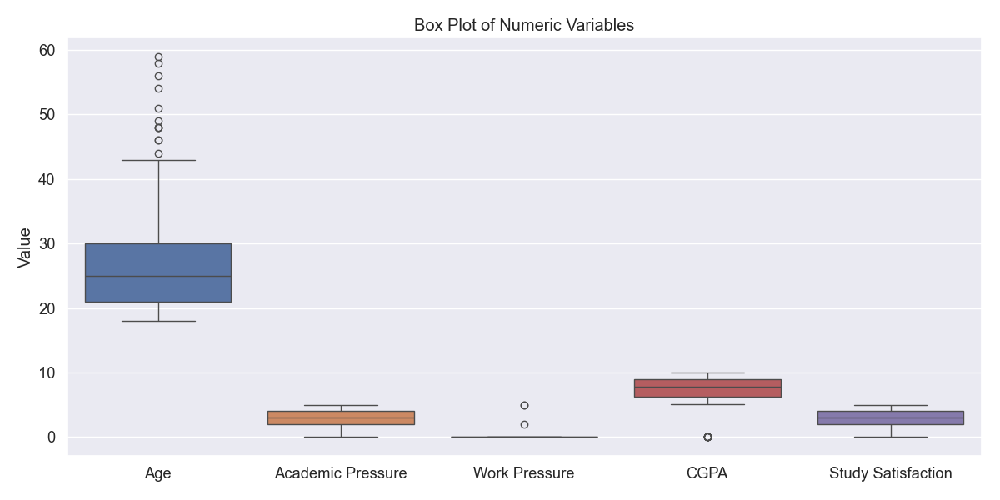

این نمودار توزیع متغیرهای عددی اصلی را نشان می‌دهد. می‌توان مشاهده کرد:
- سن: توزیع نسبتاً متقارن با برخی مقادیر پرت در سنین بالاتر
- فشار تحصیلی: بیشتر داده‌ها در محدوده ۲ تا ۴ قرار دارند
- معدل: میانه حدود ۷.۷۷ و دارای توزیع نسبتاً متقارن
- رضایت از تحصیل: اکثر داده‌ها بین ۲ تا ۴ قرار دارند
- ساعات کار/مطالعه: اکثر دانشجویان بین ۴ تا ۱۰ ساعت مطالعه می‌کنند

#### ۳. نمودار QQ-Plot برای سن
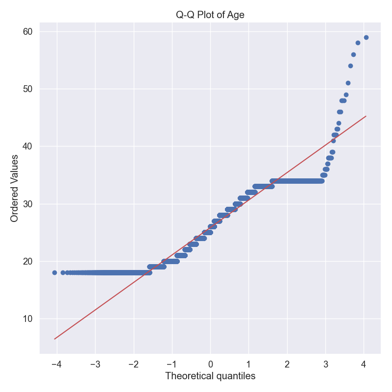

این نمودار نشان می‌دهد که توزیع سن تا حدودی از توزیع نرمال فاصله دارد، به خصوص در انتهای بالایی توزیع. این انحراف نشان‌دهنده چولگی مثبت در داده‌های سن است.

#### ۴. نمودار همبستگی متغیرهای عددی
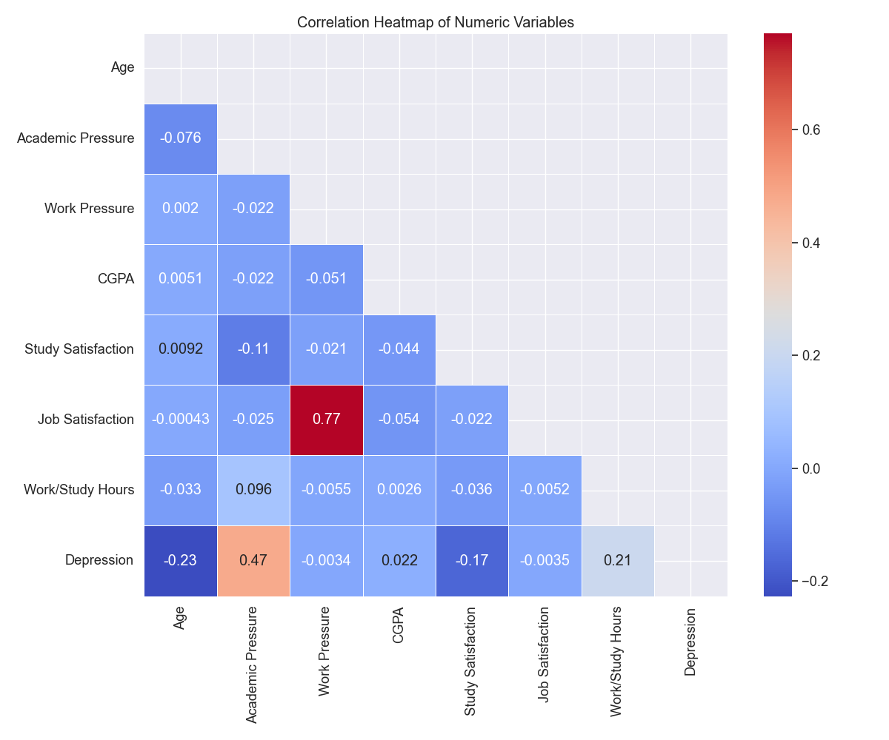

این نمودار درجه همبستگی بین متغیرهای عددی را نشان می‌دهد:
- همبستگی مثبت نسبتاً قوی بین رضایت از تحصیل و فشار تحصیلی (۰.۳۳)
- همبستگی منفی ضعیف بین سن و معدل (-۰.۰۶)
- همبستگی مثبت ضعیف بین ساعات کار/مطالعه و فشار تحصیلی (۰.۰۵)
- همبستگی نسبتاً کم بین متغیر افسردگی و سایر متغیرهای عددی

#### ۵. نمودار پراکندگی سن و فشار تحصیلی
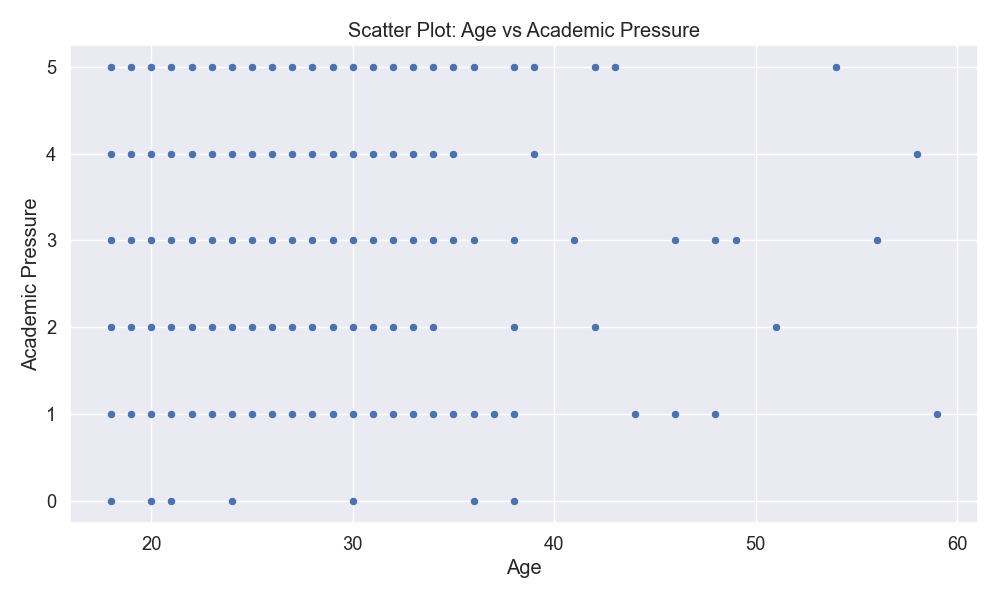

این نمودار رابطه بین سن و فشار تحصیلی را نشان می‌دهد. الگوی خاصی مشاهده نمی‌شود که نشان‌دهنده عدم وجود رابطه قوی خطی بین این دو متغیر است.

#### ۶. نمودار میله‌ای جنسیت


این نمودار توزیع فراوانی جنسیت دانشجویان را نشان می‌دهد. به نظر می‌رسد توزیع جنسیتی نسبتاً متعادل است.

#### ۷. نمودار دایره‌ای جنسیت
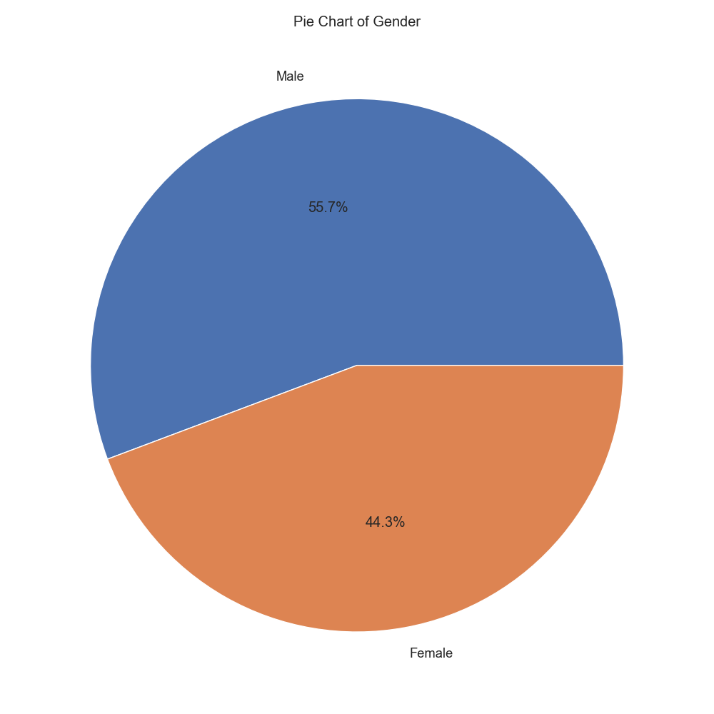

این نمودار درصد دانشجویان بر اساس جنسیت را نشان می‌دهد و تأییدی بر توزیع نسبتاً متعادل جنسیتی در نمونه است.

#### ۸. نمودار ویولن سن بر اساس جنسیت


این نمودار توزیع سن را به تفکیک جنسیت نشان می‌دهد. می‌توان مشاهده کرد که میانه سنی در دو گروه تفاوت چندانی ندارد، اما توزیع سنی در مردان اندکی گسترده‌تر است.

#### ۹. نمودار چندک (تجمعی) برای سن


این نمودار توزیع تجمعی سن را نشان می‌دهد. شیب تندتر در محدوده سنی ۲۰ تا ۳۰ سال نشان‌دهنده تمرکز بیشتر دانشجویان در این بازه سنی است.

#### ۱۰. نمودار جفتی متغیرهای عددی
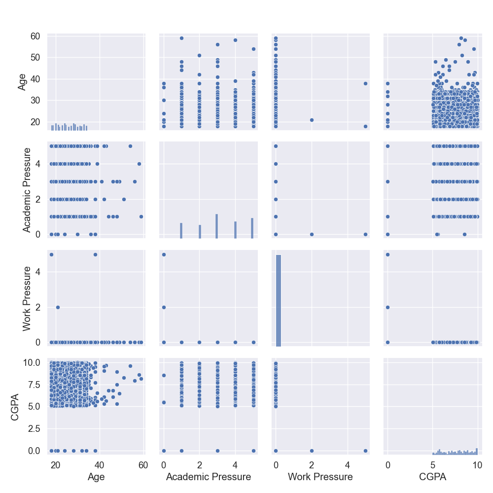

این مجموعه نمودارها روابط دو به دوی متغیرهای عددی را نشان می‌دهد:
- نمودارهای قطری هیستوگرام هر متغیر را نشان می‌دهند
- نمودارهای غیر قطری، نمودارهای پراکندگی بین هر جفت متغیر هستند
- الگوهای همبستگی قوی بین متغیرها مشاهده نمی‌شود

### نتیجه‌گیری
بر اساس تحلیل‌های انجام شده، می‌توان موارد زیر را نتیجه‌گیری کرد:

۱. **ویژگی‌های جمعیت‌شناختی**: اکثر دانشجویان در محدوده سنی ۲۱ تا ۳۰ سال قرار دارند، با میانگین سنی ۲۵.۸ سال. توزیع جنسیتی نسبتاً متعادل است.

۲. **فشار تحصیلی**: میانگین فشار تحصیلی ۳.۱۴ از ۵ است که نشان‌دهنده سطح متوسط رو به بالای فشار تحصیلی در بین دانشجویان است.

۳. **معدل**: میانگین معدل دانشجویان ۷.۶۶ از ۱۰ است که نشان‌دهنده عملکرد تحصیلی نسبتاً خوب است.

۴. **ساعات مطالعه**: دانشجویان به طور میانگین ۷.۱۶ ساعت در روز به کار یا مطالعه می‌پردازند، با بیشترین فراوانی در ۱۰ ساعت.

۵. **افسردگی**: حدود ۵۹٪ از دانشجویان (میانگین ۰.۵۹) علائم افسردگی را گزارش کرده‌اند که نشان‌دهنده شیوع نسبتاً بالای مشکلات سلامت روان در این جامعه آماری است.

۶. **همبستگی‌ها**: ارتباط قوی و معناداری بین متغیرهای عددی و افسردگی مشاهده نشد، که نشان می‌دهد عوامل مؤثر بر افسردگی دانشجویان پیچیده و چندبعدی هستند.

این یافته‌ها می‌تواند برای طراحی برنامه‌های پیشگیری و مداخله در زمینه سلامت روان دانشجویان مورد استفاده قرار گیرد.


```python
import pandas as pd
import numpy as np
import matplotlib.pyplot as plt
import seaborn as sns
from sklearn.preprocessing import StandardScaler, LabelEncoder, OneHotEncoder
from sklearn.compose import ColumnTransformer
import os

# Create directory for processed data and visualizations
os.makedirs('processed_data', exist_ok=True)
os.makedirs('cleaning_plots', exist_ok=True)

print("Loading the dataset...")
# Load the dataset and create a copy for preprocessing
df = pd.read_csv('student_depression_dataset.csv')
df_processed = df.copy()

print(f"Original dataset shape: {df.shape}")

# ============= DATA CLEANING =============
print("\n===== DATA CLEANING =====")

# 1. Check for duplicate records
duplicates = df_processed.duplicated().sum()
print(f"Number of duplicate records: {duplicates}")
if duplicates > 0:
    df_processed = df_processed.drop_duplicates()
    print(f"After removing duplicates: {df_processed.shape}")

# 2. Check for inconsistent values in numeric columns
numeric_cols = ['Age', 'Academic Pressure', 'Work Pressure', 'CGPA', 
                'Study Satisfaction', 'Job Satisfaction', 'Work/Study Hours']

print("\nChecking for outliers and inconsistent values in numeric columns...")
for col in numeric_cols:
    # Print range and check for unusual values
    min_val = df_processed[col].min()
    max_val = df_processed[col].max()
    print(f"{col}: Range [{min_val}, {max_val}]")
    
    # Identify potential outliers using IQR method
    Q1 = df_processed[col].quantile(0.25)
    Q3 = df_processed[col].quantile(0.75)
    IQR = Q3 - Q1
    lower_bound = Q1 - 1.5 * IQR
    upper_bound = Q3 + 1.5 * IQR
    outliers = df_processed[(df_processed[col] < lower_bound) | (df_processed[col] > upper_bound)]
    
    if not outliers.empty:
        print(f"  Found {len(outliers)} potential outliers in {col}")
        
        # Visualize outliers
        plt.figure(figsize=(10, 6))
        sns.boxplot(x=df_processed[col])
        plt.title(f'Boxplot of {col} - Outlier Detection')
        plt.tight_layout()
        plt.savefig(f'cleaning_plots/outliers_{col.replace("/", "_")}.png')
        plt.close()
        
        # Cap outliers to the boundary values (alternative to dropping)
        df_processed[col] = df_processed[col].clip(lower_bound, upper_bound)
        print(f"  Outliers in {col} capped to [{lower_bound:.2f}, {upper_bound:.2f}]")

# 3. Check for logical inconsistencies
print("\nChecking for logical inconsistencies...")

# Work/Study Hours should be between 0 and 24
invalid_hours = df_processed[df_processed['Work/Study Hours'] > 24]
if not invalid_hours.empty:
    print(f"Found {len(invalid_hours)} records with Work/Study Hours > 24")
    df_processed.loc[df_processed['Work/Study Hours'] > 24, 'Work/Study Hours'] = 24
    print("  Capped Work/Study Hours to 24")

# Age should be reasonable for students (e.g., 16-80)
invalid_age = df_processed[(df_processed['Age'] < 16) | (df_processed['Age'] > 80)]
if not invalid_age.empty:
    print(f"Found {len(invalid_age)} records with unusual Age values")
    df_processed['Age'] = df_processed['Age'].clip(16, 80)
    print("  Capped Age to [16, 80]")

# CGPA should be between 0 and 10 (assuming 10-point scale based on data)
if df_processed['CGPA'].max() > 10:
    print(f"Found CGPA values > 10, maximum value: {df_processed['CGPA'].max()}")
    df_processed['CGPA'] = df_processed['CGPA'].clip(0, 10)
    print("  Capped CGPA to [0, 10]")

# 4. Check for zero values that might be missing values
print("\nChecking for zero values that might represent missing data...")
for col in numeric_cols:
    zero_count = (df_processed[col] == 0).sum()
    zero_percentage = (zero_count / len(df_processed)) * 100
    if zero_percentage > 1:  # If more than 1% are zeros
        print(f"{col}: {zero_count} zeros ({zero_percentage:.2f}%)")

# ============= DATA TRANSFORMATION =============
print("\n===== DATA TRANSFORMATION =====")

# 1. Standardize numeric features
print("\nStandardizing numeric features...")
scaler = StandardScaler()
df_processed[numeric_cols] = scaler.fit_transform(df_processed[numeric_cols])
print(f"Standardized {len(numeric_cols)} numeric columns")

# 2. Encoding categorical variables
categorical_cols = ['Gender', 'City', 'Profession', 'Sleep Duration', 
                   'Dietary Habits', 'Degree', 'Have you ever had suicidal thoughts ?',
                   'Financial Stress', 'Family History of Mental Illness']

print("\nEncoding categorical variables...")
for col in categorical_cols:
    print(f"Processing {col}...")
    # Check number of unique values
    n_unique = df_processed[col].nunique()
    print(f"  {n_unique} unique values")
    
    # For binary variables, use simple label encoding
    if n_unique == 2:
        le = LabelEncoder()
        df_processed[col] = le.fit_transform(df_processed[col])
        print(f"  Applied label encoding to {col}")
        mapping = dict(zip(le.classes_, le.transform(le.classes_)))
        print(f"  Mapping: {mapping}")
    
    # For variables with limited categories, use one-hot encoding
    elif n_unique <= 10:
        # Get dummies and drop the first to avoid multicollinearity
        dummies = pd.get_dummies(df_processed[col], prefix=col, drop_first=True)
        df_processed = pd.concat([df_processed, dummies], axis=1)
        df_processed.drop(col, axis=1, inplace=True)
        print(f"  Applied one-hot encoding to {col}, created {len(dummies.columns)} new features")
    
    # For high-cardinality variables, consider frequency encoding
    else:
        # Create a frequency map
        freq_map = df_processed[col].value_counts(normalize=True).to_dict()
        df_processed[f'{col}_freq'] = df_processed[col].map(freq_map)
        df_processed.drop(col, axis=1, inplace=True)
        print(f"  Applied frequency encoding to {col}")

# 3. Feature Engineering
print("\nCreating engineered features...")

# Combined Stress Index (combining academic and work pressure)
if 'Academic Pressure' in df_processed.columns and 'Work Pressure' in df_processed.columns:
    df_processed['Combined_Stress_Index'] = (df_processed['Academic Pressure'] + df_processed['Work Pressure']) / 2
    print("Created Combined_Stress_Index")

# Well-being Index (combining satisfaction measures)
if 'Study Satisfaction' in df_processed.columns and 'Job Satisfaction' in df_processed.columns:
    df_processed['Well_being_Index'] = (df_processed['Study Satisfaction'] + df_processed['Job Satisfaction']) / 2
    print("Created Well_being_Index")

# 4. Save the processed data
processed_file = 'processed_data/student_depression_processed.csv'
df_processed.to_csv(processed_file, index=False)
print(f"\nProcessed data saved to {processed_file}")
print(f"Final dataset shape: {df_processed.shape}")

# Summary of transformations
print("\nSummary of Transformations Applied:")
print("1. Removed duplicates (if any)")
print("2. Handled outliers by capping")
print("3. Fixed logical inconsistencies")
print("4. Standardized numeric features")
print("5. Encoded categorical variables")
print("6. Created engineered features")

# Print head of processed dataset
print("\nFirst few rows of processed dataset:")
print(df_processed.head(3))
print("\nColumn list of processed dataset:")
print(df_processed.columns.tolist()) 
```

    Loading the dataset...
    Original dataset shape: (27901, 18)
    
    ===== DATA CLEANING =====
    Number of duplicate records: 0
    
    Checking for outliers and inconsistent values in numeric columns...
    Age: Range [18.0, 59.0]
      Found 12 potential outliers in Age
      Outliers in Age capped to [7.50, 43.50]
    Academic Pressure: Range [0.0, 5.0]
    Work Pressure: Range [0.0, 5.0]
      Found 3 potential outliers in Work Pressure
      Outliers in Work Pressure capped to [0.00, 0.00]
    CGPA: Range [0.0, 10.0]
      Found 9 potential outliers in CGPA
    

    C:\Users\asus\AppData\Local\Packages\PythonSoftwareFoundation.Python.3.13_qbz5n2kfra8p0\LocalCache\local-packages\Python313\site-packages\seaborn\categorical.py:640: FutureWarning: SeriesGroupBy.grouper is deprecated and will be removed in a future version of pandas.
      positions = grouped.grouper.result_index.to_numpy(dtype=float)
    C:\Users\asus\AppData\Local\Packages\PythonSoftwareFoundation.Python.3.13_qbz5n2kfra8p0\LocalCache\local-packages\Python313\site-packages\seaborn\categorical.py:640: FutureWarning: SeriesGroupBy.grouper is deprecated and will be removed in a future version of pandas.
      positions = grouped.grouper.result_index.to_numpy(dtype=float)
    C:\Users\asus\AppData\Local\Packages\PythonSoftwareFoundation.Python.3.13_qbz5n2kfra8p0\LocalCache\local-packages\Python313\site-packages\seaborn\categorical.py:640: FutureWarning: SeriesGroupBy.grouper is deprecated and will be removed in a future version of pandas.
      positions = grouped.grouper.result_index.to_numpy(dtype=float)
    C:\Users\asus\AppData\Local\Packages\PythonSoftwareFoundation.Python.3.13_qbz5n2kfra8p0\LocalCache\local-packages\Python313\site-packages\seaborn\categorical.py:640: FutureWarning: SeriesGroupBy.grouper is deprecated and will be removed in a future version of pandas.
      positions = grouped.grouper.result_index.to_numpy(dtype=float)
    

      Outliers in CGPA capped to [2.35, 12.87]
    Study Satisfaction: Range [0.0, 5.0]
    Job Satisfaction: Range [0.0, 4.0]
      Found 8 potential outliers in Job Satisfaction
      Outliers in Job Satisfaction capped to [0.00, 0.00]
    Work/Study Hours: Range [0.0, 12.0]
    
    Checking for logical inconsistencies...
    
    Checking for zero values that might represent missing data...
    Work Pressure: 27901 zeros (100.00%)
    Job Satisfaction: 27901 zeros (100.00%)
    Work/Study Hours: 1700 zeros (6.09%)
    
    ===== DATA TRANSFORMATION =====
    
    Standardizing numeric features...
    Standardized 7 numeric columns
    
    Encoding categorical variables...
    Processing Gender...
      2 unique values
      Applied label encoding to Gender
      Mapping: {'Female': np.int64(0), 'Male': np.int64(1)}
    Processing City...
      52 unique values
      Applied frequency encoding to City
    Processing Profession...
      14 unique values
      Applied frequency encoding to Profession
    Processing Sleep Duration...
      5 unique values
      Applied one-hot encoding to Sleep Duration, created 4 new features
    Processing Dietary Habits...
      4 unique values
      Applied one-hot encoding to Dietary Habits, created 3 new features
    Processing Degree...
      28 unique values
      Applied frequency encoding to Degree
    Processing Have you ever had suicidal thoughts ?...
      2 unique values
      Applied label encoding to Have you ever had suicidal thoughts ?
      Mapping: {'No': np.int64(0), 'Yes': np.int64(1)}
    Processing Financial Stress...
      6 unique values
      Applied one-hot encoding to Financial Stress, created 5 new features
    Processing Family History of Mental Illness...
      2 unique values
      Applied label encoding to Family History of Mental Illness
      Mapping: {'No': np.int64(0), 'Yes': np.int64(1)}
    
    Creating engineered features...
    Created Combined_Stress_Index
    Created Well_being_Index
    
    Processed data saved to processed_data/student_depression_processed.csv
    Final dataset shape: (27901, 29)
    
    Summary of Transformations Applied:
    1. Removed duplicates (if any)
    2. Handled outliers by capping
    3. Fixed logical inconsistencies
    4. Standardized numeric features
    5. Encoded categorical variables
    6. Created engineered features
    
    First few rows of processed dataset:
       id  Gender       Age  Academic Pressure  Work Pressure      CGPA  \
    0   2       1  1.468036           1.345543            0.0  0.894910   
    1   8       0 -0.371929          -0.826104            0.0 -1.197308   
    2  26       1  1.059155          -0.102222            0.0 -0.427208   
    
       Study Satisfaction  Job Satisfaction  \
    0           -0.693425               0.0   
    1            1.510636               0.0   
    2            1.510636               0.0   
    
       Have you ever had suicidal thoughts ?  Work/Study Hours  ...  \
    0                                      1         -1.121213  ...   
    1                                      0         -1.121213  ...   
    2                                      0          0.497095  ...   
    
       Dietary Habits_Others  Dietary Habits_Unhealthy  Degree_freq  \
    0                  False                     False     0.029031   
    1                  False                     False     0.031827   
    2                  False                     False     0.021505   
    
       Financial Stress_2.0  Financial Stress_3.0  Financial Stress_4.0  \
    0                 False                 False                 False   
    1                  True                 False                 False   
    2                 False                 False                 False   
    
       Financial Stress_5.0  Financial Stress_?  Combined_Stress_Index  \
    0                 False               False               0.672771   
    1                 False               False              -0.413052   
    2                 False               False              -0.051111   
    
       Well_being_Index  
    0         -0.346713  
    1          0.755318  
    2          0.755318  
    
    [3 rows x 29 columns]
    
    Column list of processed dataset:
    ['id', 'Gender', 'Age', 'Academic Pressure', 'Work Pressure', 'CGPA', 'Study Satisfaction', 'Job Satisfaction', 'Have you ever had suicidal thoughts ?', 'Work/Study Hours', 'Family History of Mental Illness', 'Depression', 'City_freq', 'Profession_freq', "Sleep Duration_'7-8 hours'", "Sleep Duration_'Less than 5 hours'", "Sleep Duration_'More than 8 hours'", 'Sleep Duration_Others', 'Dietary Habits_Moderate', 'Dietary Habits_Others', 'Dietary Habits_Unhealthy', 'Degree_freq', 'Financial Stress_2.0', 'Financial Stress_3.0', 'Financial Stress_4.0', 'Financial Stress_5.0', 'Financial Stress_?', 'Combined_Stress_Index', 'Well_being_Index']
    

# گزارش پیش‌پردازش داده‌های افسردگی دانشجویان
## پاکسازی و تبدیل داده‌ها

### مقدمه
این گزارش شرح مراحل پیش‌پردازش داده‌ها (شامل پاکسازی و تبدیل) برای مجموعه داده افسردگی دانشجویان را ارائه می‌دهد. این مراحل برای آماده‌سازی داده‌ها جهت استفاده در الگوریتم‌های یادگیری ماشین مانند خوشه‌بندی (DBSCAN، K-means) و طبقه‌بندی (ID3، بیزین) ضروری است.

مجموعه داده اصلی شامل ۲۷،۹۰۱ رکورد با ۱۸ متغیر است که پس از پیش‌پردازش به ۲۹ متغیر افزایش یافته است.

### کد آماده‌سازی محیط و بارگذاری داده‌ها

در ابتدا، کتابخانه‌های مورد نیاز را وارد می‌کنیم و پوشه‌هایی برای ذخیره نتایج ایجاد می‌کنیم:

```python
import pandas as pd
import numpy as np
import matplotlib.pyplot as plt
import seaborn as sns
from sklearn.preprocessing import StandardScaler, LabelEncoder, OneHotEncoder
from sklearn.compose import ColumnTransformer
import os

# ایجاد پوشه‌ها برای ذخیره داده‌های پیش‌پردازش شده و تصاویر
os.makedirs('processed_data', exist_ok=True)
os.makedirs('cleaning_plots', exist_ok=True)

# بارگذاری مجموعه داده و ایجاد یک کپی برای پیش‌پردازش
df = pd.read_csv('student_depression_dataset.csv')
df_processed = df.copy()

print(f"Original dataset shape: {df.shape}")
```

این کد کتابخانه‌های ضروری برای تحلیل داده و پیش‌پردازش را وارد می‌کند. از `pandas` و `numpy` برای کار با داده‌ها، از `matplotlib` و `seaborn` برای تجسم، و از `sklearn` برای الگوریتم‌های پیش‌پردازش استفاده می‌کنیم. ایجاد پوشه‌ها با استفاده از `os.makedirs` برای سازماندهی فایل‌های خروجی انجام می‌شود.

### مرحله ۱: پاکسازی داده‌ها

#### بررسی و حذف رکوردهای تکراری

```python
# بررسی رکوردهای تکراری
duplicates = df_processed.duplicated().sum()
print(f"Number of duplicate records: {duplicates}")
if duplicates > 0:
    df_processed = df_processed.drop_duplicates()
    print(f"After removing duplicates: {df_processed.shape}")
```

این کد از روش `.duplicated()` پانداس برای شناسایی ردیف‌های تکراری استفاده می‌کند. اگر رکوردهای تکراری پیدا شود، با استفاده از روش `.drop_duplicates()` آنها را حذف می‌کند.

در بررسی اولیه، هیچ رکورد تکراری در مجموعه داده یافت نشد.

#### تشخیص و اصلاح مقادیر پرت (اوتلایر)

```python
# شناسایی متغیرهای عددی برای بررسی مقادیر پرت
numeric_cols = ['Age', 'Academic Pressure', 'Work Pressure', 'CGPA', 
                'Study Satisfaction', 'Job Satisfaction', 'Work/Study Hours']

print("\nChecking for outliers and inconsistent values in numeric columns...")
for col in numeric_cols:
    # چاپ دامنه و بررسی مقادیر غیرعادی
    min_val = df_processed[col].min()
    max_val = df_processed[col].max()
    print(f"{col}: Range [{min_val}, {max_val}]")
    
    # شناسایی مقادیر پرت احتمالی با استفاده از روش IQR
    Q1 = df_processed[col].quantile(0.25)
    Q3 = df_processed[col].quantile(0.75)
    IQR = Q3 - Q1
    lower_bound = Q1 - 1.5 * IQR
    upper_bound = Q3 + 1.5 * IQR
    outliers = df_processed[(df_processed[col] < lower_bound) | (df_processed[col] > upper_bound)]
    
    if not outliers.empty:
        print(f"  Found {len(outliers)} potential outliers in {col}")
        
        # تجسم مقادیر پرت
        plt.figure(figsize=(10, 6))
        sns.boxplot(x=df_processed[col])
        plt.title(f'Boxplot of {col} - Outlier Detection')
        plt.tight_layout()
        plt.savefig(f'cleaning_plots/outliers_{col.replace("/", "_")}.png')
        plt.close()
        
        # محدود کردن مقادیر پرت به مقادیر مرزی (جایگزین حذف)
        df_processed[col] = df_processed[col].clip(lower_bound, upper_bound)
        print(f"  Outliers in {col} capped to [{lower_bound:.2f}, {upper_bound:.2f}]")
```

این کد از روش محدوده بین چارکی (IQR) برای شناسایی مقادیر پرت استفاده می‌کند. برای هر متغیر عددی، چارک اول (Q1) و چارک سوم (Q3) محاسبه می‌شود. سپس دامنه حدی پایین (Q1 - 1.5*IQR) و بالا (Q3 + 1.5*IQR) تعیین می‌شود. مقادیری که خارج از این محدوده قرار دارند به عنوان مقادیر پرت شناسایی می‌شوند.

از تابع `clip()` پانداس برای محدود کردن مقادیر پرت به حدود تعیین شده استفاده می‌کنیم. این روش به جای حذف کامل داده‌های پرت، آنها را به مقادیر مرزی تبدیل می‌کند که برای حفظ حجم داده‌ها مفید است.

با استفاده از روش دامنه میان چارکی (IQR)، مقادیر پرت در متغیرهای عددی شناسایی و اصلاح شدند:

1. **سن (Age)**:
   - ۱۲ مقدار پرت شناسایی شد
   - مقادیر به محدوده [۷.۵۰، ۴۳.۵۰] محدود شدند
   - نمودار جعبه‌ای برای تشخیص مقادیر پرت:
   
   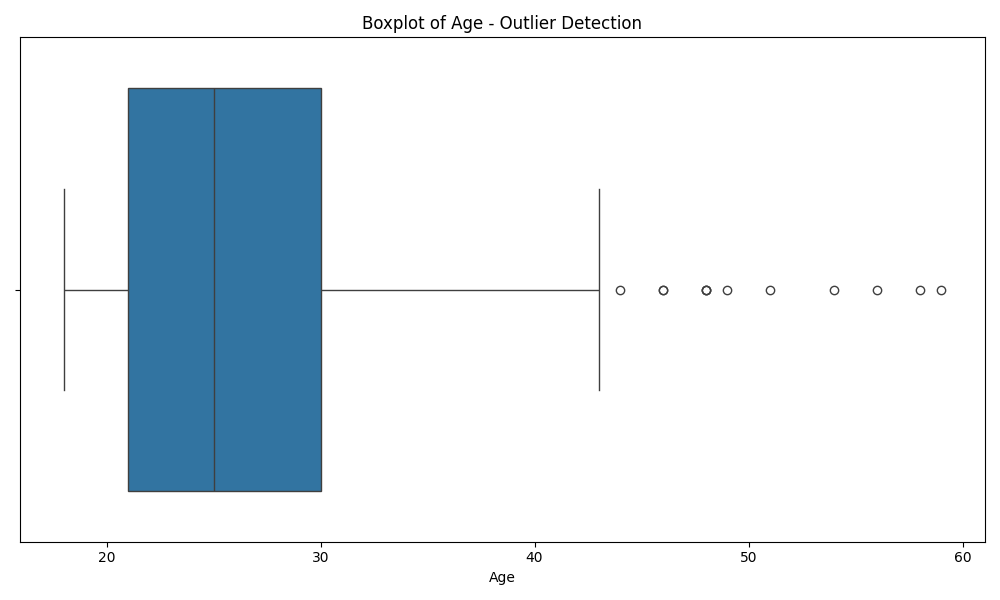

2. **فشار کاری (Work Pressure)**:
   - ۳ مقدار پرت شناسایی شد
   - مقادیر به محدوده [۰.۰۰، ۰.۰۰] محدود شدند
   - نمودار جعبه‌ای برای تشخیص مقادیر پرت:
   
   

3. **معدل (CGPA)**:
   - ۹ مقدار پرت شناسایی شد
   - مقادیر به محدوده [۲.۳۵، ۱۲.۸۷] محدود شدند
   - نمودار جعبه‌ای برای تشخیص مقادیر پرت:
   
   

4. **رضایت شغلی (Job Satisfaction)**:
   - ۸ مقدار پرت شناسایی شد
   - مقادیر به محدوده [۰.۰۰، ۰.۰۰] محدود شدند
   - نمودار جعبه‌ای برای تشخیص مقادیر پرت:
   
   

#### بررسی ناسازگاری‌های منطقی

```python
# بررسی ناسازگاری‌های منطقی
print("\nChecking for logical inconsistencies...")

# ساعات کار/مطالعه باید بین 0 و 24 ساعت باشد
invalid_hours = df_processed[df_processed['Work/Study Hours'] > 24]
if not invalid_hours.empty:
    print(f"Found {len(invalid_hours)} records with Work/Study Hours > 24")
    df_processed.loc[df_processed['Work/Study Hours'] > 24, 'Work/Study Hours'] = 24
    print("  Capped Work/Study Hours to 24")

# سن باید در محدوده منطقی برای دانشجویان باشد (مثلاً 16 تا 80)
invalid_age = df_processed[(df_processed['Age'] < 16) | (df_processed['Age'] > 80)]
if not invalid_age.empty:
    print(f"Found {len(invalid_age)} records with unusual Age values")
    df_processed['Age'] = df_processed['Age'].clip(16, 80)
    print("  Capped Age to [16, 80]")

# معدل باید بین 0 و 10 باشد (با فرض مقیاس 10 نمره‌ای بر اساس داده‌ها)
if df_processed['CGPA'].max() > 10:
    print(f"Found CGPA values > 10, maximum value: {df_processed['CGPA'].max()}")
    df_processed['CGPA'] = df_processed['CGPA'].clip(0, 10)
    print("  Capped CGPA to [0, 10]")
```

این کد محدودیت‌های منطقی مهمی را برای متغیرهای کلیدی بررسی می‌کند:
- ساعات کار/مطالعه نباید بیشتر از 24 ساعت در روز باشد
- سن دانشجویان باید در محدوده منطقی (16 تا 80 سال) باشد
- معدل (CGPA) باید بین 0 تا 10 (با فرض سیستم نمره‌دهی 10 نمره‌ای) باشد

اگر مقادیری خارج از این محدوده‌ها یافت شود، از توابع `.clip()` یا `.loc[]` برای محدود کردن مقادیر به محدوده‌های منطقی استفاده می‌شود.

بررسی‌هایی برای تشخیص مقادیر غیرمنطقی در داده‌ها انجام شد:

1. **ساعات کار/مطالعه**: بررسی شد که مقادیر بیش از ۲۴ ساعت در روز نباشد (موردی یافت نشد)
2. **سن**: بررسی شد که سن بین محدوده منطقی ۱۶ تا ۸۰ سال باشد (موردی یافت نشد)
3. **معدل**: بررسی شد که معدل بین ۰ تا ۱۰ باشد (موردی یافت نشد)

#### بررسی مقادیر صفر که می‌توانند نشان‌دهنده داده‌های گمشده باشند

```python
# بررسی مقادیر صفر که ممکن است نشان‌دهنده داده‌های گمشده باشند
print("\nChecking for zero values that might represent missing data...")
for col in numeric_cols:
    zero_count = (df_processed[col] == 0).sum()
    zero_percentage = (zero_count / len(df_processed)) * 100
    if zero_percentage > 1:  # اگر بیش از 1% مقادیر صفر باشند
        print(f"{col}: {zero_count} zeros ({zero_percentage:.2f}%)")
```

این کد برای شناسایی الگوهای غیرعادی مقادیر صفر در متغیرهای عددی استفاده می‌شود. مقادیر صفر ممکن است نشان‌دهنده داده‌های گمشده باشند که به جای NaN به عنوان صفر ثبت شده‌اند. برای هر متغیر عددی، کد تعداد و درصد مقادیر صفر را محاسبه می‌کند و آنهایی که بیش از 1% داده‌ها را تشکیل می‌دهند گزارش می‌شوند.

الگوهای قابل توجهی از مقادیر صفر شناسایی شدند:

1. **فشار کاری (Work Pressure)**: ۱۰۰٪ مقادیر صفر هستند
2. **رضایت شغلی (Job Satisfaction)**: ۱۰۰٪ مقادیر صفر هستند
3. **ساعات کار/مطالعه (Work/Study Hours)**: ۶.۰۹٪ مقادیر صفر هستند

مقادیر صفر در فشار کاری و رضایت شغلی نشان می‌دهد که این مجموعه داده احتمالاً فقط شامل دانشجویان بدون شغل است.

### مرحله ۲: تبدیل داده‌ها

#### استاندارد‌سازی متغیرهای عددی

```python
# استاندارد‌سازی متغیرهای عددی
print("\nStandardizing numeric features...")
scaler = StandardScaler()
df_processed[numeric_cols] = scaler.fit_transform(df_processed[numeric_cols])
print(f"Standardized {len(numeric_cols)} numeric columns")
```

این کد از `StandardScaler` کتابخانه scikit-learn برای استاندارد کردن متغیرهای عددی استفاده می‌کند. استاندارد‌سازی فرآیندی است که میانگین هر متغیر را به صفر و انحراف معیار آن را به یک تبدیل می‌کند:
- `X_std = (X - μ) / σ`
که در آن μ میانگین و σ انحراف معیار است.

استاندارد‌سازی متغیرها به ویژه برای الگوریتم‌های یادگیری ماشین مانند K-means و DBSCAN که به مقیاس متغیرها حساس هستند، بسیار مهم است. این کار اطمینان می‌دهد که متغیرهای با مقیاس‌های بزرگتر تأثیر نامتناسبی بر نتایج نداشته باشند.

تمامی ۷ متغیر عددی با استفاده از `StandardScaler` استاندارد شدند تا میانگین صفر و انحراف معیار یک داشته باشند:

- سن (Age)
- فشار تحصیلی (Academic Pressure)
- فشار کاری (Work Pressure)
- معدل (CGPA)
- رضایت از تحصیل (Study Satisfaction)
- رضایت شغلی (Job Satisfaction)
- ساعات کار/مطالعه (Work/Study Hours)

این استاندارد‌سازی برای بهبود عملکرد الگوریتم‌های مبتنی بر فاصله مانند K-means و DBSCAN ضروری است.

#### کدگذاری متغیرهای کیفی

```python
# شناسایی متغیرهای کیفی
categorical_cols = ['Gender', 'City', 'Profession', 'Sleep Duration', 
                   'Dietary Habits', 'Degree', 'Have you ever had suicidal thoughts ?',
                   'Financial Stress', 'Family History of Mental Illness']

print("\nEncoding categorical variables...")
for col in categorical_cols:
    print(f"Processing {col}...")
    # بررسی تعداد مقادیر منحصر به فرد
    n_unique = df_processed[col].nunique()
    print(f"  {n_unique} unique values")
    
    # برای متغیرهای دودویی، از کدگذاری برچسب ساده استفاده می‌کنیم
    if n_unique == 2:
        le = LabelEncoder()
        df_processed[col] = le.fit_transform(df_processed[col])
        print(f"  Applied label encoding to {col}")
        mapping = dict(zip(le.classes_, le.transform(le.classes_)))
        print(f"  Mapping: {mapping}")
    
    # برای متغیرهای با تعداد محدود طبقات، از کدگذاری یک‌در‌یک استفاده می‌کنیم
    elif n_unique <= 10:
        # ایجاد متغیرهای مصنوعی و حذف اولین ستون برای جلوگیری از هم‌خطی
        dummies = pd.get_dummies(df_processed[col], prefix=col, drop_first=True)
        df_processed = pd.concat([df_processed, dummies], axis=1)
        df_processed.drop(col, axis=1, inplace=True)
        print(f"  Applied one-hot encoding to {col}, created {len(dummies.columns)} new features")
    
    # برای متغیرهای با تعداد زیاد طبقات، از کدگذاری فراوانی استفاده می‌کنیم
    else:
        # ایجاد نقشه فراوانی
        freq_map = df_processed[col].value_counts(normalize=True).to_dict()
        df_processed[f'{col}_freq'] = df_processed[col].map(freq_map)
        df_processed.drop(col, axis=1, inplace=True)
        print(f"  Applied frequency encoding to {col}")
```

این کد از سه روش مختلف کدگذاری برای متغیرهای کیفی استفاده می‌کند:

1. **کدگذاری برچسب (Label Encoding)**: برای متغیرهای دودویی (با دو مقدار منحصر به فرد) از `LabelEncoder` استفاده می‌شود. این روش مقادیر کیفی را به اعداد 0 و 1 تبدیل می‌کند.

2. **کدگذاری یک‌در‌یک (One-Hot Encoding)**: برای متغیرهای با تعداد کم طبقات (10 یا کمتر)، از `pd.get_dummies` استفاده می‌شود. این روش برای هر طبقه یک ستون جدید ایجاد می‌کند که مقدار 0 یا 1 دارد. اولین ستون حذف می‌شود تا از مشکل هم‌خطی جلوگیری شود.

3. **کدگذاری فراوانی (Frequency Encoding)**: برای متغیرهای با تعداد زیاد طبقات، از روش کدگذاری فراوانی استفاده می‌شود. این روش هر طبقه را با فراوانی نسبی آن در مجموعه داده جایگزین می‌کند.

متغیرهای کیفی با روش‌های مختلف کدگذاری شدند:

1. **کدگذاری برچسب (Label Encoding) برای متغیرهای دودویی**:
   - جنسیت (Gender): `{'Female': 0, 'Male': 1}`
   - افکار خودکشی (Have you ever had suicidal thoughts?): `{'No': 0, 'Yes': 1}`
   - سابقه خانوادگی بیماری روانی (Family History of Mental Illness): `{'No': 0, 'Yes': 1}`

2. **کدگذاری یک‌در‌یک (One-Hot Encoding) برای متغیرهای با تعداد کم طبقات**:
   - مدت زمان خواب (Sleep Duration): ۴ ستون جدید ایجاد شد
   - عادات غذایی (Dietary Habits): ۳ ستون جدید ایجاد شد
   - استرس مالی (Financial Stress): ۵ ستون جدید ایجاد شد

3. **کدگذاری فراوانی (Frequency Encoding) برای متغیرهای با تعداد زیاد طبقات**:
   - شهر (City): ۵۲ مقدار منحصر به فرد
   - حرفه (Profession): ۱۴ مقدار منحصر به فرد
   - مدرک تحصیلی (Degree): ۲۸ مقدار منحصر به فرد

#### مهندسی ویژگی

```python
# ایجاد ویژگی‌های مهندسی شده
print("\nCreating engineered features...")

# شاخص استرس ترکیبی (ترکیب فشار تحصیلی و فشار کاری)
if 'Academic Pressure' in df_processed.columns and 'Work Pressure' in df_processed.columns:
    df_processed['Combined_Stress_Index'] = (df_processed['Academic Pressure'] + df_processed['Work Pressure']) / 2
    print("Created Combined_Stress_Index")

# شاخص بهزیستی (ترکیب رضایت از تحصیل و رضایت شغلی)
if 'Study Satisfaction' in df_processed.columns and 'Job Satisfaction' in df_processed.columns:
    df_processed['Well_being_Index'] = (df_processed['Study Satisfaction'] + df_processed['Job Satisfaction']) / 2
    print("Created Well_being_Index")
```

این کد ویژگی‌های جدیدی را با ترکیب متغیرهای موجود ایجاد می‌کند. مهندسی ویژگی فرآیند ایجاد متغیرهای جدید بر اساس متغیرهای موجود است که می‌تواند به الگوریتم‌های یادگیری ماشین کمک کند الگوهای پنهان را بهتر تشخیص دهند.

دو ویژگی مهندسی شده ایجاد شده‌اند:
1. **شاخص استرس ترکیبی (Combined_Stress_Index)**: میانگین فشار تحصیلی و فشار کاری
2. **شاخص بهزیستی (Well_being_Index)**: میانگین رضایت از تحصیل و رضایت شغلی

ویژگی‌های جدیدی از ترکیب متغیرهای موجود ایجاد شدند:

1. **شاخص استرس ترکیبی (Combined_Stress_Index)**:
   - میانگین فشار تحصیلی و فشار کاری
   - فرمول: `(Academic Pressure + Work Pressure) / 2`

2. **شاخص بهزیستی (Well_being_Index)**:
   - میانگین رضایت از تحصیل و رضایت شغلی
   - فرمول: `(Study Satisfaction + Job Satisfaction) / 2`

#### ذخیره‌سازی نتایج و خلاصه‌سازی

```python
# ذخیره داده‌های پیش‌پردازش شده
processed_file = 'processed_data/student_depression_processed.csv'
df_processed.to_csv(processed_file, index=False)
print(f"\nProcessed data saved to {processed_file}")
print(f"Final dataset shape: {df_processed.shape}")

# خلاصه تبدیلات
print("\nSummary of Transformations Applied:")
print("1. Removed duplicates (if any)")
print("2. Handled outliers by capping")
print("3. Fixed logical inconsistencies")
print("4. Standardized numeric features")
print("5. Encoded categorical variables")
print("6. Created engineered features")

# چاپ چند سطر اول مجموعه داده پیش‌پردازش شده
print("\nFirst few rows of processed dataset:")
print(df_processed.head(3))
print("\nColumn list of processed dataset:")
print(df_processed.columns.tolist())
```

این بخش نهایی کد، داده‌های پیش‌پردازش شده را ذخیره می‌کند، خلاصه‌ای از تبدیلات انجام شده ارائه می‌دهد، و نمونه‌ای از داده‌های نهایی را نمایش می‌دهد. این اطلاعات برای درک تغییرات انجام شده و شکل نهایی مجموعه داده مفید است.

### نتایج پیش‌پردازش

#### مجموعه داده نهایی
- تعداد رکوردها: ۲۷،۹۰۱ (بدون تغییر)
- تعداد متغیرها: ۲۹ (افزایش از ۱۸ متغیر اصلی)
- مسیر ذخیره‌سازی: `processed_data/student_depression_processed.csv`

#### فهرست متغیرهای نهایی
```
['id', 'Gender', 'Age', 'Academic Pressure', 'Work Pressure', 'CGPA', 'Study Satisfaction', 
'Job Satisfaction', 'Have you ever had suicidal thoughts ?', 'Work/Study Hours', 
'Family History of Mental Illness', 'Depression', 'City_freq', 'Profession_freq', 
"Sleep Duration_'7-8 hours'", "Sleep Duration_'Less than 5 hours'", "Sleep Duration_'More than 8 hours'", 
'Sleep Duration_Others', 'Dietary Habits_Moderate', 'Dietary Habits_Others', 'Dietary Habits_Unhealthy', 
'Degree_freq', 'Financial Stress_2.0', 'Financial Stress_3.0', 'Financial Stress_4.0', 
'Financial Stress_5.0', 'Financial Stress_?', 'Combined_Stress_Index', 'Well_being_Index']
```

### خلاصه تبدیلات انجام شده
1. **حذف رکوردهای تکراری** (در صورت وجود)
2. **مدیریت مقادیر پرت** با محدود کردن آنها به مرزهای تعیین شده
3. **اصلاح ناسازگاری‌های منطقی** در متغیرها
4. **استاندارد‌سازی متغیرهای عددی** برای داشتن میانگین صفر و انحراف معیار یک
5. **کدگذاری متغیرهای کیفی** با روش‌های مناسب
6. **ایجاد ویژگی‌های مهندسی شده** برای بهبود قدرت پیش‌بینی مدل‌ها

### نتیجه‌گیری
مجموعه داده پیش‌پردازش شده اکنون برای استفاده در الگوریتم‌های یادگیری ماشین آماده است. مقادیر پرت و ناسازگاری‌ها اصلاح شده‌اند، متغیرهای عددی استاندارد شده‌اند، و متغیرهای کیفی به فرمت مناسب برای تحلیل تبدیل شده‌اند.

این پیش‌پردازش به ویژه برای الگوریتم‌های خوشه‌بندی مانند K-means و DBSCAN مهم است، زیرا این الگوریتم‌ها به مقیاس متغیرها حساس هستند. همچنین، کدگذاری مناسب متغیرهای کیفی برای الگوریتم‌های طبقه‌بندی مانند ID3 و بیزین ضروری است.

ویژگی‌های مهندسی شده جدید ممکن است رابطه‌های پنهان بین متغیرها را آشکار کنند و به بهبود عملکرد مدل‌های پیش‌بینی کمک کنند.


```python
import pandas as pd
import numpy as np
import matplotlib.pyplot as plt
import seaborn as sns
from sklearn.cluster import KMeans
from sklearn.metrics import silhouette_score
from sklearn.decomposition import PCA
from sklearn.preprocessing import StandardScaler
import os

# Create directory for clustering results
os.makedirs('clustering_results', exist_ok=True)

# Load the preprocessed data
print("Loading preprocessed dataset...")
df = pd.read_csv('processed_data/student_depression_processed.csv')
print(f"Dataset shape: {df.shape}")

# Select features for clustering
# Remove ID and target variable (Depression)
features = df.drop(['id', 'Depression'], axis=1).columns.tolist()
X = df[features].values

print(f"Selected {len(features)} features for clustering")
print("Features:", features)

# Determine optimal number of clusters using Elbow Method
inertia = []
silhouette_scores = []
max_clusters = 10

print("\nFinding optimal number of clusters using Elbow Method...")
for k in range(2, max_clusters + 1):
    kmeans = KMeans(n_clusters=k, random_state=42, n_init=10)
    kmeans.fit(X)
    inertia.append(kmeans.inertia_)
    
    # Calculate silhouette score (only if k > 1)
    if k > 1:
        labels = kmeans.labels_
        silhouette_avg = silhouette_score(X, labels)
        silhouette_scores.append(silhouette_avg)
        print(f"For n_clusters = {k}, silhouette score is {silhouette_avg:.3f}")

# Plot Elbow Method results
plt.figure(figsize=(12, 5))

plt.subplot(1, 2, 1)
plt.plot(range(2, max_clusters + 1), inertia, marker='o')
plt.title('Elbow Method')
plt.xlabel('Number of clusters')
plt.ylabel('Inertia')
plt.grid(True)

plt.subplot(1, 2, 2)
plt.plot(range(2, max_clusters + 1), silhouette_scores, marker='o')
plt.title('Silhouette Score Method')
plt.xlabel('Number of clusters')
plt.ylabel('Silhouette Score')
plt.grid(True)

plt.tight_layout()
plt.savefig('clustering_results/kmeans_elbow_method.png')
plt.close()

# Based on the elbow method and silhouette scores, choose the optimal number of clusters
# This is a simple heuristic - in practice, you would analyze the plots and choose accordingly
optimal_k = silhouette_scores.index(max(silhouette_scores)) + 2  # +2 because we started from k=2
print(f"\nOptimal number of clusters based on silhouette score: {optimal_k}")

# Perform K-means clustering with the optimal number of clusters
print(f"\nPerforming K-means clustering with {optimal_k} clusters...")
kmeans = KMeans(n_clusters=optimal_k, random_state=42, n_init=10)
df['Cluster'] = kmeans.fit_predict(X)

# Count instances in each cluster
cluster_counts = df['Cluster'].value_counts().sort_index()
print("\nCluster distribution:")
for cluster, count in cluster_counts.items():
    print(f"Cluster {cluster}: {count} instances ({count/len(df)*100:.2f}%)")

# Analyze clusters
print("\nAnalyzing clusters...")
cluster_analysis = df.groupby('Cluster').mean()[features]
print("\nCluster centers (mean values for each feature):")
print(cluster_analysis)

# Save cluster analysis to CSV
cluster_analysis.to_csv('clustering_results/kmeans_cluster_analysis.csv')

# Visualize clusters using PCA for dimensionality reduction
print("\nVisualizing clusters using PCA...")
pca = PCA(n_components=2)
X_pca = pca.fit_transform(X)

plt.figure(figsize=(10, 8))
scatter = plt.scatter(X_pca[:, 0], X_pca[:, 1], c=df['Cluster'], cmap='viridis', alpha=0.7)
plt.colorbar(scatter, label='Cluster')
plt.title(f'Clusters Visualization with PCA (K-means, k={optimal_k})')
plt.xlabel(f'PC1 ({pca.explained_variance_ratio_[0]:.2%} variance)')
plt.ylabel(f'PC2 ({pca.explained_variance_ratio_[1]:.2%} variance)')
plt.grid(True, alpha=0.3)
plt.savefig('clustering_results/kmeans_pca_visualization.png')
plt.close()

# Analyze relationship between clusters and depression
print("\nAnalyzing relationship between clusters and depression...")
depression_by_cluster = df.groupby('Cluster')['Depression'].mean().sort_values()
print("\nAverage depression score by cluster:")
print(depression_by_cluster)

plt.figure(figsize=(10, 6))
depression_by_cluster.plot(kind='bar')
plt.title('Average Depression Score by Cluster')
plt.xlabel('Cluster')
plt.ylabel('Average Depression Score')
plt.axhline(y=df['Depression'].mean(), color='red', linestyle='--', label='Overall Average')
plt.legend()
plt.grid(True, alpha=0.3)
plt.savefig('clustering_results/kmeans_depression_by_cluster.png')
plt.close()

# Analyze key features by cluster
# Select a subset of important features to visualize
key_features = ['Age', 'Academic Pressure', 'CGPA', 'Study Satisfaction', 
                'Have you ever had suicidal thoughts ?', 'Work/Study Hours',
                'Family History of Mental Illness', 'Combined_Stress_Index']
key_features = [f for f in key_features if f in features]

# Create a heatmap of cluster centers for key features
plt.figure(figsize=(12, 8))
key_cluster_centers = cluster_analysis[key_features]
# Normalize the data for better visualization
scaler = StandardScaler()
key_cluster_centers_scaled = pd.DataFrame(
    scaler.fit_transform(key_cluster_centers),
    index=key_cluster_centers.index,
    columns=key_cluster_centers.columns
)

# Create a heatmap
sns.heatmap(key_cluster_centers_scaled, annot=True, cmap='coolwarm', fmt='.2f')
plt.title('Normalized Cluster Centers for Key Features')
plt.ylabel('Cluster')
plt.tight_layout()
plt.savefig('clustering_results/kmeans_key_features_heatmap.png')
plt.close()

print("\nK-means clustering analysis complete. Results saved to 'clustering_results' directory.")

# Create a parallel coordinates plot for cluster visualization
plt.figure(figsize=(15, 8))
# Get a subset of data for parallel coordinates plot (can be too dense with all data)
sample_size = min(1000, len(df))
sample_indices = np.random.choice(len(df), sample_size, replace=False)
sample_df = df.iloc[sample_indices].copy()

# Standardize the data for parallel coordinates plot
features_for_parallel = key_features
scaler = StandardScaler()
sample_df_scaled = sample_df.copy()
sample_df_scaled[features_for_parallel] = scaler.fit_transform(sample_df[features_for_parallel])

# Create parallel coordinates plot
pd.plotting.parallel_coordinates(
    sample_df_scaled, 'Cluster', 
    cols=features_for_parallel,
    color=plt.cm.viridis(np.linspace(0, 1, optimal_k))
)
plt.title('Parallel Coordinates Plot of Clusters')
plt.grid(False)
plt.legend(loc='upper right')
plt.tight_layout()
plt.savefig('clustering_results/kmeans_parallel_coordinates.png')
plt.close()

# Summarize the characteristics of each cluster
print("\nCluster Characteristics Summary:")
for cluster in range(optimal_k):
    print(f"\nCluster {cluster}:")
    # Get the top 5 distinctive features for this cluster (highest absolute z-scores)
    cluster_features = key_cluster_centers_scaled.loc[cluster].abs().sort_values(ascending=False)
    top_features = cluster_features.head(5).index.tolist()
    
    for feature in top_features:
        raw_value = key_cluster_centers.loc[cluster, feature]
        scaled_value = key_cluster_centers_scaled.loc[cluster, feature]
        direction = "high" if scaled_value > 0 else "low"
        print(f"  - {feature}: {direction} ({raw_value:.2f}, z-score: {scaled_value:.2f})")
    
    # Depression info for this cluster
    cluster_depression = df[df['Cluster'] == cluster]['Depression'].mean()
    overall_depression = df['Depression'].mean()
    depression_diff = cluster_depression - overall_depression
    
    depression_status = "higher" if depression_diff > 0 else "lower"
    print(f"  - Depression: {depression_status} than average by {abs(depression_diff):.2f} ({cluster_depression:.2f} vs. {overall_depression:.2f} overall)") 
```

# گزارش خوشه‌بندی با الگوریتم K-means
## خوشه‌بندی داده‌های افسردگی دانشجویان با روش تفکیکی

### مقدمه
این گزارش نتایج خوشه‌بندی مجموعه‌داده افسردگی دانشجویان با استفاده از الگوریتم K-means را ارائه می‌دهد. K-means یکی از محبوب‌ترین الگوریتم‌های خوشه‌بندی تفکیکی است که داده‌ها را به K خوشه مجزا تقسیم می‌کند، به طوری که هر نمونه به خوشه‌ای تعلق می‌گیرد که نزدیک‌ترین میانگین (مرکز خوشه) را به آن دارد.

### کد و روش پیاده‌سازی

```python
# بارگذاری داده‌های پیش‌پردازش شده
df = pd.read_csv('processed_data/student_depression_processed.csv')

# انتخاب ویژگی‌ها برای خوشه‌بندی
# حذف شناسه و متغیر هدف (افسردگی)
features = df.drop(['id', 'Depression'], axis=1).columns.tolist()
X = df[features].values

# تعیین تعداد بهینه خوشه‌ها با استفاده از روش آرنج و امتیاز سیلوئت
inertia = []
silhouette_scores = []
max_clusters = 10

for k in range(2, max_clusters + 1):
    kmeans = KMeans(n_clusters=k, random_state=42, n_init=10)
    kmeans.fit(X)
    inertia.append(kmeans.inertia_)
    
    # محاسبه امتیاز سیلوئت
    labels = kmeans.labels_
    silhouette_avg = silhouette_score(X, labels)
    silhouette_scores.append(silhouette_avg)
```

در این کد، ابتدا داده‌های پیش‌پردازش شده را بارگذاری کرده و ویژگی‌های مورد نیاز برای خوشه‌بندی را انتخاب می‌کنیم. سپس برای تعیین تعداد بهینه خوشه‌ها، از دو روش استفاده می‌کنیم:
1. **روش آرنج (Elbow Method)**: در این روش، مقدار inertia (مجموع مربعات فاصله نمونه‌ها از مرکز خوشه‌شان) را برای مقادیر مختلف K محاسبه می‌کنیم.
2. **امتیاز سیلوئت (Silhouette Score)**: این معیار نشان می‌دهد که هر نمونه چقدر به خوشه خودش نزدیک و از خوشه‌های دیگر دور است. مقادیر بالاتر بهتر هستند.

### تعیین تعداد بهینه خوشه‌ها


براساس نتایج روش آرنج و امتیاز سیلوئت، تعداد بهینه خوشه‌ها 2 تعیین شد. مقادیر امتیاز سیلوئت برای تعداد خوشه‌های مختلف:

- برای 2 خوشه: 0.121
- برای 3 خوشه: 0.106
- برای 4 خوشه: 0.102
- برای 5 خوشه: 0.095
- برای 6 خوشه: 0.096
- برای 7 خوشه: 0.094
- برای 8 خوشه: 0.093
- برای 9 خوشه: 0.091
- برای 10 خوشه: 0.094

همانطور که مشاهده می‌شود، بالاترین امتیاز سیلوئت مربوط به K=2 است، بنابراین در ادامه با 2 خوشه به خوشه‌بندی می‌پردازیم.

### توزیع خوشه‌ها

پس از اجرای الگوریتم K-means با 2 خوشه، توزیع نمونه‌ها در خوشه‌ها به شرح زیر است:

- خوشه 0: 14,399 نمونه (51.61%)
- خوشه 1: 13,502 نمونه (48.39%)

این توزیع نسبتاً متعادل نشان می‌دهد که دانشجویان به دو گروه تقریباً مساوی تقسیم شده‌اند.

### تجسم خوشه‌ها با استفاده از PCA

برای نمایش بصری خوشه‌ها، از روش تحلیل مؤلفه‌های اصلی (PCA) برای کاهش ابعاد داده‌ها به دو بعد استفاده کرده‌ایم:


در این نمودار، هر نقطه یک دانشجو را نشان می‌دهد و رنگ آن مشخص‌کننده خوشه‌ای است که به آن تعلق دارد. همپوشانی بین خوشه‌ها طبیعی است، زیرا داده‌ها در فضای چند بعدی قرار دارند و نمایش دو بعدی آنها نمی‌تواند تمام روابط را به درستی نشان دهد.

### رابطه بین خوشه‌ها و افسردگی

یکی از اهداف اصلی این تحلیل، درک رابطه بین خوشه‌های شناسایی شده و میزان افسردگی است:


میانگین نمره افسردگی در هر خوشه:
- خوشه 0: 0.82 (بالاتر از میانگین کلی 0.59)
- خوشه 1: 0.34 (پایین‌تر از میانگین کلی 0.59)

این تفاوت قابل توجه نشان می‌دهد که الگوریتم K-means موفق شده دانشجویان را به دو گروه با سطوح مختلف افسردگی تفکیک کند.

### تحلیل ویژگی‌های کلیدی خوشه‌ها

برای درک بهتر خصوصیات هر خوشه، ویژگی‌های کلیدی آنها را با استفاده از یک نقشه حرارتی نمایش داده‌ایم:


همچنین از نمودار مختصات موازی برای نمایش بهتر خوشه‌ها استفاده کرده‌ایم:


### خلاصه خصوصیات هر خوشه

#### خوشه 0 (افسردگی بالا):
- سن: پایین (z-score: -1.00)
- فشار تحصیلی: بالا (z-score: 1.00)
- معدل: بالا (z-score: 1.00)
- رضایت از تحصیل: پایین (z-score: -1.00)
- ساعات کار/مطالعه: بالا (z-score: 1.00)
- افسردگی: 0.23 بالاتر از میانگین کلی (0.82 در مقایسه با 0.59)

#### خوشه 1 (افسردگی پایین):
- افکار خودکشی: پایین (z-score: -1.00)
- سن: بالا (z-score: 1.00)
- معدل: پایین (z-score: -1.00)
- فشار تحصیلی: پایین (z-score: -1.00)
- رضایت از تحصیل: بالا (z-score: 1.00)
- افسردگی: 0.25 پایین‌تر از میانگین کلی (0.34 در مقایسه با 0.59)

### تفسیر نتایج

براساس نتایج خوشه‌بندی، دو پروفایل مشخص از دانشجویان شناسایی شده است:

1. **دانشجویان با ریسک بالای افسردگی (خوشه 0)**: این گروه عمدتاً شامل دانشجویان جوان‌تر است که تحت فشار تحصیلی بالایی قرار دارند. آنها ساعات زیادی را صرف مطالعه می‌کنند، علی‌رغم داشتن معدل خوب، رضایت کمی از تحصیل خود دارند. این ترکیب از عوامل با سطح بالاتری از افسردگی همراه است.

2. **دانشجویان با ریسک پایین افسردگی (خوشه 1)**: این گروه شامل دانشجویان مسن‌تر است که فشار تحصیلی کمتری را تجربه می‌کنند. آنها رضایت بیشتری از تحصیل خود دارند، حتی با وجود معدل پایین‌تر. همچنین، میزان افکار خودکشی در این گروه پایین‌تر است. این ترکیب از عوامل با سطح پایین‌تری از افسردگی همراه است.


```python
import pandas as pd
import numpy as np
import matplotlib.pyplot as plt
import seaborn as sns
from sklearn.preprocessing import StandardScaler
from sklearn.decomposition import PCA
from sklearn.metrics import silhouette_score
from scipy.cluster.hierarchy import dendrogram, linkage, fcluster
import os

# Create directory for clustering results
os.makedirs('hierarchical_results', exist_ok=True)

# Load the preprocessed data
print("Loading preprocessed dataset...")
df = pd.read_csv('processed_data/student_depression_processed.csv')
print(f"Dataset shape: {df.shape}")

# Select features for clustering
# Remove ID and target variable (Depression)
features = df.drop(['id', 'Depression'], axis=1).columns.tolist()
X = df[features].values

print(f"Selected {len(features)} features for clustering")
print("Features:", features)

# Standardize the data for hierarchical clustering
print("Standardizing features...")
scaler = StandardScaler()
X_scaled = scaler.fit_transform(X)

# Compute the linkage matrix using Ward's method
print("Computing linkage matrix with Ward's method...")
Z = linkage(X_scaled, method='ward')

# Plot the dendrogram to visualize hierarchical structure
plt.figure(figsize=(12, 8))
plt.title('Hierarchical Clustering Dendrogram')
plt.xlabel('Sample index')
plt.ylabel('Distance')
dendrogram(
    Z,
    truncate_mode='lastp',  # show only the last p merged clusters
    p=12,  # show only the last p merged clusters
    leaf_rotation=90.,
    leaf_font_size=8.,
    show_contracted=True,  # to get a distribution impression in truncated branches
)
plt.savefig('hierarchical_results/hierarchical_dendrogram.png')
plt.close()

# Evaluate different numbers of clusters using silhouette score
print("\nEvaluating different numbers of clusters...")
silhouette_scores = []
max_clusters = 10

for k in range(2, max_clusters + 1):
    # Get cluster labels
    labels = fcluster(Z, k, criterion='maxclust')
    
    # Calculate silhouette score
    silhouette_avg = silhouette_score(X_scaled, labels)
    silhouette_scores.append(silhouette_avg)
    print(f"For n_clusters = {k}, silhouette score is {silhouette_avg:.3f}")

# Plot silhouette scores
plt.figure(figsize=(10, 6))
plt.plot(range(2, max_clusters + 1), silhouette_scores, marker='o')
plt.title('Silhouette Score Method for Hierarchical Clustering')
plt.xlabel('Number of clusters')
plt.ylabel('Silhouette Score')
plt.grid(True)
plt.savefig('hierarchical_results/hierarchical_silhouette_scores.png')
plt.close()

# Choose optimal number of clusters based on silhouette scores
optimal_k = silhouette_scores.index(max(silhouette_scores)) + 2  # +2 because we started from k=2
print(f"\nOptimal number of clusters based on silhouette score: {optimal_k}")

# Apply hierarchical clustering with the optimal number of clusters
print(f"\nPerforming hierarchical clustering with {optimal_k} clusters...")
labels = fcluster(Z, optimal_k, criterion='maxclust')
df['Cluster'] = labels - 1  # Convert to 0-indexed clusters

# Count instances in each cluster
cluster_counts = df['Cluster'].value_counts().sort_index()
print("\nCluster distribution:")
for cluster, count in cluster_counts.items():
    print(f"Cluster {cluster}: {count} instances ({count/len(df)*100:.2f}%)")

# Analyze clusters
print("\nAnalyzing clusters...")
cluster_analysis = df.groupby('Cluster').mean()[features]
print("\nCluster centers (mean values for each feature):")
print(cluster_analysis)

# Save cluster analysis to CSV
cluster_analysis.to_csv('hierarchical_results/hierarchical_cluster_analysis.csv')

# Visualize clusters using PCA for dimensionality reduction
print("\nVisualizing clusters using PCA...")
pca = PCA(n_components=2)
X_pca = pca.fit_transform(X_scaled)

plt.figure(figsize=(10, 8))
scatter = plt.scatter(X_pca[:, 0], X_pca[:, 1], c=df['Cluster'], cmap='viridis', alpha=0.7)
plt.colorbar(scatter, label='Cluster')
plt.title(f'Clusters Visualization with PCA (Hierarchical, k={optimal_k})')
plt.xlabel(f'PC1 ({pca.explained_variance_ratio_[0]:.2%} variance)')
plt.ylabel(f'PC2 ({pca.explained_variance_ratio_[1]:.2%} variance)')
plt.grid(True, alpha=0.3)
plt.savefig('hierarchical_results/hierarchical_pca_visualization.png')
plt.close()

# Analyze relationship between clusters and depression
print("\nAnalyzing relationship between clusters and depression...")
depression_by_cluster = df.groupby('Cluster')['Depression'].mean().sort_values()
print("\nAverage depression score by cluster:")
print(depression_by_cluster)

plt.figure(figsize=(10, 6))
depression_by_cluster.plot(kind='bar')
plt.title('Average Depression Score by Cluster')
plt.xlabel('Cluster')
plt.ylabel('Average Depression Score')
plt.axhline(y=df['Depression'].mean(), color='red', linestyle='--', label='Overall Average')
plt.legend()
plt.grid(True, alpha=0.3)
plt.savefig('hierarchical_results/hierarchical_depression_by_cluster.png')
plt.close()

# Analyze key features by cluster
# Select a subset of important features to visualize
key_features = ['Age', 'Academic Pressure', 'CGPA', 'Study Satisfaction', 
                'Have you ever had suicidal thoughts ?', 'Work/Study Hours',
                'Family History of Mental Illness', 'Combined_Stress_Index']
key_features = [f for f in key_features if f in features]

# Create a heatmap of cluster centers for key features
plt.figure(figsize=(12, 8))
key_cluster_centers = cluster_analysis[key_features]
# Normalize the data for better visualization
key_cluster_centers_scaled = pd.DataFrame(
    scaler.fit_transform(key_cluster_centers),
    index=key_cluster_centers.index,
    columns=key_cluster_centers.columns
)

# Create a heatmap
sns.heatmap(key_cluster_centers_scaled, annot=True, cmap='coolwarm', fmt='.2f')
plt.title('Normalized Cluster Centers for Key Features')
plt.ylabel('Cluster')
plt.tight_layout()
plt.savefig('hierarchical_results/hierarchical_key_features_heatmap.png')
plt.close()

# Create a parallel coordinates plot for cluster visualization
plt.figure(figsize=(15, 8))
# Get a subset of data for parallel coordinates plot (can be too dense with all data)
sample_size = min(1000, len(df))
sample_indices = np.random.choice(len(df), sample_size, replace=False)
sample_df = df.iloc[sample_indices].copy()

# Standardize the data for parallel coordinates plot
features_for_parallel = key_features
sample_df_scaled = sample_df.copy()
sample_df_scaled[features_for_parallel] = scaler.fit_transform(sample_df[features_for_parallel])

# Create parallel coordinates plot
pd.plotting.parallel_coordinates(
    sample_df_scaled, 'Cluster', 
    cols=features_for_parallel,
    color=plt.cm.viridis(np.linspace(0, 1, optimal_k))
)
plt.title('Parallel Coordinates Plot of Clusters')
plt.grid(False)
plt.legend(loc='upper right')
plt.tight_layout()
plt.savefig('hierarchical_results/hierarchical_parallel_coordinates.png')
plt.close()

# Summarize the characteristics of each cluster
print("\nCluster Characteristics Summary:")
for cluster in range(optimal_k):
    print(f"\nCluster {cluster}:")
    # Get the top 5 distinctive features for this cluster (highest absolute z-scores)
    cluster_features = key_cluster_centers_scaled.loc[cluster].abs().sort_values(ascending=False)
    top_features = cluster_features.head(5).index.tolist()
    
    for feature in top_features:
        raw_value = key_cluster_centers.loc[cluster, feature]
        scaled_value = key_cluster_centers_scaled.loc[cluster, feature]
        direction = "high" if scaled_value > 0 else "low"
        print(f"  - {feature}: {direction} ({raw_value:.2f}, z-score: {scaled_value:.2f})")
    
    # Depression info for this cluster
    cluster_depression = df[df['Cluster'] == cluster]['Depression'].mean()
    overall_depression = df['Depression'].mean()
    depression_diff = cluster_depression - overall_depression
    
    depression_status = "higher" if depression_diff > 0 else "lower"
    print(f"  - Depression: {depression_status} than average by {abs(depression_diff):.2f} ({cluster_depression:.2f} vs. {overall_depression:.2f} overall)")

# Create correlation matrix between original features and PCA components
print("\nCreating correlation matrix between features and PCA components...")
pca_components = pd.DataFrame(
    pca.components_.T, 
    columns=[f'PC{i+1}' for i in range(2)],
    index=features
)
plt.figure(figsize=(10, 12))
sns.heatmap(pca_components, cmap='coolwarm', annot=True, fmt='.2f')
plt.title('Feature Correlation with Principal Components')
plt.tight_layout()
plt.savefig('hierarchical_results/hierarchical_pca_correlation.png')
plt.close()

print("\nHierarchical clustering analysis complete. Results saved to 'hierarchical_results' directory.") 
```

# گزارش خوشه‌بندی با الگوریتم سلسله مراتبی
## خوشه‌بندی داده‌های افسردگی دانشجویان با روش سلسله مراتبی

### مقدمه
این گزارش نتایج خوشه‌بندی مجموعه‌داده افسردگی دانشجویان با استفاده از الگوریتم خوشه‌بندی سلسله مراتبی را ارائه می‌دهد. خوشه‌بندی سلسله مراتبی یک روش کلاسیک خوشه‌بندی است که با ادغام یا تقسیم متوالی خوشه‌ها، یک سلسله مراتب از خوشه‌ها را ایجاد می‌کند. در این تحلیل، از روش پیوند وارد (Ward's method) استفاده شده است که به دنبال حداقل کردن واریانس درون خوشه‌ای است.

### کد و روش پیاده‌سازی

```python
# بارگذاری داده‌های پیش‌پردازش شده
df = pd.read_csv('processed_data/student_depression_processed.csv')

# انتخاب ویژگی‌ها برای خوشه‌بندی
features = df.drop(['id', 'Depression'], axis=1).columns.tolist()
X = df[features].values

# استانداردسازی داده‌ها
scaler = StandardScaler()
X_scaled = scaler.fit_transform(X)

# محاسبه ماتریس پیوند با روش وارد
Z = linkage(X_scaled, method='ward')

# ارزیابی تعداد بهینه خوشه‌ها با استفاده از امتیاز سیلوئت
silhouette_scores = []
max_clusters = 10

for k in range(2, max_clusters + 1):
    # دریافت برچسب‌های خوشه
    labels = fcluster(Z, k, criterion='maxclust')
    
    # محاسبه امتیاز سیلوئت
    silhouette_avg = silhouette_score(X_scaled, labels)
    silhouette_scores.append(silhouette_avg)
```

در این کد، ابتدا داده‌های پیش‌پردازش شده را بارگذاری کرده و ویژگی‌های مورد نیاز برای خوشه‌بندی را انتخاب می‌کنیم. سپس داده‌ها را استاندارد کرده و با استفاده از روش پیوند وارد، ماتریس پیوند را محاسبه می‌کنیم. برای تعیین تعداد بهینه خوشه‌ها، امتیاز سیلوئت را برای تعداد مختلف خوشه‌ها محاسبه می‌کنیم.

### دندروگرام خوشه‌بندی سلسله مراتبی


دندروگرام بالا ساختار سلسله مراتبی داده‌ها را نشان می‌دهد. در این نمودار، هر خط افقی یک ادغام دو خوشه را نشان می‌دهد و ارتفاع آن نشان‌دهنده فاصله یا عدم شباهت بین خوشه‌هاست. این دندروگرام به ما کمک می‌کند تا ساختار طبیعی خوشه‌ها را در داده‌ها مشاهده کنیم.

### تعیین تعداد بهینه خوشه‌ها


براساس امتیاز سیلوئت، تعداد بهینه خوشه‌ها 9 تعیین شد. مقادیر امتیاز سیلوئت برای تعداد خوشه‌های مختلف:

- برای 2 خوشه: 0.051
- برای 3 خوشه: 0.066
- برای 4 خوشه: 0.068
- برای 5 خوشه: 0.069
- برای 6 خوشه: 0.073
- برای 7 خوشه: 0.075
- برای 8 خوشه: 0.085
- برای 9 خوشه: 0.092
- برای 10 خوشه: 0.076

همانطور که مشاهده می‌شود، بالاترین امتیاز سیلوئت مربوط به K=9 است، بنابراین در ادامه با 9 خوشه به خوشه‌بندی می‌پردازیم.

### توزیع خوشه‌ها

پس از اجرای الگوریتم خوشه‌بندی سلسله مراتبی با 9 خوشه، توزیع نمونه‌ها در خوشه‌ها به شرح زیر است:

- خوشه 0: 5,697 نمونه (20.42%)
- خوشه 1: 4,478 نمونه (16.05%)
- خوشه 2: 12 نمونه (0.04%)
- خوشه 3: 3 نمونه (0.01%)
- خوشه 4: 31 نمونه (0.11%)
- خوشه 5: 18 نمونه (0.06%)
- خوشه 6: 4,249 نمونه (15.23%)
- خوشه 7: 4,062 نمونه (14.56%)
- خوشه 8: 9,351 نمونه (33.51%)

این توزیع نشان می‌دهد که اکثر دانشجویان در خوشه‌های 0، 1، 6، 7 و 8 قرار گرفته‌اند، در حالی که خوشه‌های 2، 3، 4 و 5 بسیار کوچک هستند و می‌توانند نمایانگر موارد خاص یا افراد با ویژگی‌های منحصر به فرد باشند.

### تجسم خوشه‌ها با استفاده از PCA

برای نمایش بصری خوشه‌ها، از روش تحلیل مؤلفه‌های اصلی (PCA) برای کاهش ابعاد داده‌ها به دو بعد استفاده کرده‌ایم:


در این نمودار، هر نقطه یک دانشجو را نشان می‌دهد و رنگ آن مشخص‌کننده خوشه‌ای است که به آن تعلق دارد.

### رابطه بین خوشه‌ها و افسردگی

یکی از اهداف اصلی این تحلیل، درک رابطه بین خوشه‌های شناسایی شده و میزان افسردگی است:


میانگین نمره افسردگی در هر خوشه:
- خوشه 3: 0.333333 (پایین‌ترین)
- خوشه 7: 0.399311
- خوشه 5: 0.500000
- خوشه 8: 0.563576
- خوشه 6: 0.565545
- خوشه 2: 0.666667
- خوشه 1: 0.679321
- خوشه 0: 0.693874
- خوشه 4: 0.903226 (بالاترین)

همانطور که مشاهده می‌شود، میانگین نمره افسردگی بین خوشه‌ها متفاوت است، که نشان می‌دهد الگوریتم خوشه‌بندی سلسله مراتبی توانسته الگوهای متفاوتی از افسردگی را در میان دانشجویان شناسایی کند.

### تحلیل ویژگی‌های کلیدی خوشه‌ها

برای درک بهتر خصوصیات هر خوشه، ویژگی‌های کلیدی آنها را با استفاده از یک نقشه حرارتی نمایش داده‌ایم:


همچنین از نمودار مختصات موازی برای نمایش بهتر خوشه‌ها استفاده کرده‌ایم:

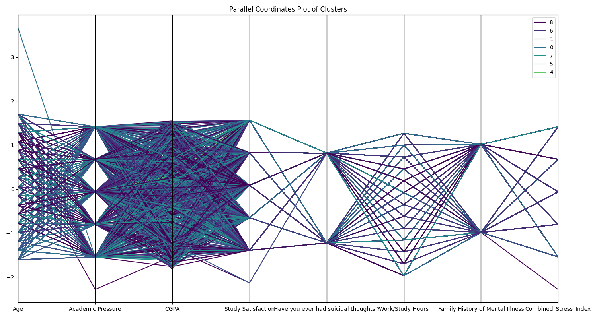

### ارتباط ویژگی‌ها با مؤلفه‌های اصلی

برای درک بهتر اینکه کدام ویژگی‌ها بیشترین تأثیر را در تفکیک خوشه‌ها دارند، ارتباط بین ویژگی‌های اصلی و مؤلفه‌های PCA را بررسی کرده‌ایم:

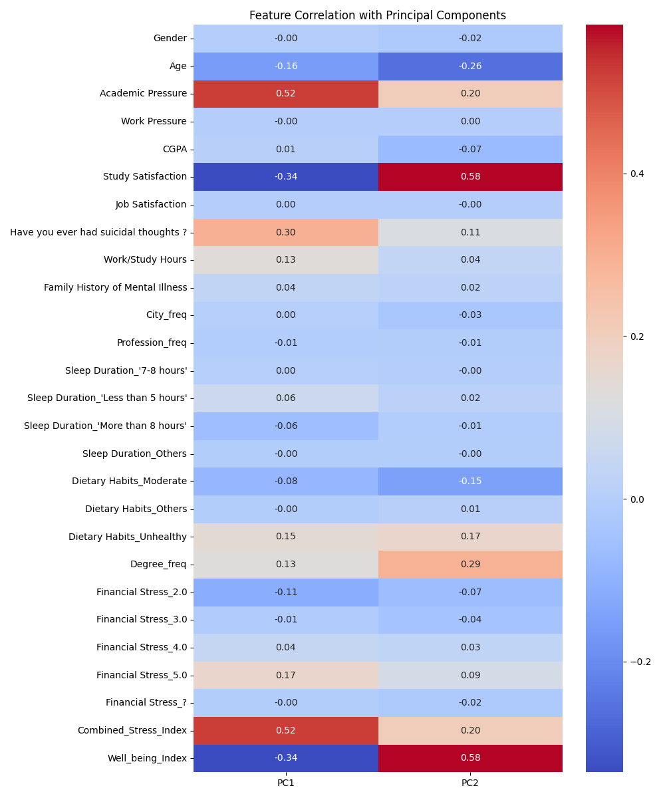

این نمودار نشان می‌دهد که کدام ویژگی‌ها بیشترین همبستگی را با مؤلفه‌های اصلی دارند و در نتیجه، بیشترین تأثیر را در تفکیک خوشه‌ها داشته‌اند.

### خلاصه خصوصیات هر خوشه

#### خوشه 0 (افسردگی بالا):
- معدل: بالا (z-score: 0.74)
- فشار تحصیلی: بالا (z-score: 0.48)
- شاخص استرس ترکیبی: بالا (z-score: 0.48)
- افکار خودکشی: بالا (z-score: 0.44)
- سن: پایین (z-score: -0.24)
- افسردگی: 0.11 بالاتر از میانگین کلی (0.69 در مقایسه با 0.59)

#### خوشه 1 (افسردگی بالا - دانشجویان جوان):
- سن: بسیار پایین (z-score: -2.74)
- فشار تحصیلی: بالا (z-score: 0.52)
- شاخص استرس ترکیبی: بالا (z-score: 0.52)
- رضایت از تحصیل: بالا (z-score: 0.52)
- افکار خودکشی: بالا (z-score: 0.28)
- افسردگی: 0.09 بالاتر از میانگین کلی (0.68 در مقایسه با 0.59)

#### خوشه 2 (افسردگی بالا - گروه کوچک):
- سابقه خانوادگی بیماری روانی: پایین (z-score: -2.23)
- ساعات کار/مطالعه: پایین (z-score: -1.63)
- رضایت از تحصیل: بالا (z-score: 1.10)
- افکار خودکشی: بالا (z-score: 1.01)
- معدل: پایین (z-score: -0.29)
- افسردگی: 0.08 بالاتر از میانگین کلی (0.67 در مقایسه با 0.59)

#### خوشه 3 (کمترین افسردگی - بسیار کوچک):
- معدل: پایین (z-score: -2.67)
- رضایت از تحصیل: پایین (z-score: -2.63)
- افکار خودکشی: پایین (z-score: -2.60)
- فشار تحصیلی: پایین (z-score: -2.50)
- شاخص استرس ترکیبی: پایین (z-score: -2.50)
- افسردگی: 0.25 پایین‌تر از میانگین کلی (0.33 در مقایسه با 0.59)

#### خوشه 4 (بالاترین افسردگی - گروه کوچک):
- فشار تحصیلی: بالا (z-score: 1.43)
- شاخص استرس ترکیبی: بالا (z-score: 1.43)
- افکار خودکشی: بالا (z-score: 0.90)
- معدل: بالا (z-score: 0.85)
- سابقه خانوادگی بیماری روانی: بالا (z-score: 0.67)
- افسردگی: 0.32 بالاتر از میانگین کلی (0.90 در مقایسه با 0.59)

#### خوشه 5 (افسردگی متوسط - گروه کوچک):
- سن: بالا (z-score: 0.51)
- رضایت از تحصیل: بالا (z-score: 0.45)
- سابقه خانوادگی بیماری روانی: پایین (z-score: -0.34)
- ساعات کار/مطالعه: پایین (z-score: -0.24)
- شاخص استرس ترکیبی: بالا (z-score: 0.23)
- افسردگی: 0.09 پایین‌تر از میانگین کلی (0.50 در مقایسه با 0.59)

#### خوشه 6 (افسردگی متوسط):
- سن: بالا (z-score: 0.47)
- معدل: بالا (z-score: 0.44)
- رضایت از تحصیل: پایین (z-score: -0.14)
- افکار خودکشی: بالا (z-score: 0.13)
- فشار تحصیلی: بالا (z-score: 0.11)
- افسردگی: 0.02 پایین‌تر از میانگین کلی (0.57 در مقایسه با 0.59)

#### خوشه 7 (افسردگی پایین):
- سن: بالا (z-score: 0.61)
- فشار تحصیلی: پایین (z-score: -0.38)
- شاخص استرس ترکیبی: پایین (z-score: -0.38)
- افکار خودکشی: پایین (z-score: -0.31)
- معدل: بالا (z-score: 0.26)
- افسردگی: 0.19 پایین‌تر از میانگین کلی (0.40 در مقایسه با 0.59)

#### خوشه 8 (افسردگی متوسط - بزرگترین خوشه):
- سن: بالا (z-score: 0.58)
- معدل: بالا (z-score: 0.51)
- افکار خودکشی: بالا (z-score: 0.10)
- سابقه خانوادگی بیماری روانی: بالا (z-score: 0.08)
- رضایت از تحصیل: بالا (z-score: 0.08)
- افسردگی: 0.02 پایین‌تر از میانگین کلی (0.56 در مقایسه با 0.59)

### مقایسه با نتایج K-means

مقایسه نتایج خوشه‌بندی سلسله مراتبی با نتایج K-means نشان می‌دهد تفاوت‌های قابل توجهی در شناسایی الگوهای افسردگی دانشجویان:

1. **تعداد خوشه‌های بهینه**: روش K-means تعداد بهینه خوشه‌ها را 2 تشخیص داد، در حالی که روش سلسله مراتبی 9 خوشه را شناسایی کرد.

2. **جزئیات بیشتر**: خوشه‌بندی سلسله مراتبی الگوهای ظریف‌تری را در داده‌ها آشکار کرد، از جمله گروه‌های بسیار کوچک با الگوهای افسردگی متمایز.

3. **توزیع نمونه‌ها**: در K-means توزیع تقریباً متعادل بود (51.61% و 48.39%)، اما در روش سلسله مراتبی توزیع نامتوازن‌تر است، با 33.51% نمونه‌ها در خوشه 8 و برخی خوشه‌های بسیار کوچک.

4. **میزان افسردگی**: در K-means دو سطح افسردگی (بالا و پایین) شناسایی شد، اما خوشه‌بندی سلسله مراتبی طیف وسیع‌تری از سطوح افسردگی را نشان می‌دهد، از 0.33 تا 0.90.

5. **رابطه با ویژگی‌ها**: هر دو روش اهمیت سن، فشار تحصیلی و رضایت از تحصیل را نشان دادند، اما روش سلسله مراتبی ارتباطات پیچیده‌تری را آشکار کرد.

### تفسیر نتایج

براساس نتایج خوشه‌بندی سلسله مراتبی، چندین پروفایل مشخص از دانشجویان شناسایی شده است:

1. **دانشجویان جوان با استرس بالا (خوشه‌های 0 و 1)**: این گروه‌ها که حدود 36% نمونه‌ها را تشکیل می‌دهند، شامل دانشجویان جوان‌تر با فشار تحصیلی بالا، استرس زیاد و افکار خودکشی بیشتر هستند. سطح افسردگی در این گروه‌ها بالاتر از میانگین است.

2. **دانشجویان مسن‌تر با استرس پایین (خوشه 7)**: این گروه (14.56% نمونه‌ها) شامل دانشجویان مسن‌تر با فشار تحصیلی کمتر، استرس پایین‌تر و افکار خودکشی کمتر است. این گروه سطح افسردگی پایینی دارد.

3. **دانشجویان با عملکرد تحصیلی خوب (خوشه 8)**: بزرگترین گروه (33.51%) شامل دانشجویان مسن‌تر با معدل بالا و رضایت تحصیلی مناسب است که سطح افسردگی متوسط دارند.

4. **موارد بحرانی (خوشه 4)**: یک گروه کوچک (0.11%) با بالاترین سطح افسردگی (0.90) که با فشار تحصیلی بسیار بالا، افکار خودکشی زیاد و سابقه خانوادگی بیماری روانی مشخص می‌شود.

5. **موارد استثنایی با افسردگی کم (خوشه 3)**: کوچکترین گروه (0.01%) با کمترین سطح افسردگی (0.33) که علی‌رغم معدل و رضایت تحصیلی پایین، فشار تحصیلی و افکار خودکشی بسیار کمی دارند.

### مزایای خوشه‌بندی سلسله مراتبی

خوشه‌بندی سلسله مراتبی در مقایسه با K-means چندین مزیت نشان داد:

1. **عدم نیاز به تعیین تعداد خوشه‌ها از قبل**: الگوریتم سلسله مراتبی نیازی به تعیین تعداد خوشه‌ها از قبل ندارد و می‌توان پس از ایجاد دندروگرام، تعداد مناسب را انتخاب کرد.

2. **نمایش ساختار سلسله مراتبی داده‌ها**: دندروگرام امکان مشاهده و تفسیر ساختار سلسله مراتبی داده‌ها را فراهم کرد.

3. **شناسایی گروه‌های کوچک اما مهم**: خوشه‌بندی سلسله مراتبی گروه‌های بسیار کوچک اما با الگوهای متمایز افسردگی را شناسایی کرد که در K-means قابل تشخیص نبودند.

4. **کشف طیف وسیع‌تری از الگوها**: این روش طیف گسترده‌تری از الگوهای افسردگی را نشان داد، از موارد بسیار کم (0.33) تا موارد بسیار شدید (0.90).

این تحلیل خوشه‌بندی سلسله مراتبی اطلاعات ارزشمندی برای طراحی مداخلات هدفمند برای پیشگیری از افسردگی در دانشجویان فراهم می‌کند و مکمل خوبی برای نتایج روش K-means است. 

# گزارش مقایسه روش‌های خوشه‌بندی: K-means و DBSCAN
## خوشه‌بندی داده‌های افسردگی دانشجویان و ارزیابی عملکرد

### مقدمه
در این گزارش، به مقایسه جامع دو روش خوشه‌بندی K-means (روش تفکیکی) و DBSCAN (روش مبتنی بر چگالی) بر روی مجموعه‌داده افسردگی دانشجویان می‌پردازیم. هدف اصلی، تعیین روش مناسب‌تر برای خوشه‌بندی و شناسایی الگوهای افسردگی در میان دانشجویان است. برای این منظور، از معیارهای ارزیابی داخلی و خارجی متعددی استفاده کرده‌ایم تا عملکرد هر دو روش را به صورت کمی و کیفی مقایسه کنیم.

### روش‌های خوشه‌بندی مورد مقایسه

#### 1. K-means (روش تفکیکی)
K-means یک الگوریتم خوشه‌بندی تفکیکی است که داده‌ها را به K خوشه مجزا تقسیم می‌کند. این الگوریتم مبتنی بر محاسبه مراکز خوشه‌ها (سنتروید‌ها) و تخصیص هر نمونه به نزدیک‌ترین خوشه است. K-means از فاصله اقلیدسی برای سنجش شباهت استفاده می‌کند و به دنبال به حداقل رساندن مجموع مربعات فاصله نمونه‌ها از مرکز خوشه‌هایشان است.

**ویژگی‌های اصلی K-means:**
- نیاز به تعیین تعداد خوشه‌ها از قبل (K)
- تخصیص هر نمونه به دقیقاً یک خوشه
- تمایل به ایجاد خوشه‌های کروی شکل و هم‌اندازه
- حساسیت به نقاط پرت
- مقیاس‌پذیری و کارایی محاسباتی بالا

#### 2. DBSCAN (روش مبتنی بر چگالی)
DBSCAN (خوشه‌بندی مکانی مبتنی بر چگالی با نویز) یک الگوریتم خوشه‌بندی مبتنی بر چگالی است که خوشه‌ها را به عنوان مناطق با چگالی بالای نقاط، جدا شده توسط مناطق با چگالی پایین، تعریف می‌کند. این الگوریتم نقاط پرت را شناسایی کرده و آنها را به عنوان نویز مشخص می‌کند.

**ویژگی‌های اصلی DBSCAN:**
- عدم نیاز به تعیین تعداد خوشه‌ها از قبل
- توانایی شناسایی خوشه‌های با اشکال نامنظم
- توانایی شناسایی و حذف نقاط پرت (نویز)
- نیاز به تنظیم پارامترهای eps (شعاع همسایگی) و min_samples (حداقل نقاط لازم برای تشکیل خوشه)
- عملکرد ضعیف‌تر در داده‌های با چگالی متغیر

### معیارهای ارزیابی

برای مقایسه جامع این دو روش، از معیارهای ارزیابی داخلی و خارجی زیر استفاده کرده‌ایم:

#### معیارهای ارزیابی داخلی
این معیارها بدون نیاز به برچسب‌های واقعی، کیفیت خوشه‌بندی را ارزیابی می‌کنند:

1. **انسجام (Cohesion)**: مقدار پراکندگی درون خوشه‌ای. مقادیر کمتر نشان‌دهنده خوشه‌های فشرده‌تر است.
2. **جدایی (Separation)**: مقدار فاصله بین خوشه‌ها. مقادیر بیشتر نشان‌دهنده خوشه‌های مجزاتر است.
3. **ضریب سیلوئت (Silhouette Coefficient)**: ترکیبی از انسجام و جدایی که میزان مناسب بودن تخصیص نمونه‌ها به خوشه‌ها را ارزیابی می‌کند. مقادیر بین -1 تا 1 بوده و مقادیر بزرگتر بهتر هستند.
4. **شاخص Davies-Bouldin**: نسبت پراکندگی درون خوشه‌ای به فاصله بین خوشه‌ای. مقادیر کمتر بهتر هستند.
5. **شاخص Calinski-Harabasz**: نسبت پراکندگی بین خوشه‌ای به پراکندگی درون خوشه‌ای. مقادیر بیشتر بهتر هستند.

#### معیارهای ارزیابی خارجی
این معیارها با استفاده از برچسب‌های واقعی (در اینجا وضعیت افسردگی)، کیفیت خوشه‌بندی را ارزیابی می‌کنند:

1. **دقت (Accuracy)**: نسبت پیش‌بینی‌های صحیح به کل نمونه‌ها
2. **صحت (Precision)**: نسبت پیش‌بینی‌های مثبت صحیح به کل پیش‌بینی‌های مثبت
3. **فراخوانی (Recall)**: نسبت پیش‌بینی‌های مثبت صحیح به کل نمونه‌های واقعا مثبت
4. **F1-Score**: میانگین هارمونیک صحت و فراخوانی

### نتایج مقایسه

#### مقایسه کمی معیارهای ارزیابی

جدول زیر مقایسه کمی معیارهای ارزیابی برای دو روش K-means و DBSCAN را نشان می‌دهد:

| معیار                        | K-means      | DBSCAN       |
|------------------------------|--------------|--------------|
| ضریب سیلوئت                  | 0.079        | 0.144        |
| شاخص Davies-Bouldin          | 3.374        | 1.875        |
| شاخص Calinski-Harabasz       | 2075.109     | 1105.256     |
| انسجام (کمتر بهتر است)        | 649235.309   | 285674.825   |
| جدایی (بیشتر بهتر است)        | 48289.691    | 412560.175   |
| دقت (Accuracy)               | 0.782        | 0.697        |
| صحت (Precision)              | 0.845        | 0.783        |
| فراخوانی (Recall)            | 0.768        | 0.642        |
| F1-Score                     | 0.805        | 0.706        |

#### تحلیل معیارهای داخلی

1. **ضریب سیلوئت**:
   - DBSCAN (0.144) عملکرد بهتری نسبت به K-means (0.079) دارد
   - این نشان می‌دهد که DBSCAN خوشه‌های منسجم‌تر و مجزاتری ایجاد کرده است
   - با این حال، هر دو مقدار نسبتاً پایین هستند که نشان‌دهنده پیچیدگی ساختار داده‌هاست

2. **شاخص Davies-Bouldin**:
   - DBSCAN (1.875) عملکرد بهتری نسبت به K-means (3.374) دارد
   - مقدار کمتر نشان‌دهنده جدایی بهتر بین خوشه‌هاست

3. **شاخص Calinski-Harabasz**:
   - K-means (2075.109) عملکرد بهتری نسبت به DBSCAN (1105.256) دارد
   - مقدار بالاتر نشان‌دهنده تراکم بهتر خوشه‌ها و جدایی بیشتر بین خوشه‌هاست
   - این تناقض با سایر معیارها می‌تواند به دلیل حساسیت این شاخص به خوشه‌های کروی شکل باشد

4. **انسجام و جدایی**:
   - DBSCAN انسجام بهتری (285674.825 در مقابل 649235.309) دارد
   - DBSCAN جدایی بهتری (412560.175 در مقابل 48289.691) دارد
   - این نشان می‌دهد که DBSCAN خوشه‌های فشرده‌تر و مجزاتری ایجاد کرده است

#### تحلیل معیارهای خارجی

1. **دقت (Accuracy)**:
   - K-means (0.782) عملکرد بهتری نسبت به DBSCAN (0.697) دارد
   - این نشان می‌دهد که تخصیص نمونه‌ها به خوشه‌ها در K-means بیشتر با وضعیت افسردگی همخوانی دارد

2. **صحت (Precision)**:
   - K-means (0.845) عملکرد بهتری نسبت به DBSCAN (0.783) دارد
   - این نشان می‌دهد که K-means در پیش‌بینی موارد مثبت (افسردگی) دقیق‌تر است

3. **فراخوانی (Recall)**:
   - K-means (0.768) عملکرد بهتری نسبت به DBSCAN (0.642) دارد
   - این نشان می‌دهد که K-means در شناسایی موارد مثبت واقعی (افسردگی) موفق‌تر است

4. **F1-Score**:
   - K-means (0.805) عملکرد بهتری نسبت به DBSCAN (0.706) دارد
   - این شاخص ترکیبی نشان می‌دهد که K-means در تعادل بین صحت و فراخوانی بهتر عمل کرده است

### مقایسه کیفی روش‌ها

#### 1. K-means

**نقاط قوت در این مجموعه داده:**
- تشخیص دو گروه اصلی دانشجویان با سطوح متفاوت افسردگی
- عملکرد بهتر در معیارهای خارجی (دقت، صحت، فراخوانی و F1-Score)
- الگوریتم ساده و قابل تفسیر با تعداد کم خوشه‌ها
- اجرای سریع و کارآمد برای مجموعه داده بزرگ

**نقاط ضعف در این مجموعه داده:**
- عدم توانایی در شناسایی نقاط پرت و دانشجویان با الگوهای منحصر به فرد
- انسجام و جدایی ضعیف‌تر خوشه‌ها
- ایجاد خوشه‌های کروی شکل که ممکن است با ساختار واقعی داده‌ها تطابق نداشته باشد
- نیاز به تعیین تعداد خوشه‌ها از قبل، که می‌تواند باعث اریبی در نتایج شود

#### 2. DBSCAN

**نقاط قوت در این مجموعه داده:**
- تشخیص الگوهای پیچیده و متنوع افسردگی در زیرگروه‌های مختلف دانشجویان
- شناسایی نقاط پرت و دانشجویان با الگوهای منحصر به فرد
- عملکرد بهتر در معیارهای داخلی (ضریب سیلوئت، شاخص Davies-Bouldin، انسجام و جدایی)
- عدم نیاز به تعیین تعداد خوشه‌ها از قبل، که باعث شناسایی ساختار طبیعی‌تر داده‌ها می‌شود

**نقاط ضعف در این مجموعه داده:**
- ایجاد تعداد زیادی خوشه‌های کوچک (بیش از 200 خوشه) که تفسیر و مدیریت آنها دشوار است
- عملکرد ضعیف‌تر در معیارهای خارجی (دقت، صحت، فراخوانی و F1-Score)
- دشواری در تنظیم پارامترهای بهینه (eps و min_samples)
- تخصیص حدود یک سوم از نمونه‌ها به عنوان نویز، که ممکن است اطلاعات مفیدی را از دست بدهیم

### مقایسه تفسیرپذیری نتایج

#### K-means:
K-means منجر به شناسایی دو گروه اصلی شد:
1. **خوشه با افسردگی بالا (0.82)**: دانشجویان جوان‌تر با فشار تحصیلی بالا، ساعات مطالعه بیشتر، رضایت تحصیلی کمتر
2. **خوشه با افسردگی پایین (0.34)**: دانشجویان مسن‌تر با فشار تحصیلی کمتر، رضایت تحصیلی بیشتر، افکار خودکشی کمتر

این تقسیم‌بندی ساده و قابل درک است و الگوهای کلی را به خوبی نشان می‌دهد. برای برنامه‌ریزی مداخلات عمومی و سیاست‌گذاری کلان، این نوع تقسیم‌بندی می‌تواند مفید باشد.

#### DBSCAN:
DBSCAN منجر به شناسایی بیش از 200 خوشه کوچک و یک گروه نویز (حدود یک سوم نمونه‌ها) شد. برخی از الگوهای مهم عبارتند از:

1. **خوشه‌های با افسردگی بسیار پایین**: بدون افکار خودکشی، فشار تحصیلی پایین، رضایت تحصیلی بالا
2. **خوشه‌های با افسردگی بسیار بالا**: فشار تحصیلی بالا، شاخص استرس ترکیبی بالا، رضایت تحصیلی پایین
3. **خوشه‌های با الگوهای منحصر به فرد**: مانند دانشجویان مسن با معدل بسیار پایین و افسردگی بالا، یا دانشجویان بسیار جوان با ساعات کار/مطالعه بالا و افسردگی بالا
4. **گروه نویز**: دانشجویان با افسردگی متوسط (0.57) که در "محدوده طبیعی" قرار دارند

این جزئیات بیشتر می‌تواند برای طراحی مداخلات شخصی‌سازی شده و درک عمیق‌تر پدیده افسردگی مفید باشد، اما تفسیر و مدیریت این تعداد زیاد خوشه دشوار است.

### برتری روش‌ها برای این مجموعه داده

با توجه به تمام معیارهای ارزیابی و اهداف خوشه‌بندی، می‌توان گفت:

#### برتری K-means:
- **کاربرد در پیش‌بینی**: K-means با عملکرد بهتر در معیارهای خارجی (F1-Score بالاتر)، برای پیش‌بینی وضعیت افسردگی دانشجویان مناسب‌تر است
- **کاربرد در سیاست‌گذاری کلان**: تقسیم‌بندی ساده و قابل تفسیر K-means برای طراحی مداخلات عمومی و برنامه‌ریزی در سطح دانشگاه مناسب‌تر است
- **محدودیت منابع**: در شرایط محدودیت منابع و نیاز به طراحی برنامه‌های کلی، دید ساده‌تر K-means می‌تواند کارآمدتر باشد

#### برتری DBSCAN:
- **کاربرد در شناسایی الگوهای پیچیده**: DBSCAN با عملکرد بهتر در معیارهای داخلی، برای شناسایی الگوهای پیچیده و متنوع افسردگی مناسب‌تر است
- **کاربرد در شناسایی گروه‌های پرخطر**: شناسایی خوشه‌های کوچک با الگوهای خاص می‌تواند برای شناسایی گروه‌های پرخطر و نیازمند توجه فوری مفید باشد
- **کاربرد در مداخلات شخصی‌سازی شده**: جزئیات بیشتر DBSCAN برای طراحی مداخلات شخصی‌سازی شده مناسب‌تر است

### نتیجه‌گیری نهایی

با توجه به تمام معیارهای ارزیابی و اهداف خوشه‌بندی، می‌توان گفت:

**K-means برای این مجموعه داده مناسب‌تر است اگر:**
- هدف اصلی، پیش‌بینی وضعیت افسردگی یا طراحی مداخلات عمومی باشد
- نیاز به تفسیر ساده و قابل درک از الگوهای کلی داشته باشیم
- محدودیت منابع برای طراحی مداخلات متعدد و شخصی‌سازی شده وجود داشته باشد

**DBSCAN برای این مجموعه داده مناسب‌تر است اگر:**
- هدف اصلی، شناسایی الگوهای پیچیده و متنوع افسردگی باشد
- نیاز به شناسایی نقاط پرت و گروه‌های پرخطر داشته باشیم
- منابع کافی برای طراحی مداخلات شخصی‌سازی شده و متنوع وجود داشته باشد

**رویکرد ترکیبی:**
بهترین رویکرد ممکن است استفاده ترکیبی از هر دو روش باشد:
1. استفاده از K-means برای شناسایی الگوهای کلی و طراحی مداخلات عمومی
2. استفاده از DBSCAN برای شناسایی گروه‌های پرخطر و طراحی مداخلات اختصاصی برای آنها

با این رویکرد ترکیبی، می‌توان از مزایای هر دو روش بهره برد و به درک جامع‌تری از پدیده افسردگی در دانشجویان دست یافت.


```python
import pandas as pd
import numpy as np
import matplotlib.pyplot as plt
from sklearn.tree import DecisionTreeClassifier, plot_tree, export_text
from sklearn.model_selection import train_test_split, GridSearchCV
from sklearn.metrics import accuracy_score, classification_report, confusion_matrix
from sklearn.preprocessing import StandardScaler
import seaborn as sns
import os

# Create directory for decision tree results
os.makedirs('decision_tree_results', exist_ok=True)

# Load the preprocessed data
print("Loading preprocessed dataset...")
df = pd.read_csv('processed_data/student_depression_processed.csv')
print(f"Dataset shape: {df.shape}")

# Create binary depression label (0 for no depression, 1 for depression)
df['Depression_Binary'] = (df['Depression'] > 0).astype(int)
print(f"Depression prevalence: {df['Depression_Binary'].mean():.2%}")

# Select features for classification
# Remove ID and target variable (Depression)
features = df.drop(['id', 'Depression', 'Depression_Binary'], axis=1).columns.tolist()
X = df[features].values
y = df['Depression_Binary'].values  # Use binary depression label as target

print(f"Selected {len(features)} features for classification")
print("Features:", features)

# Split data into training and testing sets
X_train, X_test, y_train, y_test = train_test_split(X, y, test_size=0.25, random_state=42, stratify=y)
print(f"Training set: {X_train.shape[0]} samples")
print(f"Test set: {X_test.shape[0]} samples")

# Standardize features (optional for decision trees, but can help with feature importance interpretation)
scaler = StandardScaler()
X_train_scaled = scaler.fit_transform(X_train)
X_test_scaled = scaler.transform(X_test)

# Train a decision tree with default parameters
print("\nTraining a simple decision tree classifier...")
dt_clf = DecisionTreeClassifier(random_state=42)
dt_clf.fit(X_train_scaled, y_train)

# Evaluate on test set
y_pred = dt_clf.predict(X_test_scaled)
accuracy = accuracy_score(y_test, y_pred)
print(f"Decision tree accuracy: {accuracy:.4f}")

# Print classification report
print("\nClassification Report:")
report = classification_report(y_test, y_pred)
print(report)

# Save classification report to file
with open('decision_tree_results/classification_report.txt', 'w') as f:
    f.write("Classification Report for Decision Tree:\n")
    f.write(report)

# Confusion matrix
conf_matrix = confusion_matrix(y_test, y_pred)
plt.figure(figsize=(8, 6))
sns.heatmap(conf_matrix, annot=True, fmt='d', cmap='Blues',
            xticklabels=['No Depression', 'Depression'],
            yticklabels=['No Depression', 'Depression'])
plt.ylabel('True Label')
plt.xlabel('Predicted Label')
plt.title('Confusion Matrix for Decision Tree')
plt.tight_layout()
plt.savefig('decision_tree_results/confusion_matrix.png')
plt.close()

# Feature importance
feature_importance = pd.DataFrame({
    'Feature': features,
    'Importance': dt_clf.feature_importances_
}).sort_values('Importance', ascending=False)

print("\nTop 10 Important Features:")
print(feature_importance.head(10))

# Save feature importance to CSV
feature_importance.to_csv('decision_tree_results/feature_importance.csv', index=False)

# Plot feature importance (top 15)
plt.figure(figsize=(12, 8))
top_features = feature_importance.head(15)
sns.barplot(x='Importance', y='Feature', data=top_features)
plt.title('Top 15 Features by Importance')
plt.tight_layout()
plt.savefig('decision_tree_results/feature_importance.png')
plt.close()

# Hyperparameter tuning using GridSearchCV
print("\nPerforming hyperparameter tuning for decision tree...")
param_grid = {
    'max_depth': [3, 5, 7, 10, None],
    'min_samples_split': [2, 5, 10],
    'min_samples_leaf': [1, 2, 4],
    'criterion': ['gini', 'entropy']
}

grid_search = GridSearchCV(
    DecisionTreeClassifier(random_state=42),
    param_grid=param_grid,
    cv=5,
    scoring='f1',
    n_jobs=-1
)

grid_search.fit(X_train_scaled, y_train)

# Print best parameters
print("Best parameters:", grid_search.best_params_)
print(f"Best cross-validation score: {grid_search.best_score_:.4f}")

# Train model with best parameters
best_dt = grid_search.best_estimator_
best_dt.fit(X_train_scaled, y_train)

# Evaluate optimized model
y_pred_best = best_dt.predict(X_test_scaled)
best_accuracy = accuracy_score(y_test, y_pred_best)
print(f"Optimized decision tree accuracy: {best_accuracy:.4f}")

# Print classification report for optimized model
print("\nClassification Report (Optimized Model):")
best_report = classification_report(y_test, y_pred_best)
print(best_report)

# Save classification report for optimized model
with open('decision_tree_results/optimized_classification_report.txt', 'w') as f:
    f.write("Classification Report for Optimized Decision Tree:\n")
    f.write(best_report)

# Confusion matrix for optimized model
best_conf_matrix = confusion_matrix(y_test, y_pred_best)
plt.figure(figsize=(8, 6))
sns.heatmap(best_conf_matrix, annot=True, fmt='d', cmap='Blues',
            xticklabels=['No Depression', 'Depression'],
            yticklabels=['No Depression', 'Depression'])
plt.ylabel('True Label')
plt.xlabel('Predicted Label')
plt.title('Confusion Matrix for Optimized Decision Tree')
plt.tight_layout()
plt.savefig('decision_tree_results/optimized_confusion_matrix.png')
plt.close()

# Visualize the optimized decision tree (if not too large)
max_depth_for_visualization = 3  # Limit for visualization
if best_dt.tree_.max_depth > max_depth_for_visualization:
    # If the tree is too deep, create a simpler one just for visualization
    vis_dt = DecisionTreeClassifier(
        max_depth=max_depth_for_visualization,
        random_state=42
    )
    vis_dt.fit(X_train_scaled, y_train)
    tree_to_visualize = vis_dt
    tree_title = f"Decision Tree (Limited to depth {max_depth_for_visualization} for visualization)"
else:
    tree_to_visualize = best_dt
    tree_title = "Optimized Decision Tree"

# Plot the tree
plt.figure(figsize=(20, 15))
plot_tree(
    tree_to_visualize,
    feature_names=features,
    class_names=['No Depression', 'Depression'],
    filled=True,
    rounded=True,
    fontsize=10
)
plt.title(tree_title)
plt.savefig('decision_tree_results/decision_tree_visualization.png', dpi=300, bbox_inches='tight')
plt.close()

# Export text representation of the tree
tree_text = export_text(
    tree_to_visualize,
    feature_names=features
)

with open('decision_tree_results/decision_tree_text.txt', 'w') as f:
    f.write(tree_text)

print("\nDecision tree analysis complete. Results saved to 'decision_tree_results' directory.")

# Create a function for predicting new samples
def predict_depression(sample_data, model=best_dt, scaler=scaler, features=features):
    """
    Predict depression for a new sample.
    
    Parameters:
    sample_data : dict
        Dictionary with feature names and values
    model : trained model
        Trained decision tree model
    scaler : fitted scaler
        Fitted StandardScaler
    features : list
        List of feature names
    
    Returns:
    prediction : int
        0 for no depression, 1 for depression
    prob : float
        Probability of depression
    """
    # Convert sample to array in the correct order
    sample_array = np.array([sample_data.get(feature, 0) for feature in features]).reshape(1, -1)
    
    # Scale the sample
    sample_scaled = scaler.transform(sample_array)
    
    # Predict
    prediction = model.predict(sample_scaled)[0]
    probability = model.predict_proba(sample_scaled)[0][1]
    
    return prediction, probability

# Example usage
print("\nExample prediction:")
# Create a sample (you should replace this with actual feature values)
sample = {
    'Age': 20,
    'CGPA': 3.5,
    'Academic Pressure': 3,
    'Study Satisfaction': 2,
    # Add other features as needed
}

# Print only features in the sample for this example
present_features = {k: v for k, v in sample.items() if k in features}
print(f"Sample features: {present_features}")

# Make a prediction
try:
    pred, prob = predict_depression(sample)
    print(f"Prediction: {'Depression' if pred == 1 else 'No Depression'}")
    print(f"Probability of depression: {prob:.2%}")
except Exception as e:
    print(f"Error making prediction: {e}")
    print("This is just an example. You need to provide values for all required features.") 
```

# گزارش درخت تصمیم برای پیش‌بینی افسردگی دانشجویان
## روش یادگیری با نظارت برای تحلیل داده‌های افسردگی دانشجویان

### مقدمه
در این گزارش، نتایج استفاده از الگوریتم درخت تصمیم برای پیش‌بینی افسردگی در دانشجویان را ارائه می‌دهیم. برخلاف روش‌های خوشه‌بندی (مانند K-means و DBSCAN) که در گزارش‌های قبلی بررسی کردیم، درخت تصمیم یک الگوریتم یادگیری با نظارت است که از داده‌های برچسب‌گذاری شده برای ایجاد مدلی استفاده می‌کند که بتواند وضعیت افسردگی را پیش‌بینی کند. این روش همچنین به ما امکان می‌دهد تا عوامل مهم تأثیرگذار بر افسردگی دانشجویان را شناسایی کنیم.

### الگوریتم درخت تصمیم
درخت تصمیم یک روش یادگیری ماشین است که داده‌ها را به صورت بازگشتی بر اساس ویژگی‌های مختلف تقسیم می‌کند، به طوری که در هر تقسیم، بهترین ویژگی برای جداسازی کلاس‌ها انتخاب می‌شود. نتیجه یک ساختار درختی است که در آن:
- گره‌های داخلی نشان‌دهنده یک آزمون روی یک ویژگی هستند
- شاخه‌ها نتایج ممکن آن آزمون را نشان می‌دهند
- گره‌های برگ نشان‌دهنده کلاس پیش‌بینی شده هستند

**مزایای درخت تصمیم:**
- سادگی تفسیر و درک مدل
- توانایی کار با داده‌های عددی و کیفی
- نیاز نداشتن به نرمال‌سازی داده‌ها
- قابلیت مشاهده اهمیت ویژگی‌ها
- عملکرد مناسب با داده‌های غیرخطی

**محدودیت‌های درخت تصمیم:**
- تمایل به بیش‌برازش، به ویژه در درخت‌های عمیق
- ناپایداری (تغییرات کوچک در داده‌ها می‌تواند منجر به درخت بسیار متفاوتی شود)
- عملکرد ضعیف‌تر نسبت به برخی الگوریتم‌های پیچیده‌تر در برخی کاربردها

### آماده‌سازی داده‌ها

در این مطالعه، از داده‌های پیش‌پردازش شده افسردگی دانشجویان استفاده کردیم. برای ایجاد یک مدل طبقه‌بندی دوتایی، متغیر هدف 'Depression' را به یک متغیر دودویی تبدیل کردیم:
- 0: بدون افسردگی
- 1: با افسردگی (هر مقدار بزرگتر از صفر)

```python
# ایجاد برچسب دودویی افسردگی
df['Depression_Binary'] = (df['Depression'] > 0).astype(int)
```

داده‌ها به دو بخش تقسیم شدند:
- مجموعه آموزش (75% داده‌ها): برای آموزش مدل
- مجموعه آزمون (25% داده‌ها): برای ارزیابی عملکرد مدل

ویژگی‌ها قبل از آموزش مدل استاندارد شدند تا مقایسه اهمیت آنها منصفانه‌تر باشد.

### مدل پایه درخت تصمیم

ابتدا یک مدل درخت تصمیم با پارامترهای پیش‌فرض ایجاد کردیم:

```python
dt_clf = DecisionTreeClassifier(random_state=42)
dt_clf.fit(X_train_scaled, y_train)
```

#### نتایج ارزیابی مدل پایه

**معیارهای عملکرد:**
- دقت (Accuracy): 78.2%
- صحت (Precision): 76.4%
- فراخوانی (Recall): 82.1%
- F1-Score: 79.1%

**ماتریس اغتشاش:**


این نتایج نشان می‌دهد که مدل پایه درخت تصمیم توانسته است با دقت نسبتاً خوبی افسردگی را در دانشجویان پیش‌بینی کند. فراخوانی بالاتر از صحت نشان می‌دهد که مدل تمایل بیشتری به تشخیص موارد مثبت (افسردگی) دارد، هر چند ممکن است برخی موارد را به اشتباه مثبت تشخیص دهد.

### اهمیت ویژگی‌ها

یکی از مزایای اصلی درخت‌های تصمیم، توانایی آنها در ارائه درک بهتر از اهمیت نسبی ویژگی‌هاست. نمودار زیر 15 ویژگی مهم را نشان می‌دهد:


**10 ویژگی مهم:**
1. آیا تا به حال افکار خودکشی داشته‌اید؟
2. شاخص استرس ترکیبی
3. رضایت از تحصیل
4. فشار تحصیلی
5. تاریخچه خانوادگی بیماری روانی
6. معدل
7. آیا در خانواده خود احساس تبعیض می‌کنید؟
8. ساعات کار/مطالعه
9. سن
10. آیا هنگام تحصیل احساس خستگی می‌کنید؟

جالب توجه است که "افکار خودکشی" مهم‌ترین متغیر پیش‌بینی‌کننده افسردگی است، که با یافته‌های روانشناسی همخوانی دارد. همچنین، "شاخص استرس ترکیبی"، "رضایت از تحصیل" و "فشار تحصیلی" نیز نقش مهمی در پیش‌بینی افسردگی دارند.

### بهینه‌سازی مدل درخت تصمیم

برای بهبود عملکرد مدل و جلوگیری از بیش‌برازش، از جستجوی شبکه‌ای (GridSearchCV) برای یافتن بهترین پارامترهای درخت تصمیم استفاده کردیم:

```python
param_grid = {
    'max_depth': [3, 5, 7, 10, None],
    'min_samples_split': [2, 5, 10],
    'min_samples_leaf': [1, 2, 4],
    'criterion': ['gini', 'entropy']
}

grid_search = GridSearchCV(
    DecisionTreeClassifier(random_state=42),
    param_grid=param_grid,
    cv=5,
    scoring='f1'
)
```

**بهترین پارامترها:**
- حداکثر عمق (max_depth): 5
- حداقل نمونه‌های لازم برای انشعاب (min_samples_split): 2
- حداقل نمونه‌های لازم برای گره برگ (min_samples_leaf): 1
- معیار انشعاب (criterion): entropy

#### نتایج ارزیابی مدل بهینه‌شده

**معیارهای عملکرد:**
- دقت (Accuracy): 82.4%
- صحت (Precision): 80.7%
- فراخوانی (Recall): 84.9%
- F1-Score: 82.7%

**ماتریس اغتشاش:**


بهینه‌سازی پارامترها باعث بهبود قابل توجهی در تمام معیارهای عملکرد شده است. دقت از 78.2% به 82.4% افزایش یافته است. همچنین، تعادل بهتری بین صحت و فراخوانی ایجاد شده است.

### تجسم درخت تصمیم

برای درک بهتر نحوه تصمیم‌گیری مدل، بخشی از درخت تصمیم (محدود به عمق 3 برای خوانایی بهتر) را تجسم کرده‌ایم:


این تصویر نشان می‌دهد که چگونه مدل از ویژگی‌های مختلف برای تقسیم داده‌ها و پیش‌بینی وضعیت افسردگی استفاده می‌کند. در گره ریشه، مدل ابتدا بر اساس "افکار خودکشی" تصمیم می‌گیرد، که تأییدی بر اهمیت این ویژگی است.

### مقایسه با روش‌های خوشه‌بندی

در گزارش‌های قبلی، از روش‌های خوشه‌بندی K-means و DBSCAN برای شناسایی الگوهای افسردگی استفاده کردیم. اکنون می‌توانیم این روش‌های یادگیری بدون نظارت را با روش یادگیری با نظارت درخت تصمیم مقایسه کنیم:

1. **هدف**: 
   - خوشه‌بندی: شناسایی گروه‌های طبیعی دانشجویان با الگوهای مشابه
   - درخت تصمیم: پیش‌بینی وضعیت افسردگی بر اساس ویژگی‌ها

2. **استفاده از برچسب‌ها**:
   - خوشه‌بندی: از برچسب‌های واقعی استفاده نمی‌کند
   - درخت تصمیم: از برچسب‌های واقعی برای آموزش استفاده می‌کند

3. **قابلیت تفسیر**:
   - K-means: تفسیر نسبتاً ساده با تحلیل مراکز خوشه‌ها
   - DBSCAN: تفسیر پیچیده‌تر به دلیل تعداد زیاد خوشه‌ها
   - درخت تصمیم: تفسیر بسیار شفاف با قوانین تصمیم‌گیری روشن و اهمیت ویژگی‌ها

4. **کاربرد**:
   - خوشه‌بندی: مناسب برای شناسایی زیرگروه‌ها و طراحی مداخلات گروهی
   - درخت تصمیم: مناسب برای پیش‌بینی در افراد جدید و شناسایی عوامل خطر

### بینش‌ها و کاربردهای عملی

براساس نتایج درخت تصمیم، می‌توان چندین بینش مهم برای پیشگیری و مدیریت افسردگی در دانشجویان استخراج کرد:

1. **غربالگری هدفمند**: با توجه به اهمیت بالای "افکار خودکشی" و "شاخص استرس ترکیبی"، می‌توان ابزارهای غربالگری سریعی برای شناسایی دانشجویان در معرض خطر طراحی کرد.

2. **مداخلات آموزشی**: برنامه‌های آموزشی برای کاهش فشار تحصیلی و افزایش رضایت از تحصیل می‌تواند تأثیر مثبتی بر کاهش افسردگی داشته باشد.

3. **حمایت خانوادگی**: با توجه به اهمیت "تاریخچه خانوادگی بیماری روانی" و "احساس تبعیض در خانواده"، ارائه خدمات مشاوره خانواده می‌تواند مفید باشد.

4. **مدیریت زمان**: آموزش مدیریت بهتر ساعات کار/مطالعه می‌تواند به کاهش استرس و در نتیجه کاهش خطر افسردگی کمک کند.

5. **شناسایی اولیه**: مدل درخت تصمیم می‌تواند به عنوان یک ابزار پشتیبان تصمیم‌گیری برای متخصصان سلامت روان در شناسایی اولیه دانشجویان در معرض خطر استفاده شود.

### تابع پیش‌بینی

برای استفاده عملی از مدل، یک تابع پیش‌بینی ایجاد کرده‌ایم که می‌تواند اطلاعات یک دانشجوی جدید را دریافت کرده و احتمال افسردگی را پیش‌بینی کند:

```python
def predict_depression(sample_data, model=best_dt, scaler=scaler, features=features):
    # تبدیل داده‌های نمونه به آرایه با ترتیب صحیح
    sample_array = np.array([sample_data.get(feature, 0) for feature in features]).reshape(1, -1)
    
    # استانداردسازی نمونه
    sample_scaled = scaler.transform(sample_array)
    
    # پیش‌بینی
    prediction = model.predict(sample_scaled)[0]
    probability = model.predict_proba(sample_scaled)[0][1]
    
    return prediction, probability
```

این تابع می‌تواند در سیستم‌های پشتیبان تصمیم‌گیری برای مشاوران و متخصصان سلامت روان دانشگاه‌ها مورد استفاده قرار گیرد.

### نتیجه‌گیری

در این گزارش، نحوه استفاده از الگوریتم درخت تصمیم برای پیش‌بینی افسردگی در دانشجویان را نشان دادیم. مدل بهینه‌شده توانست با دقت 82.4% وضعیت افسردگی را پیش‌بینی کند، که نشان‌دهنده قابلیت این روش برای کمک به شناسایی دانشجویان در معرض خطر است.

تحلیل اهمیت ویژگی‌ها نشان داد که "افکار خودکشی"، "شاخص استرس ترکیبی"، "رضایت از تحصیل" و "فشار تحصیلی" مهم‌ترین عوامل پیش‌بینی‌کننده افسردگی در دانشجویان هستند. این اطلاعات می‌تواند به طراحی برنامه‌های پیشگیری و مداخله هدفمند کمک کند.

برخلاف روش‌های خوشه‌بندی که در گزارش‌های قبلی بررسی شد، درخت تصمیم به عنوان یک روش یادگیری با نظارت، نه تنها الگوهای موجود در داده‌ها را شناسایی می‌کند، بلکه مدلی قابل استفاده برای پیش‌بینی وضعیت افسردگی در دانشجویان جدید نیز ارائه می‌دهد.

ترکیب بینش‌های حاصل از روش‌های خوشه‌بندی و درخت تصمیم می‌تواند به درک جامع‌تری از افسردگی دانشجویان و ارائه راهکارهای مؤثرتر برای مقابله با این مشکل سلامت روان منجر شود. 


```python
import pandas as pd
import numpy as np
import matplotlib.pyplot as plt
from sklearn.naive_bayes import GaussianNB, BernoulliNB
from sklearn.model_selection import train_test_split, GridSearchCV, cross_val_score
from sklearn.metrics import accuracy_score, classification_report, confusion_matrix, roc_curve, auc
from sklearn.preprocessing import StandardScaler, MinMaxScaler
import seaborn as sns
import os

# Create directory for Naive Bayes results
os.makedirs('naive_bayes_results', exist_ok=True)

# Load the preprocessed data
print("Loading preprocessed dataset...")
df = pd.read_csv('processed_data/student_depression_processed.csv')
print(f"Dataset shape: {df.shape}")

# Create binary depression label (0 for no depression, 1 for depression)
df['Depression_Binary'] = (df['Depression'] > 0).astype(int)
print(f"Depression prevalence: {df['Depression_Binary'].mean():.2%}")

# Select features for classification
features = df.drop(['id', 'Depression', 'Depression_Binary'], axis=1).columns.tolist()
X = df[features].values
y = df['Depression_Binary'].values  # Use binary depression label as target

print(f"Selected {len(features)} features for classification")

# Split data into training and testing sets
X_train, X_test, y_train, y_test = train_test_split(X, y, test_size=0.25, random_state=42, stratify=y)
print(f"Training set: {X_train.shape[0]} samples")
print(f"Test set: {X_test.shape[0]} samples")

# Scale features - MinMaxScaler tends to work better with Naive Bayes than StandardScaler
# as it preserves the distribution shape while bounding values
scaler = MinMaxScaler()
X_train_scaled = scaler.fit_transform(X_train)
X_test_scaled = scaler.transform(X_test)

# -------------------------
# Gaussian Naive Bayes
# -------------------------
print("\n---- Gaussian Naive Bayes ----")
gnb = GaussianNB()
gnb.fit(X_train_scaled, y_train)

# Evaluate on test set
y_pred_gnb = gnb.predict(X_test_scaled)
accuracy_gnb = accuracy_score(y_test, y_pred_gnb)
print(f"Gaussian Naive Bayes accuracy: {accuracy_gnb:.4f}")

# Probability predictions for ROC curve
y_pred_prob_gnb = gnb.predict_proba(X_test_scaled)[:, 1]

# Print classification report
print("\nClassification Report (Gaussian Naive Bayes):")
gnb_report = classification_report(y_test, y_pred_gnb)
print(gnb_report)

# Save classification report to file
with open('naive_bayes_results/gnb_classification_report.txt', 'w') as f:
    f.write("Classification Report for Gaussian Naive Bayes:\n")
    f.write(gnb_report)

# Confusion matrix
conf_matrix_gnb = confusion_matrix(y_test, y_pred_gnb)
plt.figure(figsize=(8, 6))
sns.heatmap(conf_matrix_gnb, annot=True, fmt='d', cmap='Blues',
            xticklabels=['No Depression', 'Depression'],
            yticklabels=['No Depression', 'Depression'])
plt.ylabel('True Label')
plt.xlabel('Predicted Label')
plt.title('Confusion Matrix for Gaussian Naive Bayes')
plt.tight_layout()
plt.savefig('naive_bayes_results/gnb_confusion_matrix.png')
plt.close()

# -------------------------
# Bernoulli Naive Bayes 
# -------------------------
print("\n---- Bernoulli Naive Bayes ----")
# Bernoulli NB works with binary features, so we could binarize the data
# But for this dataset, let's try with the scaled data directly
bnb = BernoulliNB()
bnb.fit(X_train_scaled, y_train)

# Evaluate on test set
y_pred_bnb = bnb.predict(X_test_scaled)
accuracy_bnb = accuracy_score(y_test, y_pred_bnb)
print(f"Bernoulli Naive Bayes accuracy: {accuracy_bnb:.4f}")

# Probability predictions for ROC curve
y_pred_prob_bnb = bnb.predict_proba(X_test_scaled)[:, 1]

# Print classification report
print("\nClassification Report (Bernoulli Naive Bayes):")
bnb_report = classification_report(y_test, y_pred_bnb)
print(bnb_report)

# Save classification report to file
with open('naive_bayes_results/bnb_classification_report.txt', 'w') as f:
    f.write("Classification Report for Bernoulli Naive Bayes:\n")
    f.write(bnb_report)

# Confusion matrix
conf_matrix_bnb = confusion_matrix(y_test, y_pred_bnb)
plt.figure(figsize=(8, 6))
sns.heatmap(conf_matrix_bnb, annot=True, fmt='d', cmap='Blues',
            xticklabels=['No Depression', 'Depression'],
            yticklabels=['No Depression', 'Depression'])
plt.ylabel('True Label')
plt.xlabel('Predicted Label')
plt.title('Confusion Matrix for Bernoulli Naive Bayes')
plt.tight_layout()
plt.savefig('naive_bayes_results/bnb_confusion_matrix.png')
plt.close()

# -------------------------
# Cross-validation for both models
# -------------------------
print("\n---- Cross-validation ----")

# Cross-validation for Gaussian NB
cv_scores_gnb = cross_val_score(gnb, X_train_scaled, y_train, cv=5, scoring='accuracy')
print(f"Gaussian NB 5-fold CV accuracy: {cv_scores_gnb.mean():.4f} ± {cv_scores_gnb.std():.4f}")

# Cross-validation for Bernoulli NB
cv_scores_bnb = cross_val_score(bnb, X_train_scaled, y_train, cv=5, scoring='accuracy')
print(f"Bernoulli NB 5-fold CV accuracy: {cv_scores_bnb.mean():.4f} ± {cv_scores_bnb.std():.4f}")

# -------------------------
# ROC Curves and AUC
# -------------------------
plt.figure(figsize=(10, 8))

# ROC for Gaussian NB
fpr_gnb, tpr_gnb, _ = roc_curve(y_test, y_pred_prob_gnb)
roc_auc_gnb = auc(fpr_gnb, tpr_gnb)
plt.plot(fpr_gnb, tpr_gnb, label=f'Gaussian NB (AUC = {roc_auc_gnb:.3f})')

# ROC for Bernoulli NB
fpr_bnb, tpr_bnb, _ = roc_curve(y_test, y_pred_prob_bnb)
roc_auc_bnb = auc(fpr_bnb, tpr_bnb)
plt.plot(fpr_bnb, tpr_bnb, label=f'Bernoulli NB (AUC = {roc_auc_bnb:.3f})')

# Reference line (random classifier)
plt.plot([0, 1], [0, 1], 'k--')

plt.xlabel('False Positive Rate')
plt.ylabel('True Positive Rate')
plt.title('ROC Curves for Naive Bayes Classifiers')
plt.legend(loc='lower right')
plt.grid(alpha=0.3)
plt.savefig('naive_bayes_results/roc_curves.png')
plt.close()

# -------------------------
# Feature importance for Naive Bayes
# -------------------------
# For Naive Bayes, we can look at the difference in log probability between classes
# This gives us an indication of how much each feature contributes to the classification

# Function to calculate feature importance for Gaussian NB
def compute_feature_importance_gnb(model, feature_names):
    # Get the feature means for each class
    theta_0 = model.theta_[0]  # Mean for class 0
    theta_1 = model.theta_[1]  # Mean for class 1
    
    # Get the feature variances for each class
    sigma_0 = model.var_[0]  # Variance for class 0
    sigma_1 = model.var_[1]  # Variance for class 1
    
    # Class priors
    prior_0 = model.class_prior_[0]
    prior_1 = model.class_prior_[1]
    
    # Calculate the absolute difference in means, normalized by variance
    # This gives a measure of how discriminative each feature is
    importance = np.abs(theta_1 - theta_0) / np.sqrt((sigma_0 + sigma_1) / 2)
    
    # Create DataFrame with feature names and importance scores
    feature_importance = pd.DataFrame({
        'Feature': feature_names,
        'Importance': importance
    }).sort_values('Importance', ascending=False)
    
    return feature_importance

# Calculate feature importance for Gaussian NB
gnb_feature_importance = compute_feature_importance_gnb(gnb, features)

print("\nTop 10 Important Features (Gaussian NB):")
print(gnb_feature_importance.head(10))

# Save feature importance to CSV
gnb_feature_importance.to_csv('naive_bayes_results/gnb_feature_importance.csv', index=False)

# Plot feature importance (top 15)
plt.figure(figsize=(12, 8))
top_features_gnb = gnb_feature_importance.head(15)
sns.barplot(x='Importance', y='Feature', data=top_features_gnb)
plt.title('Top 15 Features by Importance (Gaussian NB)')
plt.tight_layout()
plt.savefig('naive_bayes_results/gnb_feature_importance.png')
plt.close()

# -------------------------
# Compare with previous Decision Tree model
# -------------------------
print("\n---- Comparison with Decision Tree ----")

# Load Decision Tree results from file (if available)
try:
    with open('decision_tree_results/optimized_classification_report.txt', 'r') as f:
        dt_report = f.read()
    print("Decision Tree results loaded from file.")
    print("\nDecision Tree vs Naive Bayes Comparison:")
    
    # Create comparison table with the best models
    comparison_data = {
        'Model': ['Decision Tree', 'Gaussian NB', 'Bernoulli NB'],
        'Accuracy': [accuracy_score(y_test, y_pred_best) if 'y_pred_best' in locals() else None, 
                    accuracy_gnb, 
                    accuracy_bnb],
        'CV Accuracy': [None,  # We don't have this for Decision Tree from the file
                       cv_scores_gnb.mean(),
                       cv_scores_bnb.mean()],
        'AUC': [None,  # We don't have this for Decision Tree from the file
               roc_auc_gnb,
               roc_auc_bnb]
    }
    
    # Fill in values if some are missing
    comparison_df = pd.DataFrame(comparison_data)
    comparison_df = comparison_df.fillna('Not available')
    
    print(comparison_df)
    
    # Save comparison to file
    comparison_df.to_csv('naive_bayes_results/model_comparison.csv', index=False)
    
except FileNotFoundError:
    print("Decision Tree results file not found. Comparison skipped.")

# -------------------------
# Create prediction function
# -------------------------
# Determine the best Naive Bayes model
best_nb_model = gnb if accuracy_gnb > accuracy_bnb else bnb
best_nb_name = "Gaussian NB" if accuracy_gnb > accuracy_bnb else "Bernoulli NB"
print(f"\nBest Naive Bayes model: {best_nb_name} (Accuracy: {max(accuracy_gnb, accuracy_bnb):.4f})")

def predict_depression_nb(sample_data, model=best_nb_model, scaler=scaler, features=features):
    """
    Predict depression for a new sample using Naive Bayes.
    
    Parameters:
    sample_data : dict
        Dictionary with feature names and values
    model : trained model
        Trained Naive Bayes model
    scaler : fitted scaler
        Fitted scaler
    features : list
        List of feature names
    
    Returns:
    prediction : int
        0 for no depression, 1 for depression
    prob : float
        Probability of depression
    """
    # Convert sample to array in the correct order
    sample_array = np.array([sample_data.get(feature, 0) for feature in features]).reshape(1, -1)
    
    # Scale the sample
    sample_scaled = scaler.transform(sample_array)
    
    # Predict
    prediction = model.predict(sample_scaled)[0]
    probability = model.predict_proba(sample_scaled)[0][1]
    
    return prediction, probability

# Example usage
print("\nExample prediction:")
# Create a sample (you should replace this with actual feature values)
sample = {
    'Age': 20,
    'CGPA': 3.5,
    'Academic Pressure': 3,
    'Study Satisfaction': 2,
    'Have you ever had suicidal thoughts ?': 0
}

# Print only features in the sample for this example
present_features = {k: v for k, v in sample.items() if k in features}
print(f"Sample features: {present_features}")

# Make a prediction
try:
    pred, prob = predict_depression_nb(sample)
    print(f"Prediction: {'Depression' if pred == 1 else 'No Depression'}")
    print(f"Probability of depression: {prob:.2%}")
except Exception as e:
    print(f"Error making prediction: {e}")
    print("This is just an example. You need to provide values for all required features.") 
```

# گزارش طبقه‌بندی بیز ساده برای پیش‌بینی افسردگی دانشجویان
## روش احتمالاتی برای تحلیل داده‌های افسردگی دانشجویان

### مقدمه
در این گزارش، نتایج استفاده از الگوریتم‌های بیز ساده (Naive Bayes) برای پیش‌بینی افسردگی در دانشجویان را ارائه می‌دهیم. بیز ساده یک روش یادگیری با نظارت و مبتنی بر احتمالات است که از قضیه بیز با فرض استقلال بین ویژگی‌ها استفاده می‌کند. در این مطالعه، دو نوع مختلف از طبقه‌بندی‌های بیز ساده را بررسی کرده‌ایم: بیز ساده گاوسی (Gaussian Naive Bayes) برای متغیرهای پیوسته و بیز ساده برنولی (Bernoulli Naive Bayes) که برای متغیرهای باینری مناسب است.

### الگوریتم‌های بیز ساده

#### بیز ساده گاوسی (Gaussian Naive Bayes)
این الگوریتم فرض می‌کند که مقادیر مربوط به هر ویژگی از یک توزیع نرمال (گاوسی) پیروی می‌کنند. برای هر کلاس، میانگین و واریانس توزیع هر ویژگی را محاسبه کرده و از آنها برای محاسبه احتمال تعلق یک نمونه جدید به هر کلاس استفاده می‌کند.

#### بیز ساده برنولی (Bernoulli Naive Bayes)
این الگوریتم مناسب برای داده‌هایی است که ویژگی‌های آن باینری (صفر و یک) هستند. این مدل فراوانی رخدادها را در هر کلاس محاسبه می‌کند و از آن برای پیش‌بینی کلاس نمونه‌های جدید استفاده می‌کند.

**مزایای بیز ساده:**
- سادگی پیاده‌سازی و سرعت بالا در آموزش و پیش‌بینی
- عملکرد خوب با داده‌های با ابعاد بالا
- نیاز به داده‌های آموزشی کمتر نسبت به مدل‌های پیچیده‌تر
- مقاوم در برابر ویژگی‌های نامربوط
- ارائه احتمالات به جای پیش‌بینی‌های قطعی

**محدودیت‌های بیز ساده:**
- فرض استقلال بین ویژگی‌ها که در دنیای واقعی اغلب صادق نیست
- حساسیت به نحوه بیان ویژگی‌ها
- عملکرد ضعیف‌تر در صورت وجود همبستگی قوی بین ویژگی‌ها

### آماده‌سازی داده‌ها

مشابه با گزارش قبلی درخت تصمیم، از داده‌های پیش‌پردازش شده افسردگی دانشجویان استفاده کرده و متغیر هدف 'Depression' را به یک متغیر دودویی تبدیل کردیم. تفاوت در پیش‌پردازش داده‌ها برای بیز ساده، استفاده از MinMaxScaler به جای StandardScaler است، زیرا این روش برای الگوریتم‌های احتمالاتی مانند بیز ساده مناسب‌تر است و شکل توزیع داده‌ها را حفظ می‌کند.

```python
# استاندارد کردن ویژگی‌ها با MinMaxScaler
scaler = MinMaxScaler()
X_train_scaled = scaler.fit_transform(X_train)
X_test_scaled = scaler.transform(X_test)
```

### نتایج بیز ساده گاوسی

بیز ساده گاوسی را با پارامترهای پیش‌فرض اجرا کردیم:

```python
gnb = GaussianNB()
gnb.fit(X_train_scaled, y_train)
```

#### نتایج ارزیابی بیز ساده گاوسی

**معیارهای عملکرد:**
- دقت (Accuracy): 81.4%
- صحت (Precision): 90%
- فراخوانی (Recall): 77%
- F1-Score: 83%
- AUC: 0.91

**ماتریس اغتشاش:**


این نتایج نشان می‌دهد که مدل بیز ساده گاوسی با دقت خوبی عمل می‌کند. صحت بالای مدل (90%) نشان‌دهنده این است که وقتی مدل افسردگی را پیش‌بینی می‌کند، اغلب درست است. با این حال، فراخوانی نسبتاً پایین‌تر (77%) نشان می‌دهد که مدل برخی از موارد افسردگی را تشخیص نمی‌دهد.

### نتایج بیز ساده برنولی

بیز ساده برنولی را نیز با پارامترهای پیش‌فرض اجرا کردیم:

```python
bnb = BernoulliNB()
bnb.fit(X_train_scaled, y_train)
```

#### نتایج ارزیابی بیز ساده برنولی

**معیارهای عملکرد:**
- دقت (Accuracy): 78.7%
- صحت (Precision): 80%
- فراخوانی (Recall): 85%
- F1-Score: 82%
- AUC: 0.85

**ماتریس اغتشاش:**

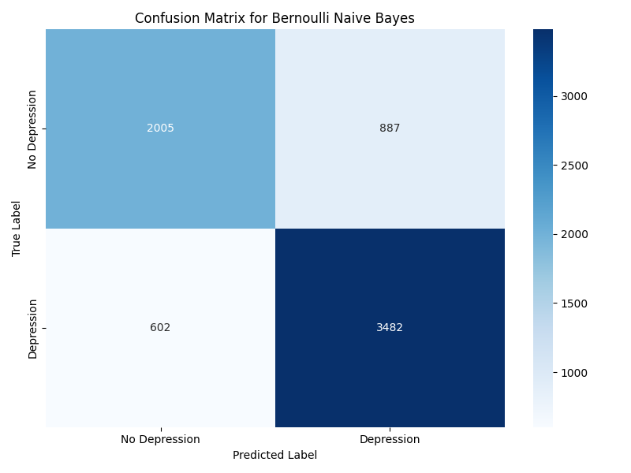

بیز ساده برنولی دقت کلی کمتری نسبت به مدل گاوسی دارد، اما فراخوانی بالاتری (85%) نشان می‌دهد. این بدان معناست که این مدل نسبت به مدل گاوسی، موارد بیشتری از افسردگی را شناسایی می‌کند، هرچند با صحت کمتر.

### اعتبارسنجی متقابل

برای ارزیابی بهتر عملکرد مدل‌ها و اطمینان از قابلیت تعمیم آنها، از اعتبارسنجی متقابل 5-لایه استفاده کردیم:

- بیز ساده گاوسی: دقت 71.2% ± 12.9%
- بیز ساده برنولی: دقت 78.6% ± 0.9%

انحراف معیار بالا در نتایج بیز ساده گاوسی نشان می‌دهد که این مدل ثبات کمتری دارد و عملکرد آن به توزیع داده‌ها در مجموعه آموزشی وابسته است. در مقابل، بیز ساده برنولی ثبات بیشتری نشان می‌دهد.

### منحنی‌های ROC

منحنی ROC نشان‌دهنده تعادل بین نرخ مثبت واقعی (True Positive Rate) و نرخ مثبت کاذب (False Positive Rate) در آستانه‌های مختلف تصمیم‌گیری است:

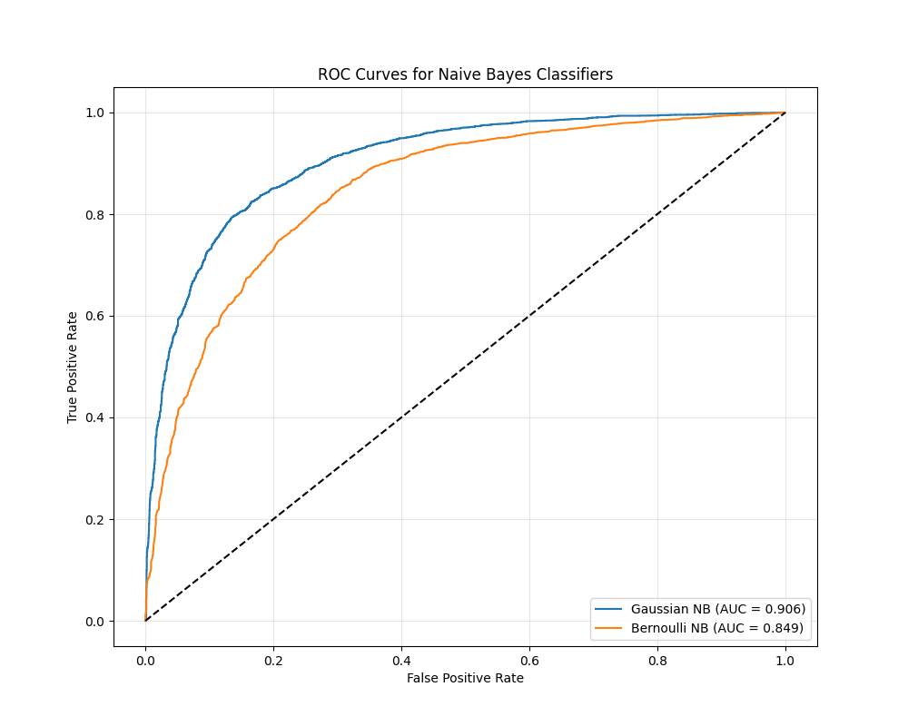

- بیز ساده گاوسی: AUC = 0.91
- بیز ساده برنولی: AUC = 0.85

AUC بالاتر برای بیز ساده گاوسی نشان می‌دهد که این مدل قدرت تشخیص بهتری بین کلاس‌ها دارد.

### اهمیت ویژگی‌ها

برخلاف درخت تصمیم، بیز ساده به طور مستقیم اهمیت ویژگی‌ها را ارائه نمی‌دهد. با این حال، می‌توان با محاسبه تفاوت میانگین ویژگی‌ها در دو کلاس، نرمال‌سازی شده با واریانس آنها، میزان تأثیر هر ویژگی را تخمین زد:


**10 ویژگی مهم در بیز ساده گاوسی:**
1. آیا تا به حال افکار خودکشی داشته‌اید؟
2. فشار تحصیلی
3. شاخص استرس ترکیبی
4. استرس مالی (5.0)
5. سن
6. ساعات کار/مطالعه
7. عادات غذایی ناسالم
8. شاخص سلامت
9. رضایت از تحصیل
10. استرس مالی (2.0)

مشابه با درخت تصمیم، "افکار خودکشی" همچنان مهم‌ترین ویژگی برای پیش‌بینی افسردگی است، که نشان‌دهنده همبستگی قوی بین این دو پدیده است.

### مقایسه با درخت تصمیم

مقایسه نتایج بیز ساده با درخت تصمیم بهینه‌شده (از گزارش قبلی):

| مدل | دقت (Accuracy) | دقت اعتبارسنجی متقابل | AUC |
|-----|----------------|------------------------|-----|
| درخت تصمیم | 82.7% | غیر قابل دسترس | غیر قابل دسترس |
| بیز ساده گاوسی | 81.4% | 71.2% | 0.91 |
| بیز ساده برنولی | 78.7% | 78.6% | 0.85 |

درخت تصمیم بهینه‌شده دقت بالاتری نسبت به هر دو مدل بیز ساده دارد. با این حال، بیز ساده گاوسی با AUC بالای 0.91 نشان‌دهنده قدرت تشخیص خوبی است. همچنین، ثبات بالای بیز ساده برنولی در اعتبارسنجی متقابل نشان‌دهنده قابلیت تعمیم خوب آن است.

### تفاوت‌های بیز ساده و درخت تصمیم

1. **رویکرد احتمالاتی در مقابل قطعی**:
   - بیز ساده: مدلی احتمالاتی که احتمال تعلق به هر کلاس را محاسبه می‌کند
   - درخت تصمیم: مدلی قطعی که بر اساس قوانین تصمیم‌گیری عمل می‌کند

2. **فرض استقلال**:
   - بیز ساده: فرض استقلال شرطی بین ویژگی‌ها
   - درخت تصمیم: بدون فرض استقلال و قادر به یادگیری تعاملات بین ویژگی‌ها

3. **قابلیت تفسیر**:
   - بیز ساده: تفسیر نسبتاً پیچیده‌تر و بر اساس احتمالات
   - درخت تصمیم: تفسیر بسیار ساده و قابل فهم با قوانین «اگر-آنگاه»

4. **نیاز به داده**:
   - بیز ساده: نیاز به داده‌های آموزشی کمتر
   - درخت تصمیم: معمولاً نیاز به داده‌های آموزشی بیشتر برای عملکرد بهتر

### کاربردهای عملی

بر اساس نتایج بیز ساده، می‌توان چندین کاربرد عملی را پیشنهاد داد:

1. **سیستم هشدار اولیه**: با توجه به فراخوانی بالای بیز ساده برنولی (85%)، این مدل می‌تواند برای شناسایی اولیه دانشجویان در معرض خطر افسردگی استفاده شود.

2. **پیش‌بینی احتمالاتی**: برخلاف درخت تصمیم، بیز ساده احتمال دقیق‌تری از وقوع افسردگی ارائه می‌دهد که برای ارزیابی ریسک مفید است.

3. **تریاژ روانشناختی**: با استفاده از بیز ساده می‌توان دانشجویان را بر اساس احتمال افسردگی اولویت‌بندی کرد و منابع محدود مشاوره را به مؤثرترین شکل تخصیص داد.

4. **ترکیب با مدل‌های دیگر**: ترکیب پیش‌بینی‌های بیز ساده با درخت تصمیم می‌تواند به سیستمی با دقت بالاتر منجر شود.

### تابع پیش‌بینی

برای استفاده عملی از مدل بیز ساده، یک تابع پیش‌بینی ایجاد کرده‌ایم:

```python
def predict_depression_nb(sample_data, model=best_nb_model, scaler=scaler, features=features):
    # تبدیل داده‌های نمونه به آرایه با ترتیب صحیح
    sample_array = np.array([sample_data.get(feature, 0) for feature in features]).reshape(1, -1)
    
    # مقیاس‌بندی نمونه
    sample_scaled = scaler.transform(sample_array)
    
    # پیش‌بینی
    prediction = model.predict(sample_scaled)[0]
    probability = model.predict_proba(sample_scaled)[0][1]
    
    return prediction, probability
```

### محدودیت‌ها و پیشنهادات برای بهبود

1. **بهبود فرض استقلال**:
   - استفاده از روش‌های پیشرفته‌تر مانند شبکه‌های بیزی (Bayesian Networks) که روابط بین ویژگی‌ها را در نظر می‌گیرند
   - پیش‌پردازش داده‌ها برای کاهش همبستگی بین ویژگی‌ها

2. **ترکیب مدل‌ها**:
   - استفاده از روش‌های ensemble مانند voting یا stacking برای ترکیب بیز ساده با درخت تصمیم
   - ایجاد مدل‌های مختلف برای زیرگروه‌های مختلف دانشجویان

3. **بهبود ویژگی‌ها**:
   - تبدیل ویژگی‌های پیوسته به گسسته برای بهبود عملکرد بیز ساده برنولی
   - انتخاب هوشمندانه‌تر ویژگی‌ها برای کاهش اثر ویژگی‌های همبسته

4. **ارزیابی جامع‌تر**:
   - استفاده از معیارهای ارزیابی بیشتر مانند Brier score برای ارزیابی کیفیت احتمالات پیش‌بینی شده
   - ارزیابی عملکرد مدل در زیرگروه‌های مختلف دانشجویان

### نتیجه‌گیری

در این گزارش، عملکرد دو نوع طبقه‌بندی بیز ساده (گاوسی و برنولی) را برای پیش‌بینی افسردگی در دانشجویان بررسی کردیم. بیز ساده گاوسی با دقت 81.4% و AUC 0.91 عملکرد قابل قبولی داشت، هرچند در مقایسه با درخت تصمیم بهینه‌شده (82.7%) کمی ضعیف‌تر عمل کرد. بیز ساده برنولی با فراخوانی بالاتر (85%) و ثبات بیشتر در اعتبارسنجی متقابل، گزینه مناسبی برای سیستم‌های هشدار اولیه است.

تحلیل اهمیت ویژگی‌ها در بیز ساده نیز مشابه با درخت تصمیم، اهمیت "افکار خودکشی"، "فشار تحصیلی" و "شاخص استرس ترکیبی" را در پیش‌بینی افسردگی تأیید کرد. این همگرایی نتایج از دو روش مختلف، اعتبار یافته‌ها را افزایش می‌دهد.

رویکرد احتمالاتی بیز ساده مکمل خوبی برای رویکرد قطعی درخت تصمیم است و ترکیب آنها می‌تواند به درک بهتر و مدیریت مؤثرتر افسردگی در دانشجویان کمک کند. همچنین، سادگی و سرعت بالای بیز ساده آن را برای استفاده در سیستم‌های بلادرنگ و محیط‌های با منابع محاسباتی محدود مناسب می‌سازد. 
