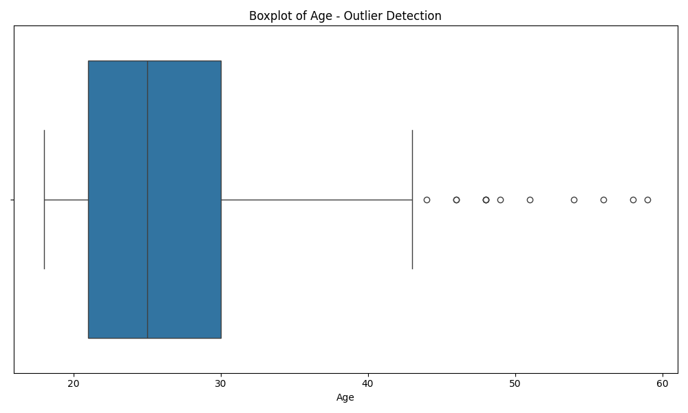
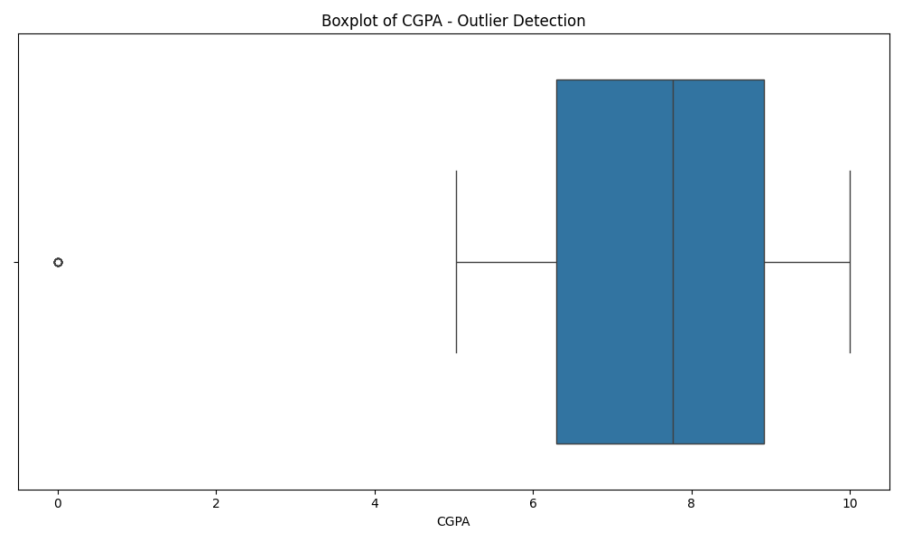

# گزارش پیش‌پردازش داده‌های افسردگی دانشجویان
## پاکسازی و تبدیل داده‌ها

### مقدمه
این گزارش شرح مراحل پیش‌پردازش داده‌ها (شامل پاکسازی و تبدیل) برای مجموعه داده افسردگی دانشجویان را ارائه می‌دهد. این مراحل برای آماده‌سازی داده‌ها جهت استفاده در الگوریتم‌های یادگیری ماشین مانند خوشه‌بندی (DBSCAN، K-means) و طبقه‌بندی (ID3، بیزین) ضروری است.

مجموعه داده اصلی شامل ۲۷،۹۰۱ رکورد با ۱۸ متغیر است که پس از پیش‌پردازش به ۲۹ متغیر افزایش یافته است.

### کد آماده‌سازی محیط و بارگذاری داده‌ها

در ابتدا، کتابخانه‌های مورد نیاز را وارد می‌کنیم و پوشه‌هایی برای ذخیره نتایج ایجاد می‌کنیم:

```python
import pandas as pd
import numpy as np
import matplotlib.pyplot as plt
import seaborn as sns
from sklearn.preprocessing import StandardScaler, LabelEncoder, OneHotEncoder
from sklearn.compose import ColumnTransformer
import os

# ایجاد پوشه‌ها برای ذخیره داده‌های پیش‌پردازش شده و تصاویر
os.makedirs('processed_data', exist_ok=True)
os.makedirs('cleaning_plots', exist_ok=True)

# بارگذاری مجموعه داده و ایجاد یک کپی برای پیش‌پردازش
df = pd.read_csv('student_depression_dataset.csv')
df_processed = df.copy()

print(f"Original dataset shape: {df.shape}")
```

این کد کتابخانه‌های ضروری برای تحلیل داده و پیش‌پردازش را وارد می‌کند. از `pandas` و `numpy` برای کار با داده‌ها، از `matplotlib` و `seaborn` برای تجسم، و از `sklearn` برای الگوریتم‌های پیش‌پردازش استفاده می‌کنیم. ایجاد پوشه‌ها با استفاده از `os.makedirs` برای سازماندهی فایل‌های خروجی انجام می‌شود.

### مرحله ۱: پاکسازی داده‌ها

#### بررسی و حذف رکوردهای تکراری

```python
# بررسی رکوردهای تکراری
duplicates = df_processed.duplicated().sum()
print(f"Number of duplicate records: {duplicates}")
if duplicates > 0:
    df_processed = df_processed.drop_duplicates()
    print(f"After removing duplicates: {df_processed.shape}")
```

این کد از روش `.duplicated()` پانداس برای شناسایی ردیف‌های تکراری استفاده می‌کند. اگر رکوردهای تکراری پیدا شود، با استفاده از روش `.drop_duplicates()` آنها را حذف می‌کند.

در بررسی اولیه، هیچ رکورد تکراری در مجموعه داده یافت نشد.

#### تشخیص و اصلاح مقادیر پرت (اوتلایر)

```python
# شناسایی متغیرهای عددی برای بررسی مقادیر پرت
numeric_cols = ['Age', 'Academic Pressure', 'Work Pressure', 'CGPA', 
                'Study Satisfaction', 'Job Satisfaction', 'Work/Study Hours']

print("\nChecking for outliers and inconsistent values in numeric columns...")
for col in numeric_cols:
    # چاپ دامنه و بررسی مقادیر غیرعادی
    min_val = df_processed[col].min()
    max_val = df_processed[col].max()
    print(f"{col}: Range [{min_val}, {max_val}]")
    
    # شناسایی مقادیر پرت احتمالی با استفاده از روش IQR
    Q1 = df_processed[col].quantile(0.25)
    Q3 = df_processed[col].quantile(0.75)
    IQR = Q3 - Q1
    lower_bound = Q1 - 1.5 * IQR
    upper_bound = Q3 + 1.5 * IQR
    outliers = df_processed[(df_processed[col] < lower_bound) | (df_processed[col] > upper_bound)]
    
    if not outliers.empty:
        print(f"  Found {len(outliers)} potential outliers in {col}")
        
        # تجسم مقادیر پرت
        plt.figure(figsize=(10, 6))
        sns.boxplot(x=df_processed[col])
        plt.title(f'Boxplot of {col} - Outlier Detection')
        plt.tight_layout()
        plt.savefig(f'cleaning_plots/outliers_{col.replace("/", "_")}.png')
        plt.close()
        
        # محدود کردن مقادیر پرت به مقادیر مرزی (جایگزین حذف)
        df_processed[col] = df_processed[col].clip(lower_bound, upper_bound)
        print(f"  Outliers in {col} capped to [{lower_bound:.2f}, {upper_bound:.2f}]")
```

این کد از روش محدوده بین چارکی (IQR) برای شناسایی مقادیر پرت استفاده می‌کند. برای هر متغیر عددی، چارک اول (Q1) و چارک سوم (Q3) محاسبه می‌شود. سپس دامنه حدی پایین (Q1 - 1.5*IQR) و بالا (Q3 + 1.5*IQR) تعیین می‌شود. مقادیری که خارج از این محدوده قرار دارند به عنوان مقادیر پرت شناسایی می‌شوند.

از تابع `clip()` پانداس برای محدود کردن مقادیر پرت به حدود تعیین شده استفاده می‌کنیم. این روش به جای حذف کامل داده‌های پرت، آنها را به مقادیر مرزی تبدیل می‌کند که برای حفظ حجم داده‌ها مفید است.

با استفاده از روش دامنه میان چارکی (IQR)، مقادیر پرت در متغیرهای عددی شناسایی و اصلاح شدند:

1. **سن (Age)**:
   - ۱۲ مقدار پرت شناسایی شد
   - مقادیر به محدوده [۷.۵۰، ۴۳.۵۰] محدود شدند
   - نمودار جعبه‌ای برای تشخیص مقادیر پرت:
   
   

2. **فشار کاری (Work Pressure)**:
   - ۳ مقدار پرت شناسایی شد
   - مقادیر به محدوده [۰.۰۰، ۰.۰۰] محدود شدند
   - نمودار جعبه‌ای برای تشخیص مقادیر پرت:
   
   

3. **معدل (CGPA)**:
   - ۹ مقدار پرت شناسایی شد
   - مقادیر به محدوده [۲.۳۵، ۱۲.۸۷] محدود شدند
   - نمودار جعبه‌ای برای تشخیص مقادیر پرت:
   
   

4. **رضایت شغلی (Job Satisfaction)**:
   - ۸ مقدار پرت شناسایی شد
   - مقادیر به محدوده [۰.۰۰، ۰.۰۰] محدود شدند
   - نمودار جعبه‌ای برای تشخیص مقادیر پرت:
   
   

#### بررسی ناسازگاری‌های منطقی

```python
# بررسی ناسازگاری‌های منطقی
print("\nChecking for logical inconsistencies...")

# ساعات کار/مطالعه باید بین 0 و 24 ساعت باشد
invalid_hours = df_processed[df_processed['Work/Study Hours'] > 24]
if not invalid_hours.empty:
    print(f"Found {len(invalid_hours)} records with Work/Study Hours > 24")
    df_processed.loc[df_processed['Work/Study Hours'] > 24, 'Work/Study Hours'] = 24
    print("  Capped Work/Study Hours to 24")

# سن باید در محدوده منطقی برای دانشجویان باشد (مثلاً 16 تا 80)
invalid_age = df_processed[(df_processed['Age'] < 16) | (df_processed['Age'] > 80)]
if not invalid_age.empty:
    print(f"Found {len(invalid_age)} records with unusual Age values")
    df_processed['Age'] = df_processed['Age'].clip(16, 80)
    print("  Capped Age to [16, 80]")

# معدل باید بین 0 و 10 باشد (با فرض مقیاس 10 نمره‌ای بر اساس داده‌ها)
if df_processed['CGPA'].max() > 10:
    print(f"Found CGPA values > 10, maximum value: {df_processed['CGPA'].max()}")
    df_processed['CGPA'] = df_processed['CGPA'].clip(0, 10)
    print("  Capped CGPA to [0, 10]")
```

این کد محدودیت‌های منطقی مهمی را برای متغیرهای کلیدی بررسی می‌کند:
- ساعات کار/مطالعه نباید بیشتر از 24 ساعت در روز باشد
- سن دانشجویان باید در محدوده منطقی (16 تا 80 سال) باشد
- معدل (CGPA) باید بین 0 تا 10 (با فرض سیستم نمره‌دهی 10 نمره‌ای) باشد

اگر مقادیری خارج از این محدوده‌ها یافت شود، از توابع `.clip()` یا `.loc[]` برای محدود کردن مقادیر به محدوده‌های منطقی استفاده می‌شود.

بررسی‌هایی برای تشخیص مقادیر غیرمنطقی در داده‌ها انجام شد:

1. **ساعات کار/مطالعه**: بررسی شد که مقادیر بیش از ۲۴ ساعت در روز نباشد (موردی یافت نشد)
2. **سن**: بررسی شد که سن بین محدوده منطقی ۱۶ تا ۸۰ سال باشد (موردی یافت نشد)
3. **معدل**: بررسی شد که معدل بین ۰ تا ۱۰ باشد (موردی یافت نشد)

#### بررسی مقادیر صفر که می‌توانند نشان‌دهنده داده‌های گمشده باشند

```python
# بررسی مقادیر صفر که ممکن است نشان‌دهنده داده‌های گمشده باشند
print("\nChecking for zero values that might represent missing data...")
for col in numeric_cols:
    zero_count = (df_processed[col] == 0).sum()
    zero_percentage = (zero_count / len(df_processed)) * 100
    if zero_percentage > 1:  # اگر بیش از 1% مقادیر صفر باشند
        print(f"{col}: {zero_count} zeros ({zero_percentage:.2f}%)")
```

این کد برای شناسایی الگوهای غیرعادی مقادیر صفر در متغیرهای عددی استفاده می‌شود. مقادیر صفر ممکن است نشان‌دهنده داده‌های گمشده باشند که به جای NaN به عنوان صفر ثبت شده‌اند. برای هر متغیر عددی، کد تعداد و درصد مقادیر صفر را محاسبه می‌کند و آنهایی که بیش از 1% داده‌ها را تشکیل می‌دهند گزارش می‌شوند.

الگوهای قابل توجهی از مقادیر صفر شناسایی شدند:

1. **فشار کاری (Work Pressure)**: ۱۰۰٪ مقادیر صفر هستند
2. **رضایت شغلی (Job Satisfaction)**: ۱۰۰٪ مقادیر صفر هستند
3. **ساعات کار/مطالعه (Work/Study Hours)**: ۶.۰۹٪ مقادیر صفر هستند

مقادیر صفر در فشار کاری و رضایت شغلی نشان می‌دهد که این مجموعه داده احتمالاً فقط شامل دانشجویان بدون شغل است.

### مرحله ۲: تبدیل داده‌ها

#### استاندارد‌سازی متغیرهای عددی

```python
# استاندارد‌سازی متغیرهای عددی
print("\nStandardizing numeric features...")
scaler = StandardScaler()
df_processed[numeric_cols] = scaler.fit_transform(df_processed[numeric_cols])
print(f"Standardized {len(numeric_cols)} numeric columns")
```

این کد از `StandardScaler` کتابخانه scikit-learn برای استاندارد کردن متغیرهای عددی استفاده می‌کند. استاندارد‌سازی فرآیندی است که میانگین هر متغیر را به صفر و انحراف معیار آن را به یک تبدیل می‌کند:
- `X_std = (X - μ) / σ`
که در آن μ میانگین و σ انحراف معیار است.

استاندارد‌سازی متغیرها به ویژه برای الگوریتم‌های یادگیری ماشین مانند K-means و DBSCAN که به مقیاس متغیرها حساس هستند، بسیار مهم است. این کار اطمینان می‌دهد که متغیرهای با مقیاس‌های بزرگتر تأثیر نامتناسبی بر نتایج نداشته باشند.

تمامی ۷ متغیر عددی با استفاده از `StandardScaler` استاندارد شدند تا میانگین صفر و انحراف معیار یک داشته باشند:

- سن (Age)
- فشار تحصیلی (Academic Pressure)
- فشار کاری (Work Pressure)
- معدل (CGPA)
- رضایت از تحصیل (Study Satisfaction)
- رضایت شغلی (Job Satisfaction)
- ساعات کار/مطالعه (Work/Study Hours)

این استاندارد‌سازی برای بهبود عملکرد الگوریتم‌های مبتنی بر فاصله مانند K-means و DBSCAN ضروری است.

#### کدگذاری متغیرهای کیفی

```python
# شناسایی متغیرهای کیفی
categorical_cols = ['Gender', 'City', 'Profession', 'Sleep Duration', 
                   'Dietary Habits', 'Degree', 'Have you ever had suicidal thoughts ?',
                   'Financial Stress', 'Family History of Mental Illness']

print("\nEncoding categorical variables...")
for col in categorical_cols:
    print(f"Processing {col}...")
    # بررسی تعداد مقادیر منحصر به فرد
    n_unique = df_processed[col].nunique()
    print(f"  {n_unique} unique values")
    
    # برای متغیرهای دودویی، از کدگذاری برچسب ساده استفاده می‌کنیم
    if n_unique == 2:
        le = LabelEncoder()
        df_processed[col] = le.fit_transform(df_processed[col])
        print(f"  Applied label encoding to {col}")
        mapping = dict(zip(le.classes_, le.transform(le.classes_)))
        print(f"  Mapping: {mapping}")
    
    # برای متغیرهای با تعداد محدود طبقات، از کدگذاری یک‌در‌یک استفاده می‌کنیم
    elif n_unique <= 10:
        # ایجاد متغیرهای مصنوعی و حذف اولین ستون برای جلوگیری از هم‌خطی
        dummies = pd.get_dummies(df_processed[col], prefix=col, drop_first=True)
        df_processed = pd.concat([df_processed, dummies], axis=1)
        df_processed.drop(col, axis=1, inplace=True)
        print(f"  Applied one-hot encoding to {col}, created {len(dummies.columns)} new features")
    
    # برای متغیرهای با تعداد زیاد طبقات، از کدگذاری فراوانی استفاده می‌کنیم
    else:
        # ایجاد نقشه فراوانی
        freq_map = df_processed[col].value_counts(normalize=True).to_dict()
        df_processed[f'{col}_freq'] = df_processed[col].map(freq_map)
        df_processed.drop(col, axis=1, inplace=True)
        print(f"  Applied frequency encoding to {col}")
```

این کد از سه روش مختلف کدگذاری برای متغیرهای کیفی استفاده می‌کند:

1. **کدگذاری برچسب (Label Encoding)**: برای متغیرهای دودویی (با دو مقدار منحصر به فرد) از `LabelEncoder` استفاده می‌شود. این روش مقادیر کیفی را به اعداد 0 و 1 تبدیل می‌کند.

2. **کدگذاری یک‌در‌یک (One-Hot Encoding)**: برای متغیرهای با تعداد کم طبقات (10 یا کمتر)، از `pd.get_dummies` استفاده می‌شود. این روش برای هر طبقه یک ستون جدید ایجاد می‌کند که مقدار 0 یا 1 دارد. اولین ستون حذف می‌شود تا از مشکل هم‌خطی جلوگیری شود.

3. **کدگذاری فراوانی (Frequency Encoding)**: برای متغیرهای با تعداد زیاد طبقات، از روش کدگذاری فراوانی استفاده می‌شود. این روش هر طبقه را با فراوانی نسبی آن در مجموعه داده جایگزین می‌کند.

متغیرهای کیفی با روش‌های مختلف کدگذاری شدند:

1. **کدگذاری برچسب (Label Encoding) برای متغیرهای دودویی**:
   - جنسیت (Gender): `{'Female': 0, 'Male': 1}`
   - افکار خودکشی (Have you ever had suicidal thoughts?): `{'No': 0, 'Yes': 1}`
   - سابقه خانوادگی بیماری روانی (Family History of Mental Illness): `{'No': 0, 'Yes': 1}`

2. **کدگذاری یک‌در‌یک (One-Hot Encoding) برای متغیرهای با تعداد کم طبقات**:
   - مدت زمان خواب (Sleep Duration): ۴ ستون جدید ایجاد شد
   - عادات غذایی (Dietary Habits): ۳ ستون جدید ایجاد شد
   - استرس مالی (Financial Stress): ۵ ستون جدید ایجاد شد

3. **کدگذاری فراوانی (Frequency Encoding) برای متغیرهای با تعداد زیاد طبقات**:
   - شهر (City): ۵۲ مقدار منحصر به فرد
   - حرفه (Profession): ۱۴ مقدار منحصر به فرد
   - مدرک تحصیلی (Degree): ۲۸ مقدار منحصر به فرد

#### مهندسی ویژگی

```python
# ایجاد ویژگی‌های مهندسی شده
print("\nCreating engineered features...")

# شاخص استرس ترکیبی (ترکیب فشار تحصیلی و فشار کاری)
if 'Academic Pressure' in df_processed.columns and 'Work Pressure' in df_processed.columns:
    df_processed['Combined_Stress_Index'] = (df_processed['Academic Pressure'] + df_processed['Work Pressure']) / 2
    print("Created Combined_Stress_Index")

# شاخص بهزیستی (ترکیب رضایت از تحصیل و رضایت شغلی)
if 'Study Satisfaction' in df_processed.columns and 'Job Satisfaction' in df_processed.columns:
    df_processed['Well_being_Index'] = (df_processed['Study Satisfaction'] + df_processed['Job Satisfaction']) / 2
    print("Created Well_being_Index")
```

این کد ویژگی‌های جدیدی را با ترکیب متغیرهای موجود ایجاد می‌کند. مهندسی ویژگی فرآیند ایجاد متغیرهای جدید بر اساس متغیرهای موجود است که می‌تواند به الگوریتم‌های یادگیری ماشین کمک کند الگوهای پنهان را بهتر تشخیص دهند.

دو ویژگی مهندسی شده ایجاد شده‌اند:
1. **شاخص استرس ترکیبی (Combined_Stress_Index)**: میانگین فشار تحصیلی و فشار کاری
2. **شاخص بهزیستی (Well_being_Index)**: میانگین رضایت از تحصیل و رضایت شغلی

ویژگی‌های جدیدی از ترکیب متغیرهای موجود ایجاد شدند:

1. **شاخص استرس ترکیبی (Combined_Stress_Index)**:
   - میانگین فشار تحصیلی و فشار کاری
   - فرمول: `(Academic Pressure + Work Pressure) / 2`

2. **شاخص بهزیستی (Well_being_Index)**:
   - میانگین رضایت از تحصیل و رضایت شغلی
   - فرمول: `(Study Satisfaction + Job Satisfaction) / 2`

#### ذخیره‌سازی نتایج و خلاصه‌سازی

```python
# ذخیره داده‌های پیش‌پردازش شده
processed_file = 'processed_data/student_depression_processed.csv'
df_processed.to_csv(processed_file, index=False)
print(f"\nProcessed data saved to {processed_file}")
print(f"Final dataset shape: {df_processed.shape}")

# خلاصه تبدیلات
print("\nSummary of Transformations Applied:")
print("1. Removed duplicates (if any)")
print("2. Handled outliers by capping")
print("3. Fixed logical inconsistencies")
print("4. Standardized numeric features")
print("5. Encoded categorical variables")
print("6. Created engineered features")

# چاپ چند سطر اول مجموعه داده پیش‌پردازش شده
print("\nFirst few rows of processed dataset:")
print(df_processed.head(3))
print("\nColumn list of processed dataset:")
print(df_processed.columns.tolist())
```

این بخش نهایی کد، داده‌های پیش‌پردازش شده را ذخیره می‌کند، خلاصه‌ای از تبدیلات انجام شده ارائه می‌دهد، و نمونه‌ای از داده‌های نهایی را نمایش می‌دهد. این اطلاعات برای درک تغییرات انجام شده و شکل نهایی مجموعه داده مفید است.

### نتایج پیش‌پردازش

#### مجموعه داده نهایی
- تعداد رکوردها: ۲۷،۹۰۱ (بدون تغییر)
- تعداد متغیرها: ۲۹ (افزایش از ۱۸ متغیر اصلی)
- مسیر ذخیره‌سازی: `processed_data/student_depression_processed.csv`

#### فهرست متغیرهای نهایی
```
['id', 'Gender', 'Age', 'Academic Pressure', 'Work Pressure', 'CGPA', 'Study Satisfaction', 
'Job Satisfaction', 'Have you ever had suicidal thoughts ?', 'Work/Study Hours', 
'Family History of Mental Illness', 'Depression', 'City_freq', 'Profession_freq', 
"Sleep Duration_'7-8 hours'", "Sleep Duration_'Less than 5 hours'", "Sleep Duration_'More than 8 hours'", 
'Sleep Duration_Others', 'Dietary Habits_Moderate', 'Dietary Habits_Others', 'Dietary Habits_Unhealthy', 
'Degree_freq', 'Financial Stress_2.0', 'Financial Stress_3.0', 'Financial Stress_4.0', 
'Financial Stress_5.0', 'Financial Stress_?', 'Combined_Stress_Index', 'Well_being_Index']
```

### خلاصه تبدیلات انجام شده
1. **حذف رکوردهای تکراری** (در صورت وجود)
2. **مدیریت مقادیر پرت** با محدود کردن آنها به مرزهای تعیین شده
3. **اصلاح ناسازگاری‌های منطقی** در متغیرها
4. **استاندارد‌سازی متغیرهای عددی** برای داشتن میانگین صفر و انحراف معیار یک
5. **کدگذاری متغیرهای کیفی** با روش‌های مناسب
6. **ایجاد ویژگی‌های مهندسی شده** برای بهبود قدرت پیش‌بینی مدل‌ها

### نتیجه‌گیری
مجموعه داده پیش‌پردازش شده اکنون برای استفاده در الگوریتم‌های یادگیری ماشین آماده است. مقادیر پرت و ناسازگاری‌ها اصلاح شده‌اند، متغیرهای عددی استاندارد شده‌اند، و متغیرهای کیفی به فرمت مناسب برای تحلیل تبدیل شده‌اند.

این پیش‌پردازش به ویژه برای الگوریتم‌های خوشه‌بندی مانند K-means و DBSCAN مهم است، زیرا این الگوریتم‌ها به مقیاس متغیرها حساس هستند. همچنین، کدگذاری مناسب متغیرهای کیفی برای الگوریتم‌های طبقه‌بندی مانند ID3 و بیزین ضروری است.

ویژگی‌های مهندسی شده جدید ممکن است رابطه‌های پنهان بین متغیرها را آشکار کنند و به بهبود عملکرد مدل‌های پیش‌بینی کمک کنند. 