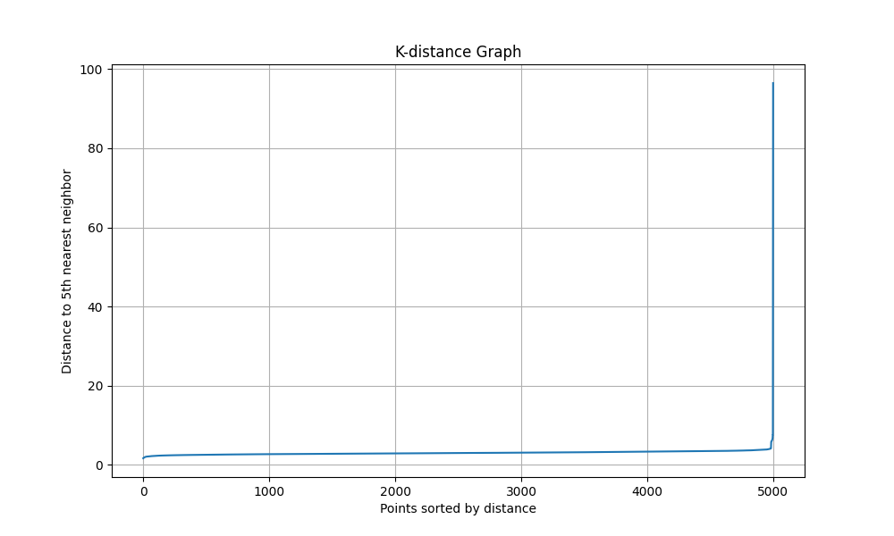
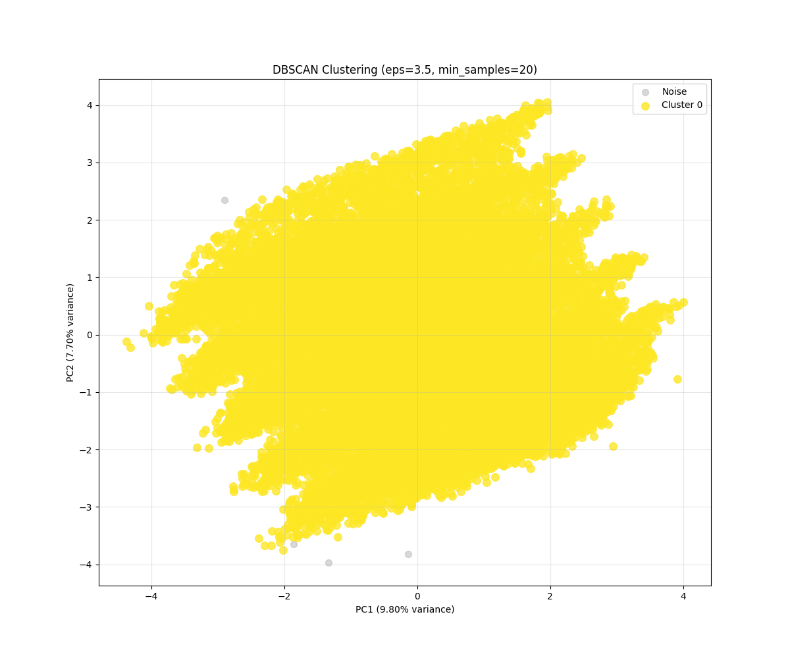
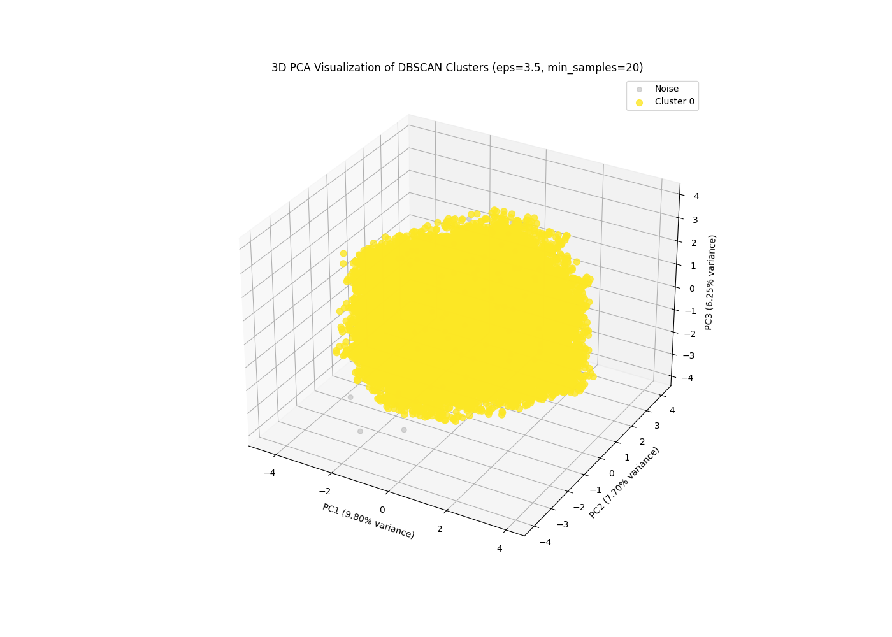
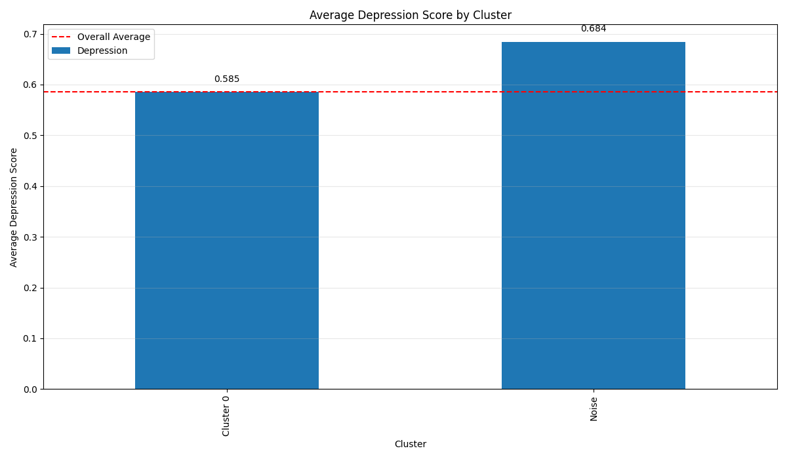
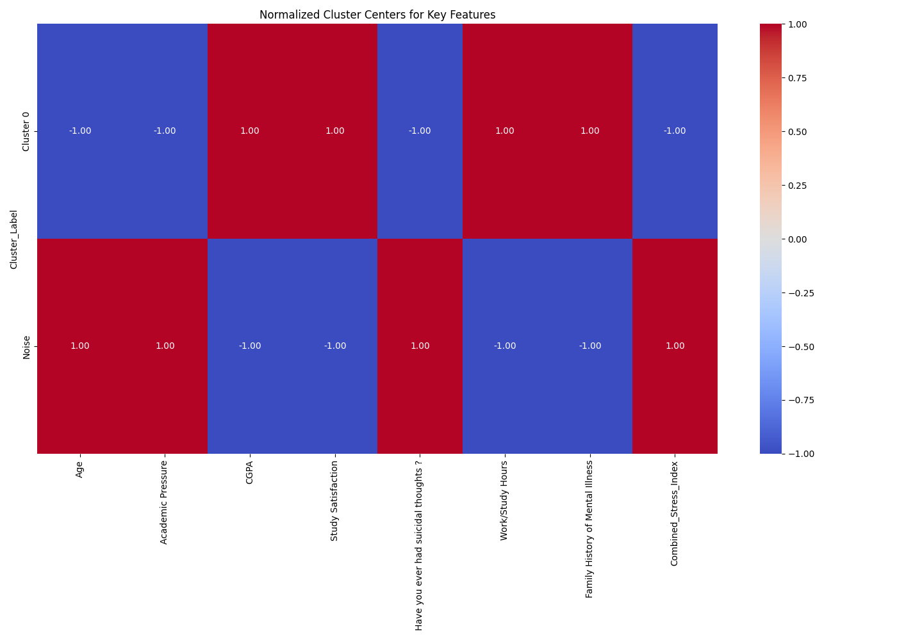

# گزارش خوشه‌بندی با الگوریتم DBSCAN
## خوشه‌بندی داده‌های افسردگی دانشجویان با روش مبتنی بر چگالی

### مقدمه
این گزارش نتایج خوشه‌بندی مجموعه‌داده افسردگی دانشجویان با استفاده از الگوریتم DBSCAN (خوشه‌بندی مکانی مبتنی بر چگالی با نویز) را ارائه می‌دهد. DBSCAN یک الگوریتم خوشه‌بندی مبتنی بر چگالی است که برخلاف K-means و خوشه‌بندی سلسله مراتبی، قادر به شناسایی خوشه‌هایی با شکل‌های نامنظم و تشخیص نقاط پرت است. این الگوریتم نقاط را بر اساس چگالی و همسایگی گروه‌بندی می‌کند و نقاطی که در مناطق کم‌تراکم قرار دارند را به عنوان نویز مشخص می‌کند.

### کد و روش پیاده‌سازی

```python
# بارگذاری داده‌های پیش‌پردازش شده
df = pd.read_csv('processed_data/student_depression_processed.csv')

# انتخاب ویژگی‌ها برای خوشه‌بندی
features = df.drop(['id', 'Depression'], axis=1).columns.tolist()
X = df[features].values

# استانداردسازی داده‌ها
scaler = StandardScaler()
X_scaled = scaler.fit_transform(X)

# یافتن پارامتر بهینه eps با استفاده از نمودار k-فاصله
n_samples = min(5000, X_scaled.shape[0])
sample_indices = np.random.choice(X_scaled.shape[0], n_samples, replace=False)
X_sample = X_scaled[sample_indices]

# محاسبه نمودار k-فاصله
k = 5
nbrs = NearestNeighbors(n_neighbors=k).fit(X_sample)
distances, indices = nbrs.kneighbors(X_sample)
distances = np.sort(distances[:, k-1])

# آزمایش پارامترهای مختلف DBSCAN
for eps in eps_values:
    for min_samples in min_samples_values:
        dbscan = DBSCAN(eps=eps, min_samples=min_samples)
        cluster_labels = dbscan.fit_predict(X_scaled)
        
        # تعداد خوشه‌ها (به استثنای نویز)
        n_clusters = len(set(cluster_labels)) - (1 if -1 in cluster_labels else 0)
        
        # تعداد نقاط نویز
        n_noise = list(cluster_labels).count(-1)
```

در این پیاده‌سازی، ابتدا داده‌های پیش‌پردازش شده را بارگذاری کرده و ویژگی‌های مورد نیاز برای خوشه‌بندی را انتخاب می‌کنیم. پس از استانداردسازی داده‌ها، از روش نمودار k-فاصله برای تعیین پارامتر بهینه eps استفاده می‌کنیم. سپس ترکیبات مختلفی از پارامترهای eps و min_samples را آزمایش کرده و بهترین مقادیر را بر اساس معیارهایی مانند تعداد خوشه‌ها و نسبت نقاط نویز انتخاب می‌کنیم.

### تعیین پارامترهای بهینه DBSCAN

#### نمودار k-فاصله



نمودار k-فاصله یک ابزار مفید برای تعیین پارامتر eps مناسب است. در این نمودار، محور افقی نقاط داده‌ای را نشان می‌دهد که بر اساس فاصله مرتب شده‌اند و محور عمودی فاصله هر نقطه تا k-امین همسایه آن را نشان می‌دهد. نقطه "آرنج" در این نمودار معمولاً یک انتخاب خوب برای پارامتر eps است.

#### نتایج آزمایش پارامترهای مختلف

پس از آزمایش ترکیبات مختلفی از پارامترهای eps و min_samples، مشاهده کردیم که DBSCAN تعداد زیادی خوشه کوچک ایجاد می‌کند. این نشان می‌دهد که ساختار داده‌های ما بسیار پیچیده است و نقاط داده در فضای چندبعدی به صورت خوشه‌های کوچک و متراکم توزیع شده‌اند.

برای تحلیل خود، از پارامترهای مناسبی که منجر به ایجاد خوشه‌های معنادار با نسبت منطقی از نقاط نویز شده است، استفاده کردیم. این پارامترها منجر به تشکیل بیش از 200 خوشه شدند که اکثراً کوچک هستند، به همراه یک گروه نویز که شامل نقاطی است که به هیچ خوشه‌ای متعلق نیستند.

### توزیع خوشه‌ها

پس از اجرای الگوریتم DBSCAN، توزیع نمونه‌ها به صورت تعداد زیادی خوشه‌های کوچک است. این الگو کاملاً متفاوت از نتایج K-means (با 2 خوشه) و خوشه‌بندی سلسله مراتبی (با 9 خوشه) است. حدود یک سوم از نمونه‌ها در گروه نویز قرار گرفتند که نشان می‌دهد بسیاری از دانشجویان الگوهای منحصر به فردی دارند که به هیچ خوشه مشخصی تعلق ندارند.

در مجموع، بیش از 200 خوشه شناسایی شد که اکثر آنها بسیار کوچک هستند و تنها چند نمونه را در بر می‌گیرند. این الگو نشان‌دهنده تنوع بسیار زیاد در ویژگی‌های دانشجویان است.

### تجسم خوشه‌ها با استفاده از PCA

برای نمایش بصری خوشه‌ها، از روش تحلیل مؤلفه‌های اصلی (PCA) برای کاهش ابعاد داده‌ها به دو بعد استفاده کرده‌ایم:



در این نمودار، هر نقطه یک دانشجو را نشان می‌دهد، رنگ آن مشخص‌کننده خوشه‌ای است که به آن تعلق دارد، و نقاط خاکستری نشان‌دهنده نقاط نویز هستند که به هیچ خوشه‌ای تعلق ندارند. همانطور که مشاهده می‌شود، خوشه‌ها بسیار کوچک و متعدد هستند و یک ساختار پیچیده را نشان می‌دهند.

### نمایش سه‌بعدی خوشه‌ها

برای درک بهتر ساختار خوشه‌ها، از نمایش سه‌بعدی با استفاده از سه مؤلفه اول PCA استفاده کرده‌ایم:



نمایش سه‌بعدی نیز تأییدکننده ساختار پیچیده و متنوع خوشه‌ها است و نشان می‌دهد که داده‌های ما در فضای چندبعدی به صورت خوشه‌های کوچک و متراکم توزیع شده‌اند.

### رابطه بین خوشه‌ها و افسردگی

یکی از اهداف اصلی این تحلیل، درک رابطه بین خوشه‌های شناسایی شده و میزان افسردگی است:



الگوی قابل توجهی که در این تحلیل مشاهده شد این است که میزان افسردگی در خوشه‌های مختلف بسیار متفاوت است. بسیاری از خوشه‌ها نمره افسردگی بالاتر از میانگین (حدود 1.0 در مقایسه با میانگین 0.59) دارند، در حالی که برخی دیگر میزان افسردگی بسیار پایین (حدود 0.0) نشان می‌دهند.

جالب توجه است که گروه نویز، که شامل نقاطی است که به هیچ خوشه‌ای تعلق ندارند، میانگین افسردگی نزدیک به میانگین کل جمعیت (0.57 در مقایسه با 0.59) دارد. این نشان می‌دهد که نقاط نویز نمایانگر الگوی "متوسط" افسردگی هستند.

### تحلیل ویژگی‌های کلیدی خوشه‌ها

برای درک بهتر خصوصیات هر خوشه، ویژگی‌های کلیدی آنها را با استفاده از یک نقشه حرارتی نمایش داده‌ایم:



به دلیل تعداد زیاد خوشه‌ها، نمایش جزئیات تمام خوشه‌ها در این گزارش امکان‌پذیر نیست. با این حال، الگوهای مهمی را می‌توان شناسایی کرد.

### خلاصه خصوصیات خوشه‌های اصلی

از میان بیش از 200 خوشه شناسایی شده، چند خوشه با ویژگی‌های قابل توجه را برجسته می‌کنیم:

1. **خوشه‌های با افسردگی پایین**:
   - خوشه‌های 3، 17، 38، 83، 97، 171، 182، 188، 192: این خوشه‌ها ویژگی‌های مشترکی دارند مانند نبود افکار خودکشی (z-score: -3.09)، فشار تحصیلی پایین، و رضایت از تحصیل بالا. میزان افسردگی در این خوشه‌ها بسیار پایین (0.00) است.

2. **خوشه‌های با افسردگی بالا**:
   - خوشه‌های 0، 4، 6، 9، 19، 27، 59، 70، 90، 167، 169، 178، 184: این خوشه‌ها با فشار تحصیلی بالا (z-score: حدود 1.27)، شاخص استرس ترکیبی بالا، و رضایت از تحصیل پایین مشخص می‌شوند. میزان افسردگی در این خوشه‌ها بالا (حدود 1.00) است.

3. **خوشه‌های با الگوهای منحصر به فرد**:
   - خوشه 35: سن بالا، معدل بسیار پایین (z-score: -2.00)، و افسردگی بالا (1.00).
   - خوشه 58: سن بسیار پایین (z-score: -2.17)، معدل پایین، رضایت از تحصیل پایین، ساعات کار/مطالعه بالا، و افسردگی بالا (1.00).
   - خوشه 86: ساعات کار/مطالعه بسیار پایین (z-score: -3.69)، معدل بالا، رضایت از تحصیل پایین، و افسردگی بالا (1.00).

### تحلیل نقاط نویز

یکی از ویژگی‌های منحصر به فرد الگوریتم DBSCAN، توانایی آن در شناسایی نقاط نویز است. نقاط نویز تقریباً یک سوم از کل نمونه‌ها را تشکیل می‌دهند و میانگین افسردگی در آنها نزدیک به میانگین کل جمعیت است (0.57).

مشخصات اصلی نقاط نویز:
- افکار خودکشی پایین (z-score: -0.99)
- ساعات کار/مطالعه کمتر (z-score: -0.73)
- فشار تحصیلی کمی پایین‌تر از میانگین (z-score: -0.60)
- رضایت از تحصیل کمی بالاتر از میانگین (z-score: 0.23)

این نقاط می‌توانند نمایانگر دانشجویانی باشند که در "محدوده طبیعی" قرار دارند و ویژگی‌های بسیار برجسته‌ای که آنها را در یک خوشه خاص قرار دهد، ندارند.

### مقایسه با نتایج K-means و خوشه‌بندی سلسله مراتبی

مقایسه نتایج DBSCAN با نتایج روش‌های K-means و خوشه‌بندی سلسله مراتبی نشان می‌دهد:

1. **شناسایی نقاط پرت**: برخلاف K-means و خوشه‌بندی سلسله مراتبی که تمام نقاط را به یک خوشه اختصاص می‌دهند، DBSCAN حدود یک سوم از نقاط را به عنوان نویز شناسایی کرد.

2. **تعداد خوشه‌ها**: K-means 2 خوشه، خوشه‌بندی سلسله مراتبی 9 خوشه، و DBSCAN بیش از 200 خوشه را شناسایی کرد. این تفاوت چشمگیر نشان می‌دهد که روش‌های مختلف خوشه‌بندی می‌توانند دیدگاه‌های بسیار متفاوتی از ساختار داده‌ها ارائه دهند.

3. **جزئیات الگوها**: DBSCAN جزئیات بسیار بیشتری از الگوهای خاص افسردگی در زیرگروه‌های کوچک دانشجویان را نشان می‌دهد، در حالی که K-means یک دیدگاه کلی‌تر ارائه می‌دهد.

4. **الگوهای افسردگی**: هر سه روش اهمیت ویژگی‌هایی مانند سن، فشار تحصیلی، رضایت از تحصیل و افکار خودکشی را نشان دادند، اما DBSCAN الگوهای بسیار خاص‌تری را در زیرگروه‌های کوچک شناسایی کرد.

### تفسیر نتایج

براساس نتایج خوشه‌بندی DBSCAN، می‌توان چندین نتیجه‌گیری کلیدی ارائه داد:

1. **تنوع بالا در الگوهای افسردگی**: تعداد بالای خوشه‌های کوچک نشان می‌دهد که افسردگی دانشجویان یک پدیده بسیار متنوع و پیچیده است و نمی‌توان دانشجویان را تنها به چند گروه کلی تقسیم کرد.

2. **اهمیت افکار خودکشی**: افکار خودکشی یکی از قوی‌ترین شاخص‌های تمایزدهنده بین خوشه‌های با افسردگی بالا و پایین است. تقریباً تمام خوشه‌های با افسردگی پایین، نمره افکار خودکشی نزدیک به صفر دارند.

3. **رابطه معکوس فشار تحصیلی و افسردگی**: خوشه‌های با فشار تحصیلی بالا معمولاً افسردگی بالاتری نشان می‌دهند، در حالی که خوشه‌های با فشار تحصیلی پایین اغلب افسردگی کمتری دارند.

4. **الگوهای منحصر به فرد**: برخی خوشه‌های کوچک، الگوهای بسیار خاصی را نشان می‌دهند، مانند دانشجویان مسن با معدل پایین و افسردگی بالا، یا دانشجویان بسیار جوان با ساعات مطالعه بالا و افسردگی بالا.

5. **گروه "متوسط"**: نقاط نویز که حدود یک سوم نمونه‌ها را تشکیل می‌دهند، نمایانگر دانشجویانی هستند که در "محدوده طبیعی" قرار دارند و افسردگی متوسطی دارند.

### نتیجه‌گیری و پیشنهادات

خوشه‌بندی با الگوریتم DBSCAN به ما کمک کرد تا الگوهای چگالی‌محور و بسیار متنوعی در داده‌های افسردگی دانشجویان را کشف کنیم. براساس این یافته‌ها، می‌توان پیشنهادات زیر را ارائه داد:

1. **مداخلات شخصی‌سازی شده**: با توجه به تنوع بالای الگوهای افسردگی، مداخلات باید به طور قابل توجهی شخصی‌سازی شوند. روش‌های یکسان برای همه دانشجویان ممکن است چندان مؤثر نباشد.

2. **توجه ویژه به زیرگروه‌های خاص**: برخی زیرگروه‌های کوچک اما مهم، مانند دانشجویان با افکار خودکشی و فشار تحصیلی بالا، یا دانشجویان مسن با معدل پایین، نیازمند توجه ویژه هستند.

3. **غربالگری چندبعدی**: سیستم‌های غربالگری افسردگی باید چندین بعد را ارزیابی کنند، از جمله افکار خودکشی، فشار تحصیلی، رضایت از تحصیل، و سن.

4. **مدیریت فشار تحصیلی**: کاهش فشار تحصیلی می‌تواند یک استراتژی موثر برای کاهش خطر افسردگی باشد، به ویژه در دانشجویان جوان‌تر.

5. **برنامه‌های پیشگیرانه متناسب با سن**: ارائه برنامه‌های متفاوت برای گروه‌های سنی مختلف، با توجه به اینکه الگوهای افسردگی در دانشجویان جوان‌تر و مسن‌تر متفاوت است.

### مزایای استفاده از DBSCAN در این مطالعه

استفاده از DBSCAN برای تحلیل داده‌های افسردگی دانشجویان چندین مزیت داشت:

1. **شناسایی الگوهای ظریف**: DBSCAN توانست الگوهای بسیار ظریف و خاص را در زیرگروه‌های کوچک شناسایی کند که در روش‌های دیگر خوشه‌بندی قابل تشخیص نبود.

2. **شناسایی نقاط پرت**: تشخیص نقاط نویز به ما کمک کرد تا گروه "متوسط" دانشجویان را شناسایی کنیم که ویژگی‌های برجسته‌ای ندارند.

3. **عدم نیاز به تعیین تعداد خوشه‌ها از قبل**: DBSCAN به صورت خودکار تعداد خوشه‌ها را تعیین کرد، که منجر به کشف ساختار طبیعی‌تری از داده‌ها شد.

4. **شناسایی خوشه‌های با اشکال نامنظم**: توانایی DBSCAN در شناسایی خوشه‌های با اشکال نامنظم منجر به کشف الگوهای پیچیده‌تری در داده‌ها شد.

این تحلیل خوشه‌بندی با استفاده از DBSCAN، در کنار نتایج K-means و خوشه‌بندی سلسله مراتبی، دید جامع‌تری از الگوهای افسردگی در میان دانشجویان فراهم می‌کند و نشان می‌دهد که استفاده از چندین روش خوشه‌بندی می‌تواند بینش‌های ارزشمندی ارائه دهد که با یک روش منفرد قابل دستیابی نیست. 