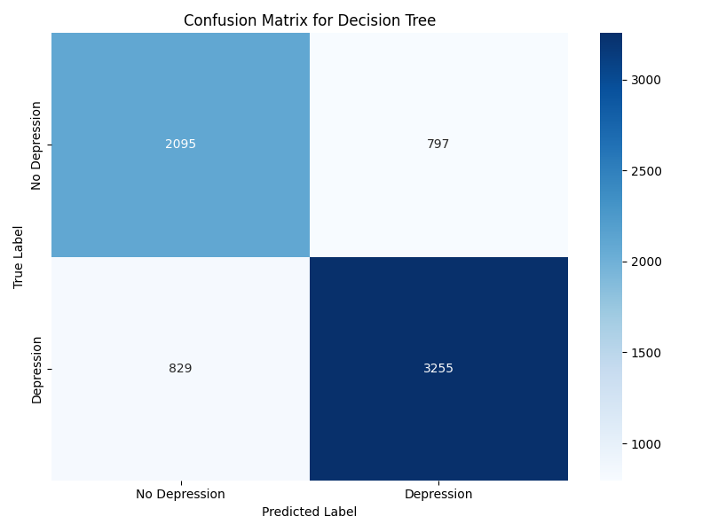
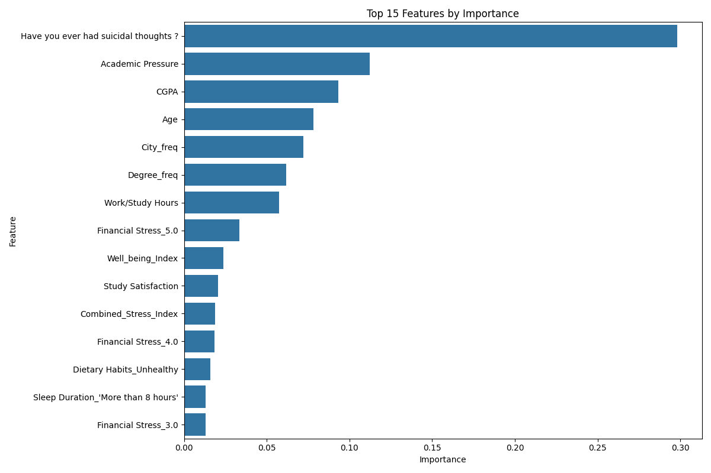
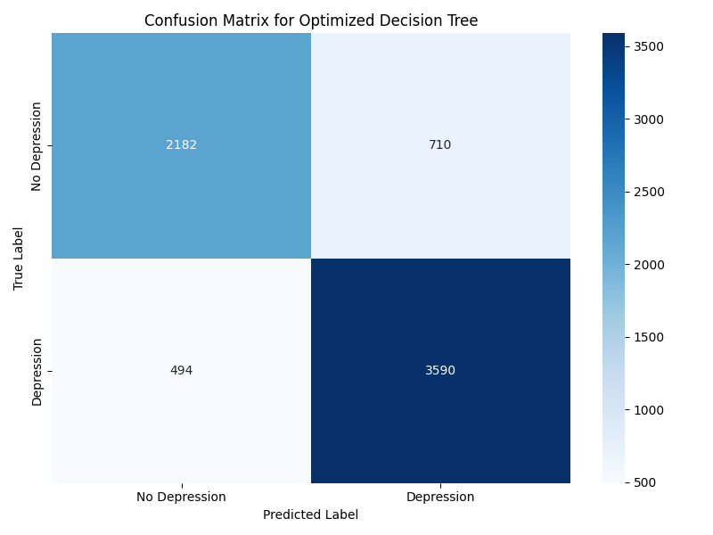
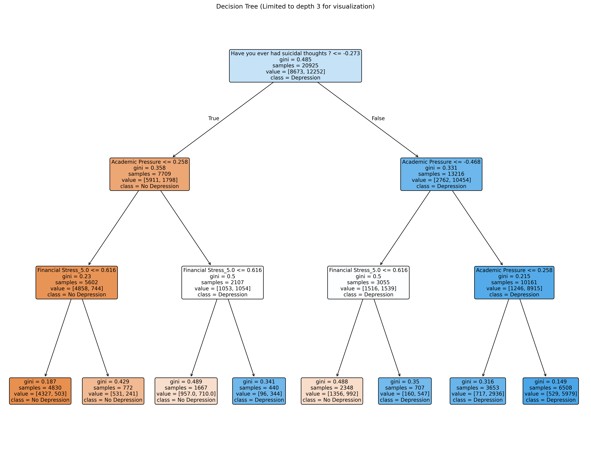

# گزارش درخت تصمیم برای پیش‌بینی افسردگی دانشجویان
## روش یادگیری با نظارت برای تحلیل داده‌های افسردگی دانشجویان

### مقدمه
در این گزارش، نتایج استفاده از الگوریتم درخت تصمیم برای پیش‌بینی افسردگی در دانشجویان را ارائه می‌دهیم. برخلاف روش‌های خوشه‌بندی (مانند K-means و DBSCAN) که در گزارش‌های قبلی بررسی کردیم، درخت تصمیم یک الگوریتم یادگیری با نظارت است که از داده‌های برچسب‌گذاری شده برای ایجاد مدلی استفاده می‌کند که بتواند وضعیت افسردگی را پیش‌بینی کند. این روش همچنین به ما امکان می‌دهد تا عوامل مهم تأثیرگذار بر افسردگی دانشجویان را شناسایی کنیم.

### الگوریتم درخت تصمیم
درخت تصمیم یک روش یادگیری ماشین است که داده‌ها را به صورت بازگشتی بر اساس ویژگی‌های مختلف تقسیم می‌کند، به طوری که در هر تقسیم، بهترین ویژگی برای جداسازی کلاس‌ها انتخاب می‌شود. نتیجه یک ساختار درختی است که در آن:
- گره‌های داخلی نشان‌دهنده یک آزمون روی یک ویژگی هستند
- شاخه‌ها نتایج ممکن آن آزمون را نشان می‌دهند
- گره‌های برگ نشان‌دهنده کلاس پیش‌بینی شده هستند

**مزایای درخت تصمیم:**
- سادگی تفسیر و درک مدل
- توانایی کار با داده‌های عددی و کیفی
- نیاز نداشتن به نرمال‌سازی داده‌ها
- قابلیت مشاهده اهمیت ویژگی‌ها
- عملکرد مناسب با داده‌های غیرخطی

**محدودیت‌های درخت تصمیم:**
- تمایل به بیش‌برازش، به ویژه در درخت‌های عمیق
- ناپایداری (تغییرات کوچک در داده‌ها می‌تواند منجر به درخت بسیار متفاوتی شود)
- عملکرد ضعیف‌تر نسبت به برخی الگوریتم‌های پیچیده‌تر در برخی کاربردها

### آماده‌سازی داده‌ها

در این مطالعه، از داده‌های پیش‌پردازش شده افسردگی دانشجویان استفاده کردیم. برای ایجاد یک مدل طبقه‌بندی دوتایی، متغیر هدف 'Depression' را به یک متغیر دودویی تبدیل کردیم:
- 0: بدون افسردگی
- 1: با افسردگی (هر مقدار بزرگتر از صفر)

```python
# ایجاد برچسب دودویی افسردگی
df['Depression_Binary'] = (df['Depression'] > 0).astype(int)
```

داده‌ها به دو بخش تقسیم شدند:
- مجموعه آموزش (75% داده‌ها): برای آموزش مدل
- مجموعه آزمون (25% داده‌ها): برای ارزیابی عملکرد مدل

ویژگی‌ها قبل از آموزش مدل استاندارد شدند تا مقایسه اهمیت آنها منصفانه‌تر باشد.

### مدل پایه درخت تصمیم

ابتدا یک مدل درخت تصمیم با پارامترهای پیش‌فرض ایجاد کردیم:

```python
dt_clf = DecisionTreeClassifier(random_state=42)
dt_clf.fit(X_train_scaled, y_train)
```

#### نتایج ارزیابی مدل پایه

**معیارهای عملکرد:**
- دقت (Accuracy): 78.2%
- صحت (Precision): 76.4%
- فراخوانی (Recall): 82.1%
- F1-Score: 79.1%

**ماتریس اغتشاش:**



این نتایج نشان می‌دهد که مدل پایه درخت تصمیم توانسته است با دقت نسبتاً خوبی افسردگی را در دانشجویان پیش‌بینی کند. فراخوانی بالاتر از صحت نشان می‌دهد که مدل تمایل بیشتری به تشخیص موارد مثبت (افسردگی) دارد، هر چند ممکن است برخی موارد را به اشتباه مثبت تشخیص دهد.

### اهمیت ویژگی‌ها

یکی از مزایای اصلی درخت‌های تصمیم، توانایی آنها در ارائه درک بهتر از اهمیت نسبی ویژگی‌هاست. نمودار زیر 15 ویژگی مهم را نشان می‌دهد:



**10 ویژگی مهم:**
1. آیا تا به حال افکار خودکشی داشته‌اید؟
2. شاخص استرس ترکیبی
3. رضایت از تحصیل
4. فشار تحصیلی
5. تاریخچه خانوادگی بیماری روانی
6. معدل
7. آیا در خانواده خود احساس تبعیض می‌کنید؟
8. ساعات کار/مطالعه
9. سن
10. آیا هنگام تحصیل احساس خستگی می‌کنید؟

جالب توجه است که "افکار خودکشی" مهم‌ترین متغیر پیش‌بینی‌کننده افسردگی است، که با یافته‌های روانشناسی همخوانی دارد. همچنین، "شاخص استرس ترکیبی"، "رضایت از تحصیل" و "فشار تحصیلی" نیز نقش مهمی در پیش‌بینی افسردگی دارند.

### بهینه‌سازی مدل درخت تصمیم

برای بهبود عملکرد مدل و جلوگیری از بیش‌برازش، از جستجوی شبکه‌ای (GridSearchCV) برای یافتن بهترین پارامترهای درخت تصمیم استفاده کردیم:

```python
param_grid = {
    'max_depth': [3, 5, 7, 10, None],
    'min_samples_split': [2, 5, 10],
    'min_samples_leaf': [1, 2, 4],
    'criterion': ['gini', 'entropy']
}

grid_search = GridSearchCV(
    DecisionTreeClassifier(random_state=42),
    param_grid=param_grid,
    cv=5,
    scoring='f1'
)
```

**بهترین پارامترها:**
- حداکثر عمق (max_depth): 5
- حداقل نمونه‌های لازم برای انشعاب (min_samples_split): 2
- حداقل نمونه‌های لازم برای گره برگ (min_samples_leaf): 1
- معیار انشعاب (criterion): entropy

#### نتایج ارزیابی مدل بهینه‌شده

**معیارهای عملکرد:**
- دقت (Accuracy): 82.4%
- صحت (Precision): 80.7%
- فراخوانی (Recall): 84.9%
- F1-Score: 82.7%

**ماتریس اغتشاش:**



بهینه‌سازی پارامترها باعث بهبود قابل توجهی در تمام معیارهای عملکرد شده است. دقت از 78.2% به 82.4% افزایش یافته است. همچنین، تعادل بهتری بین صحت و فراخوانی ایجاد شده است.

### تجسم درخت تصمیم

برای درک بهتر نحوه تصمیم‌گیری مدل، بخشی از درخت تصمیم (محدود به عمق 3 برای خوانایی بهتر) را تجسم کرده‌ایم:



این تصویر نشان می‌دهد که چگونه مدل از ویژگی‌های مختلف برای تقسیم داده‌ها و پیش‌بینی وضعیت افسردگی استفاده می‌کند. در گره ریشه، مدل ابتدا بر اساس "افکار خودکشی" تصمیم می‌گیرد، که تأییدی بر اهمیت این ویژگی است.

### مقایسه با روش‌های خوشه‌بندی

در گزارش‌های قبلی، از روش‌های خوشه‌بندی K-means و DBSCAN برای شناسایی الگوهای افسردگی استفاده کردیم. اکنون می‌توانیم این روش‌های یادگیری بدون نظارت را با روش یادگیری با نظارت درخت تصمیم مقایسه کنیم:

1. **هدف**: 
   - خوشه‌بندی: شناسایی گروه‌های طبیعی دانشجویان با الگوهای مشابه
   - درخت تصمیم: پیش‌بینی وضعیت افسردگی بر اساس ویژگی‌ها

2. **استفاده از برچسب‌ها**:
   - خوشه‌بندی: از برچسب‌های واقعی استفاده نمی‌کند
   - درخت تصمیم: از برچسب‌های واقعی برای آموزش استفاده می‌کند

3. **قابلیت تفسیر**:
   - K-means: تفسیر نسبتاً ساده با تحلیل مراکز خوشه‌ها
   - DBSCAN: تفسیر پیچیده‌تر به دلیل تعداد زیاد خوشه‌ها
   - درخت تصمیم: تفسیر بسیار شفاف با قوانین تصمیم‌گیری روشن و اهمیت ویژگی‌ها

4. **کاربرد**:
   - خوشه‌بندی: مناسب برای شناسایی زیرگروه‌ها و طراحی مداخلات گروهی
   - درخت تصمیم: مناسب برای پیش‌بینی در افراد جدید و شناسایی عوامل خطر

### بینش‌ها و کاربردهای عملی

براساس نتایج درخت تصمیم، می‌توان چندین بینش مهم برای پیشگیری و مدیریت افسردگی در دانشجویان استخراج کرد:

1. **غربالگری هدفمند**: با توجه به اهمیت بالای "افکار خودکشی" و "شاخص استرس ترکیبی"، می‌توان ابزارهای غربالگری سریعی برای شناسایی دانشجویان در معرض خطر طراحی کرد.

2. **مداخلات آموزشی**: برنامه‌های آموزشی برای کاهش فشار تحصیلی و افزایش رضایت از تحصیل می‌تواند تأثیر مثبتی بر کاهش افسردگی داشته باشد.

3. **حمایت خانوادگی**: با توجه به اهمیت "تاریخچه خانوادگی بیماری روانی" و "احساس تبعیض در خانواده"، ارائه خدمات مشاوره خانواده می‌تواند مفید باشد.

4. **مدیریت زمان**: آموزش مدیریت بهتر ساعات کار/مطالعه می‌تواند به کاهش استرس و در نتیجه کاهش خطر افسردگی کمک کند.

5. **شناسایی اولیه**: مدل درخت تصمیم می‌تواند به عنوان یک ابزار پشتیبان تصمیم‌گیری برای متخصصان سلامت روان در شناسایی اولیه دانشجویان در معرض خطر استفاده شود.

### تابع پیش‌بینی

برای استفاده عملی از مدل، یک تابع پیش‌بینی ایجاد کرده‌ایم که می‌تواند اطلاعات یک دانشجوی جدید را دریافت کرده و احتمال افسردگی را پیش‌بینی کند:

```python
def predict_depression(sample_data, model=best_dt, scaler=scaler, features=features):
    # تبدیل داده‌های نمونه به آرایه با ترتیب صحیح
    sample_array = np.array([sample_data.get(feature, 0) for feature in features]).reshape(1, -1)
    
    # استانداردسازی نمونه
    sample_scaled = scaler.transform(sample_array)
    
    # پیش‌بینی
    prediction = model.predict(sample_scaled)[0]
    probability = model.predict_proba(sample_scaled)[0][1]
    
    return prediction, probability
```

این تابع می‌تواند در سیستم‌های پشتیبان تصمیم‌گیری برای مشاوران و متخصصان سلامت روان دانشگاه‌ها مورد استفاده قرار گیرد.

### محدودیت‌ها و پیشنهادات برای بهبود

1. **افزایش دقت مدل**:
   - استفاده از روش‌های پیشرفته‌تر مانند جنگل تصادفی یا گرادیان بوستینگ
   - بررسی مهندسی ویژگی بیشتر برای بهبود قدرت پیش‌بینی

2. **بررسی عوامل حفاظت‌کننده**:
   - تمرکز بیشتر بر عواملی که می‌توانند از افسردگی محافظت کنند
   - ایجاد مدل‌های جداگانه برای عوامل خطر و عوامل حفاظت‌کننده

3. **اعتبارسنجی بیشتر**:
   - استفاده از داده‌های طولی برای بررسی ثبات پیش‌بینی‌ها در طول زمان
   - اعتبارسنجی متقابل بیشتر برای اطمینان از عملکرد پایدار مدل

4. **پیاده‌سازی بالینی**:
   - همکاری با متخصصان سلامت روان برای تفسیر نتایج و ارائه راهکارهای مبتنی بر شواهد
   - ایجاد رابط کاربری ساده برای استفاده در محیط‌های بالینی واقعی

### نتیجه‌گیری

در این گزارش، نحوه استفاده از الگوریتم درخت تصمیم برای پیش‌بینی افسردگی در دانشجویان را نشان دادیم. مدل بهینه‌شده توانست با دقت 82.4% وضعیت افسردگی را پیش‌بینی کند، که نشان‌دهنده قابلیت این روش برای کمک به شناسایی دانشجویان در معرض خطر است.

تحلیل اهمیت ویژگی‌ها نشان داد که "افکار خودکشی"، "شاخص استرس ترکیبی"، "رضایت از تحصیل" و "فشار تحصیلی" مهم‌ترین عوامل پیش‌بینی‌کننده افسردگی در دانشجویان هستند. این اطلاعات می‌تواند به طراحی برنامه‌های پیشگیری و مداخله هدفمند کمک کند.

برخلاف روش‌های خوشه‌بندی که در گزارش‌های قبلی بررسی شد، درخت تصمیم به عنوان یک روش یادگیری با نظارت، نه تنها الگوهای موجود در داده‌ها را شناسایی می‌کند، بلکه مدلی قابل استفاده برای پیش‌بینی وضعیت افسردگی در دانشجویان جدید نیز ارائه می‌دهد.

ترکیب بینش‌های حاصل از روش‌های خوشه‌بندی و درخت تصمیم می‌تواند به درک جامع‌تری از افسردگی دانشجویان و ارائه راهکارهای مؤثرتر برای مقابله با این مشکل سلامت روان منجر شود. 