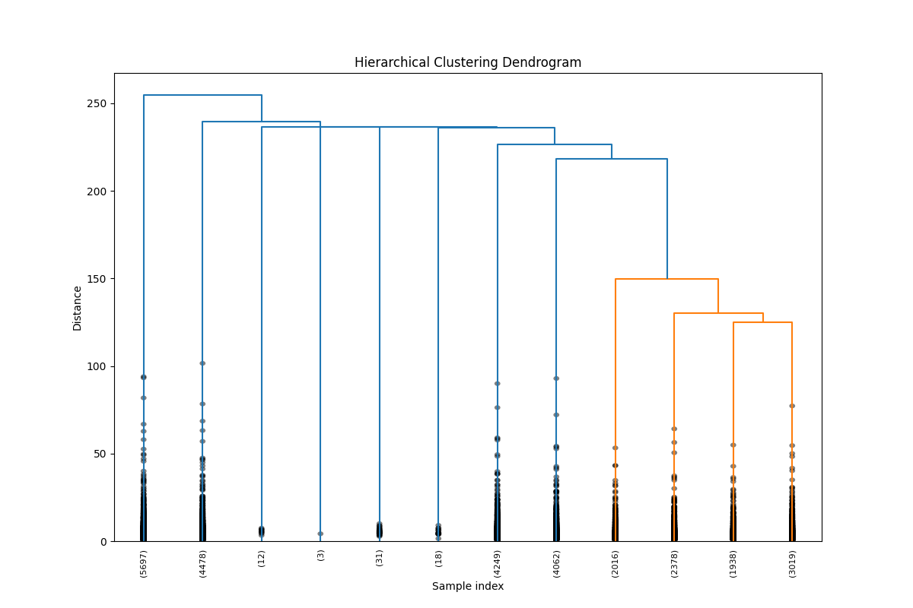
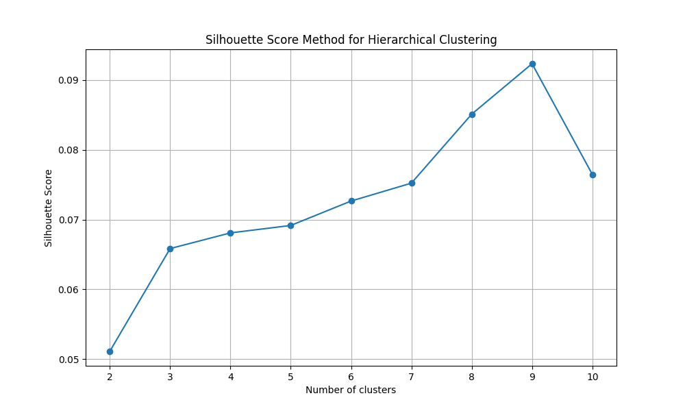
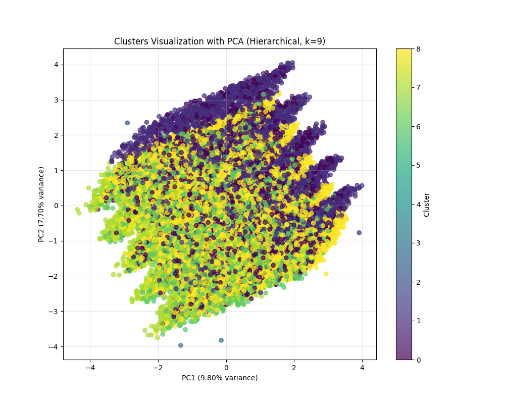
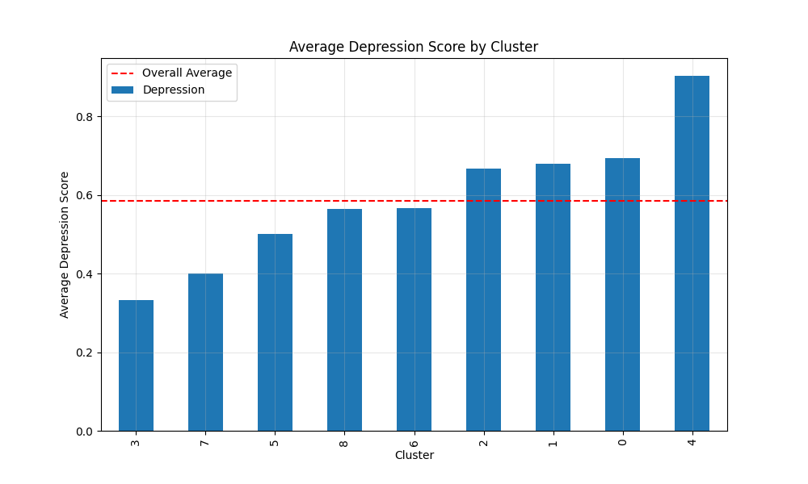
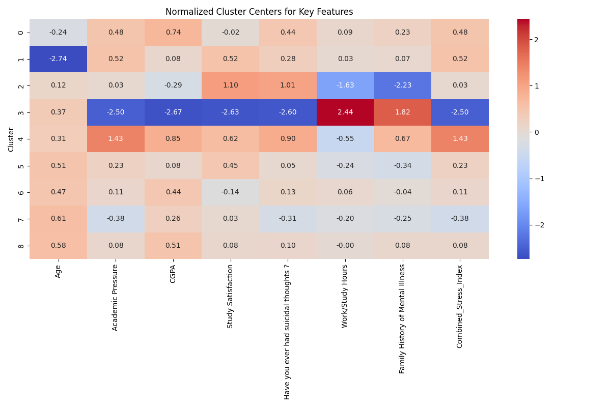
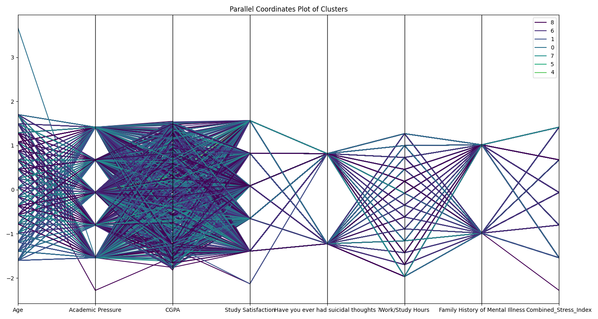
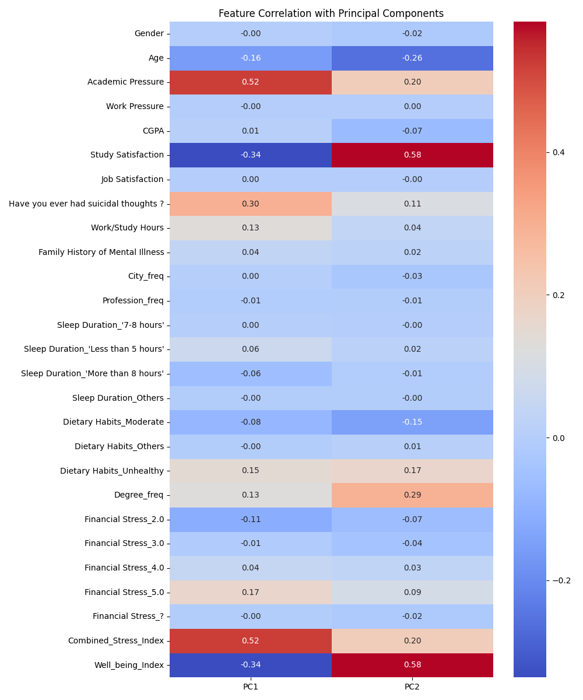

# گزارش خوشه‌بندی با الگوریتم سلسله مراتبی
## خوشه‌بندی داده‌های افسردگی دانشجویان با روش سلسله مراتبی

### مقدمه
این گزارش نتایج خوشه‌بندی مجموعه‌داده افسردگی دانشجویان با استفاده از الگوریتم خوشه‌بندی سلسله مراتبی را ارائه می‌دهد. خوشه‌بندی سلسله مراتبی یک روش کلاسیک خوشه‌بندی است که با ادغام یا تقسیم متوالی خوشه‌ها، یک سلسله مراتب از خوشه‌ها را ایجاد می‌کند. در این تحلیل، از روش پیوند وارد (Ward's method) استفاده شده است که به دنبال حداقل کردن واریانس درون خوشه‌ای است.

### کد و روش پیاده‌سازی

```python
# بارگذاری داده‌های پیش‌پردازش شده
df = pd.read_csv('processed_data/student_depression_processed.csv')

# انتخاب ویژگی‌ها برای خوشه‌بندی
features = df.drop(['id', 'Depression'], axis=1).columns.tolist()
X = df[features].values

# استانداردسازی داده‌ها
scaler = StandardScaler()
X_scaled = scaler.fit_transform(X)

# محاسبه ماتریس پیوند با روش وارد
Z = linkage(X_scaled, method='ward')

# ارزیابی تعداد بهینه خوشه‌ها با استفاده از امتیاز سیلوئت
silhouette_scores = []
max_clusters = 10

for k in range(2, max_clusters + 1):
    # دریافت برچسب‌های خوشه
    labels = fcluster(Z, k, criterion='maxclust')
    
    # محاسبه امتیاز سیلوئت
    silhouette_avg = silhouette_score(X_scaled, labels)
    silhouette_scores.append(silhouette_avg)
```

در این کد، ابتدا داده‌های پیش‌پردازش شده را بارگذاری کرده و ویژگی‌های مورد نیاز برای خوشه‌بندی را انتخاب می‌کنیم. سپس داده‌ها را استاندارد کرده و با استفاده از روش پیوند وارد، ماتریس پیوند را محاسبه می‌کنیم. برای تعیین تعداد بهینه خوشه‌ها، امتیاز سیلوئت را برای تعداد مختلف خوشه‌ها محاسبه می‌کنیم.

### دندروگرام خوشه‌بندی سلسله مراتبی



دندروگرام بالا ساختار سلسله مراتبی داده‌ها را نشان می‌دهد. در این نمودار، هر خط افقی یک ادغام دو خوشه را نشان می‌دهد و ارتفاع آن نشان‌دهنده فاصله یا عدم شباهت بین خوشه‌هاست. این دندروگرام به ما کمک می‌کند تا ساختار طبیعی خوشه‌ها را در داده‌ها مشاهده کنیم.

### تعیین تعداد بهینه خوشه‌ها



براساس امتیاز سیلوئت، تعداد بهینه خوشه‌ها 9 تعیین شد. مقادیر امتیاز سیلوئت برای تعداد خوشه‌های مختلف:

- برای 2 خوشه: 0.051
- برای 3 خوشه: 0.066
- برای 4 خوشه: 0.068
- برای 5 خوشه: 0.069
- برای 6 خوشه: 0.073
- برای 7 خوشه: 0.075
- برای 8 خوشه: 0.085
- برای 9 خوشه: 0.092
- برای 10 خوشه: 0.076

همانطور که مشاهده می‌شود، بالاترین امتیاز سیلوئت مربوط به K=9 است، بنابراین در ادامه با 9 خوشه به خوشه‌بندی می‌پردازیم.

### توزیع خوشه‌ها

پس از اجرای الگوریتم خوشه‌بندی سلسله مراتبی با 9 خوشه، توزیع نمونه‌ها در خوشه‌ها به شرح زیر است:

- خوشه 0: 5,697 نمونه (20.42%)
- خوشه 1: 4,478 نمونه (16.05%)
- خوشه 2: 12 نمونه (0.04%)
- خوشه 3: 3 نمونه (0.01%)
- خوشه 4: 31 نمونه (0.11%)
- خوشه 5: 18 نمونه (0.06%)
- خوشه 6: 4,249 نمونه (15.23%)
- خوشه 7: 4,062 نمونه (14.56%)
- خوشه 8: 9,351 نمونه (33.51%)

این توزیع نشان می‌دهد که اکثر دانشجویان در خوشه‌های 0، 1، 6، 7 و 8 قرار گرفته‌اند، در حالی که خوشه‌های 2، 3، 4 و 5 بسیار کوچک هستند و می‌توانند نمایانگر موارد خاص یا افراد با ویژگی‌های منحصر به فرد باشند.

### تجسم خوشه‌ها با استفاده از PCA

برای نمایش بصری خوشه‌ها، از روش تحلیل مؤلفه‌های اصلی (PCA) برای کاهش ابعاد داده‌ها به دو بعد استفاده کرده‌ایم:



در این نمودار، هر نقطه یک دانشجو را نشان می‌دهد و رنگ آن مشخص‌کننده خوشه‌ای است که به آن تعلق دارد.

### رابطه بین خوشه‌ها و افسردگی

یکی از اهداف اصلی این تحلیل، درک رابطه بین خوشه‌های شناسایی شده و میزان افسردگی است:



میانگین نمره افسردگی در هر خوشه:
- خوشه 3: 0.333333 (پایین‌ترین)
- خوشه 7: 0.399311
- خوشه 5: 0.500000
- خوشه 8: 0.563576
- خوشه 6: 0.565545
- خوشه 2: 0.666667
- خوشه 1: 0.679321
- خوشه 0: 0.693874
- خوشه 4: 0.903226 (بالاترین)

همانطور که مشاهده می‌شود، میانگین نمره افسردگی بین خوشه‌ها متفاوت است، که نشان می‌دهد الگوریتم خوشه‌بندی سلسله مراتبی توانسته الگوهای متفاوتی از افسردگی را در میان دانشجویان شناسایی کند.

### تحلیل ویژگی‌های کلیدی خوشه‌ها

برای درک بهتر خصوصیات هر خوشه، ویژگی‌های کلیدی آنها را با استفاده از یک نقشه حرارتی نمایش داده‌ایم:



همچنین از نمودار مختصات موازی برای نمایش بهتر خوشه‌ها استفاده کرده‌ایم:



### ارتباط ویژگی‌ها با مؤلفه‌های اصلی

برای درک بهتر اینکه کدام ویژگی‌ها بیشترین تأثیر را در تفکیک خوشه‌ها دارند، ارتباط بین ویژگی‌های اصلی و مؤلفه‌های PCA را بررسی کرده‌ایم:



این نمودار نشان می‌دهد که کدام ویژگی‌ها بیشترین همبستگی را با مؤلفه‌های اصلی دارند و در نتیجه، بیشترین تأثیر را در تفکیک خوشه‌ها داشته‌اند.

### خلاصه خصوصیات هر خوشه

#### خوشه 0 (افسردگی بالا):
- معدل: بالا (z-score: 0.74)
- فشار تحصیلی: بالا (z-score: 0.48)
- شاخص استرس ترکیبی: بالا (z-score: 0.48)
- افکار خودکشی: بالا (z-score: 0.44)
- سن: پایین (z-score: -0.24)
- افسردگی: 0.11 بالاتر از میانگین کلی (0.69 در مقایسه با 0.59)

#### خوشه 1 (افسردگی بالا - دانشجویان جوان):
- سن: بسیار پایین (z-score: -2.74)
- فشار تحصیلی: بالا (z-score: 0.52)
- شاخص استرس ترکیبی: بالا (z-score: 0.52)
- رضایت از تحصیل: بالا (z-score: 0.52)
- افکار خودکشی: بالا (z-score: 0.28)
- افسردگی: 0.09 بالاتر از میانگین کلی (0.68 در مقایسه با 0.59)

#### خوشه 2 (افسردگی بالا - گروه کوچک):
- سابقه خانوادگی بیماری روانی: پایین (z-score: -2.23)
- ساعات کار/مطالعه: پایین (z-score: -1.63)
- رضایت از تحصیل: بالا (z-score: 1.10)
- افکار خودکشی: بالا (z-score: 1.01)
- معدل: پایین (z-score: -0.29)
- افسردگی: 0.08 بالاتر از میانگین کلی (0.67 در مقایسه با 0.59)

#### خوشه 3 (کمترین افسردگی - بسیار کوچک):
- معدل: پایین (z-score: -2.67)
- رضایت از تحصیل: پایین (z-score: -2.63)
- افکار خودکشی: پایین (z-score: -2.60)
- فشار تحصیلی: پایین (z-score: -2.50)
- شاخص استرس ترکیبی: پایین (z-score: -2.50)
- افسردگی: 0.25 پایین‌تر از میانگین کلی (0.33 در مقایسه با 0.59)

#### خوشه 4 (بالاترین افسردگی - گروه کوچک):
- فشار تحصیلی: بالا (z-score: 1.43)
- شاخص استرس ترکیبی: بالا (z-score: 1.43)
- افکار خودکشی: بالا (z-score: 0.90)
- معدل: بالا (z-score: 0.85)
- سابقه خانوادگی بیماری روانی: بالا (z-score: 0.67)
- افسردگی: 0.32 بالاتر از میانگین کلی (0.90 در مقایسه با 0.59)

#### خوشه 5 (افسردگی متوسط - گروه کوچک):
- سن: بالا (z-score: 0.51)
- رضایت از تحصیل: بالا (z-score: 0.45)
- سابقه خانوادگی بیماری روانی: پایین (z-score: -0.34)
- ساعات کار/مطالعه: پایین (z-score: -0.24)
- شاخص استرس ترکیبی: بالا (z-score: 0.23)
- افسردگی: 0.09 پایین‌تر از میانگین کلی (0.50 در مقایسه با 0.59)

#### خوشه 6 (افسردگی متوسط):
- سن: بالا (z-score: 0.47)
- معدل: بالا (z-score: 0.44)
- رضایت از تحصیل: پایین (z-score: -0.14)
- افکار خودکشی: بالا (z-score: 0.13)
- فشار تحصیلی: بالا (z-score: 0.11)
- افسردگی: 0.02 پایین‌تر از میانگین کلی (0.57 در مقایسه با 0.59)

#### خوشه 7 (افسردگی پایین):
- سن: بالا (z-score: 0.61)
- فشار تحصیلی: پایین (z-score: -0.38)
- شاخص استرس ترکیبی: پایین (z-score: -0.38)
- افکار خودکشی: پایین (z-score: -0.31)
- معدل: بالا (z-score: 0.26)
- افسردگی: 0.19 پایین‌تر از میانگین کلی (0.40 در مقایسه با 0.59)

#### خوشه 8 (افسردگی متوسط - بزرگترین خوشه):
- سن: بالا (z-score: 0.58)
- معدل: بالا (z-score: 0.51)
- افکار خودکشی: بالا (z-score: 0.10)
- سابقه خانوادگی بیماری روانی: بالا (z-score: 0.08)
- رضایت از تحصیل: بالا (z-score: 0.08)
- افسردگی: 0.02 پایین‌تر از میانگین کلی (0.56 در مقایسه با 0.59)

### مقایسه با نتایج K-means

مقایسه نتایج خوشه‌بندی سلسله مراتبی با نتایج K-means نشان می‌دهد تفاوت‌های قابل توجهی در شناسایی الگوهای افسردگی دانشجویان:

1. **تعداد خوشه‌های بهینه**: روش K-means تعداد بهینه خوشه‌ها را 2 تشخیص داد، در حالی که روش سلسله مراتبی 9 خوشه را شناسایی کرد.

2. **جزئیات بیشتر**: خوشه‌بندی سلسله مراتبی الگوهای ظریف‌تری را در داده‌ها آشکار کرد، از جمله گروه‌های بسیار کوچک با الگوهای افسردگی متمایز.

3. **توزیع نمونه‌ها**: در K-means توزیع تقریباً متعادل بود (51.61% و 48.39%)، اما در روش سلسله مراتبی توزیع نامتوازن‌تر است، با 33.51% نمونه‌ها در خوشه 8 و برخی خوشه‌های بسیار کوچک.

4. **میزان افسردگی**: در K-means دو سطح افسردگی (بالا و پایین) شناسایی شد، اما خوشه‌بندی سلسله مراتبی طیف وسیع‌تری از سطوح افسردگی را نشان می‌دهد، از 0.33 تا 0.90.

5. **رابطه با ویژگی‌ها**: هر دو روش اهمیت سن، فشار تحصیلی و رضایت از تحصیل را نشان دادند، اما روش سلسله مراتبی ارتباطات پیچیده‌تری را آشکار کرد.

### تفسیر نتایج

براساس نتایج خوشه‌بندی سلسله مراتبی، چندین پروفایل مشخص از دانشجویان شناسایی شده است:

1. **دانشجویان جوان با استرس بالا (خوشه‌های 0 و 1)**: این گروه‌ها که حدود 36% نمونه‌ها را تشکیل می‌دهند، شامل دانشجویان جوان‌تر با فشار تحصیلی بالا، استرس زیاد و افکار خودکشی بیشتر هستند. سطح افسردگی در این گروه‌ها بالاتر از میانگین است.

2. **دانشجویان مسن‌تر با استرس پایین (خوشه 7)**: این گروه (14.56% نمونه‌ها) شامل دانشجویان مسن‌تر با فشار تحصیلی کمتر، استرس پایین‌تر و افکار خودکشی کمتر است. این گروه سطح افسردگی پایینی دارد.

3. **دانشجویان با عملکرد تحصیلی خوب (خوشه 8)**: بزرگترین گروه (33.51%) شامل دانشجویان مسن‌تر با معدل بالا و رضایت تحصیلی مناسب است که سطح افسردگی متوسط دارند.

4. **موارد بحرانی (خوشه 4)**: یک گروه کوچک (0.11%) با بالاترین سطح افسردگی (0.90) که با فشار تحصیلی بسیار بالا، افکار خودکشی زیاد و سابقه خانوادگی بیماری روانی مشخص می‌شود.

5. **موارد استثنایی با افسردگی کم (خوشه 3)**: کوچکترین گروه (0.01%) با کمترین سطح افسردگی (0.33) که علی‌رغم معدل و رضایت تحصیلی پایین، فشار تحصیلی و افکار خودکشی بسیار کمی دارند.

### نتیجه‌گیری و پیشنهادات

خوشه‌بندی سلسله مراتبی به ما کمک کرد تا الگوهای پنهان و متنوعی از افسردگی در دانشجویان را کشف کنیم. براساس این یافته‌ها، می‌توان پیشنهادات زیر را ارائه داد:

1. **مداخلات هدفمند برای گروه‌های پرخطر**: توجه ویژه به دانشجویان جوان با فشار تحصیلی بالا و دانشجویانی که علائم مشابه با خوشه 4 (با بالاترین افسردگی) دارند.

2. **برنامه‌های پیشگیرانه متناسب با سن**: طراحی برنامه‌های متفاوت برای گروه‌های سنی مختلف، با توجه به اینکه الگوهای افسردگی در دانشجویان جوان‌تر و مسن‌تر متفاوت است.

3. **مدیریت استرس تحصیلی**: ارائه کارگاه‌های مدیریت استرس با تمرکز بر فشارهای تحصیلی، به‌ویژه برای دانشجویان با معدل بالا که همچنان سطح استرس بالایی دارند.

4. **شناسایی زودهنگام موارد بحرانی**: ایجاد سیستم‌های غربالگری برای شناسایی دانشجویانی با ویژگی‌های مشابه خوشه 4 که در معرض بالاترین خطر افسردگی هستند.

5. **حمایت از دانشجویان با سابقه خانوادگی بیماری روانی**: ارائه خدمات مشاوره و پشتیبانی ویژه برای دانشجویانی که سابقه خانوادگی بیماری روانی دارند.

6. **بررسی عوامل محافظتی**: مطالعه بیشتر روی ویژگی‌های خوشه 3 که علی‌رغم شرایط تحصیلی نامطلوب، سطح افسردگی پایینی دارند، برای شناسایی عوامل محافظتی احتمالی.

### مزایای خوشه‌بندی سلسله مراتبی

خوشه‌بندی سلسله مراتبی در مقایسه با K-means چندین مزیت نشان داد:

1. **عدم نیاز به تعیین تعداد خوشه‌ها از قبل**: الگوریتم سلسله مراتبی نیازی به تعیین تعداد خوشه‌ها از قبل ندارد و می‌توان پس از ایجاد دندروگرام، تعداد مناسب را انتخاب کرد.

2. **نمایش ساختار سلسله مراتبی داده‌ها**: دندروگرام امکان مشاهده و تفسیر ساختار سلسله مراتبی داده‌ها را فراهم کرد.

3. **شناسایی گروه‌های کوچک اما مهم**: خوشه‌بندی سلسله مراتبی گروه‌های بسیار کوچک اما با الگوهای متمایز افسردگی را شناسایی کرد که در K-means قابل تشخیص نبودند.

4. **کشف طیف وسیع‌تری از الگوها**: این روش طیف گسترده‌تری از الگوهای افسردگی را نشان داد، از موارد بسیار کم (0.33) تا موارد بسیار شدید (0.90).

این تحلیل خوشه‌بندی سلسله مراتبی اطلاعات ارزشمندی برای طراحی مداخلات هدفمند برای پیشگیری از افسردگی در دانشجویان فراهم می‌کند و مکمل خوبی برای نتایج روش K-means است. 