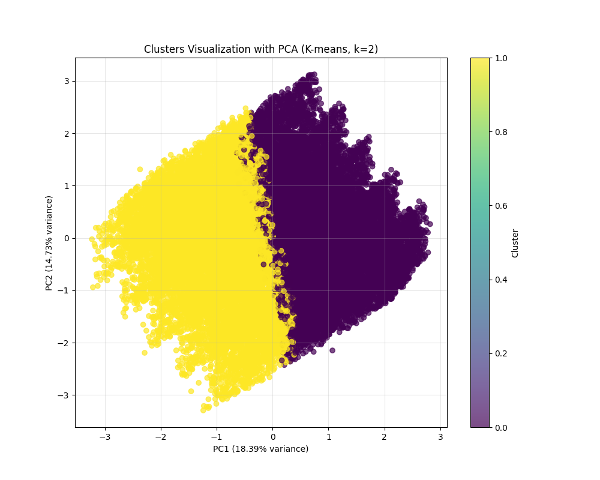

# گزارش خوشه‌بندی با الگوریتم K-means
## خوشه‌بندی داده‌های افسردگی دانشجویان با روش تفکیکی

### مقدمه
این گزارش نتایج خوشه‌بندی مجموعه‌داده افسردگی دانشجویان با استفاده از الگوریتم K-means را ارائه می‌دهد. K-means یکی از محبوب‌ترین الگوریتم‌های خوشه‌بندی تفکیکی است که داده‌ها را به K خوشه مجزا تقسیم می‌کند، به طوری که هر نمونه به خوشه‌ای تعلق می‌گیرد که نزدیک‌ترین میانگین (مرکز خوشه) را به آن دارد.

### کد و روش پیاده‌سازی

```python
# بارگذاری داده‌های پیش‌پردازش شده
df = pd.read_csv('processed_data/student_depression_processed.csv')

# انتخاب ویژگی‌ها برای خوشه‌بندی
# حذف شناسه و متغیر هدف (افسردگی)
features = df.drop(['id', 'Depression'], axis=1).columns.tolist()
X = df[features].values

# تعیین تعداد بهینه خوشه‌ها با استفاده از روش آرنج و امتیاز سیلوئت
inertia = []
silhouette_scores = []
max_clusters = 10

for k in range(2, max_clusters + 1):
    kmeans = KMeans(n_clusters=k, random_state=42, n_init=10)
    kmeans.fit(X)
    inertia.append(kmeans.inertia_)
    
    # محاسبه امتیاز سیلوئت
    labels = kmeans.labels_
    silhouette_avg = silhouette_score(X, labels)
    silhouette_scores.append(silhouette_avg)
```

در این کد، ابتدا داده‌های پیش‌پردازش شده را بارگذاری کرده و ویژگی‌های مورد نیاز برای خوشه‌بندی را انتخاب می‌کنیم. سپس برای تعیین تعداد بهینه خوشه‌ها، از دو روش استفاده می‌کنیم:
1. **روش آرنج (Elbow Method)**: در این روش، مقدار inertia (مجموع مربعات فاصله نمونه‌ها از مرکز خوشه‌شان) را برای مقادیر مختلف K محاسبه می‌کنیم.
2. **امتیاز سیلوئت (Silhouette Score)**: این معیار نشان می‌دهد که هر نمونه چقدر به خوشه خودش نزدیک و از خوشه‌های دیگر دور است. مقادیر بالاتر بهتر هستند.

### تعیین تعداد بهینه خوشه‌ها


براساس نتایج روش آرنج و امتیاز سیلوئت، تعداد بهینه خوشه‌ها 2 تعیین شد. مقادیر امتیاز سیلوئت برای تعداد خوشه‌های مختلف:

- برای 2 خوشه: 0.121
- برای 3 خوشه: 0.106
- برای 4 خوشه: 0.102
- برای 5 خوشه: 0.095
- برای 6 خوشه: 0.096
- برای 7 خوشه: 0.094
- برای 8 خوشه: 0.093
- برای 9 خوشه: 0.091
- برای 10 خوشه: 0.094

همانطور که مشاهده می‌شود، بالاترین امتیاز سیلوئت مربوط به K=2 است، بنابراین در ادامه با 2 خوشه به خوشه‌بندی می‌پردازیم.

### توزیع خوشه‌ها

پس از اجرای الگوریتم K-means با 2 خوشه، توزیع نمونه‌ها در خوشه‌ها به شرح زیر است:

- خوشه 0: 14,399 نمونه (51.61%)
- خوشه 1: 13,502 نمونه (48.39%)

این توزیع نسبتاً متعادل نشان می‌دهد که دانشجویان به دو گروه تقریباً مساوی تقسیم شده‌اند.

### تجسم خوشه‌ها با استفاده از PCA

برای نمایش بصری خوشه‌ها، از روش تحلیل مؤلفه‌های اصلی (PCA) برای کاهش ابعاد داده‌ها به دو بعد استفاده کرده‌ایم:



در این نمودار، هر نقطه یک دانشجو را نشان می‌دهد و رنگ آن مشخص‌کننده خوشه‌ای است که به آن تعلق دارد. همپوشانی بین خوشه‌ها طبیعی است، زیرا داده‌ها در فضای چند بعدی قرار دارند و نمایش دو بعدی آنها نمی‌تواند تمام روابط را به درستی نشان دهد.

### رابطه بین خوشه‌ها و افسردگی

یکی از اهداف اصلی این تحلیل، درک رابطه بین خوشه‌های شناسایی شده و میزان افسردگی است:


میانگین نمره افسردگی در هر خوشه:
- خوشه 0: 0.82 (بالاتر از میانگین کلی 0.59)
- خوشه 1: 0.34 (پایین‌تر از میانگین کلی 0.59)

این تفاوت قابل توجه نشان می‌دهد که الگوریتم K-means موفق شده دانشجویان را به دو گروه با سطوح مختلف افسردگی تفکیک کند.

### تحلیل ویژگی‌های کلیدی خوشه‌ها

برای درک بهتر خصوصیات هر خوشه، ویژگی‌های کلیدی آنها را با استفاده از یک نقشه حرارتی نمایش داده‌ایم:


همچنین از نمودار مختصات موازی برای نمایش بهتر خوشه‌ها استفاده کرده‌ایم:


### خلاصه خصوصیات هر خوشه

#### خوشه 0 (افسردگی بالا):
- سن: پایین (z-score: -1.00)
- فشار تحصیلی: بالا (z-score: 1.00)
- معدل: بالا (z-score: 1.00)
- رضایت از تحصیل: پایین (z-score: -1.00)
- ساعات کار/مطالعه: بالا (z-score: 1.00)
- افسردگی: 0.23 بالاتر از میانگین کلی (0.82 در مقایسه با 0.59)

#### خوشه 1 (افسردگی پایین):
- افکار خودکشی: پایین (z-score: -1.00)
- سن: بالا (z-score: 1.00)
- معدل: پایین (z-score: -1.00)
- فشار تحصیلی: پایین (z-score: -1.00)
- رضایت از تحصیل: بالا (z-score: 1.00)
- افسردگی: 0.25 پایین‌تر از میانگین کلی (0.34 در مقایسه با 0.59)

### تفسیر نتایج

براساس نتایج خوشه‌بندی، دو پروفایل مشخص از دانشجویان شناسایی شده است:

1. **دانشجویان با ریسک بالای افسردگی (خوشه 0)**: این گروه عمدتاً شامل دانشجویان جوان‌تر است که تحت فشار تحصیلی بالایی قرار دارند. آنها ساعات زیادی را صرف مطالعه می‌کنند، علی‌رغم داشتن معدل خوب، رضایت کمی از تحصیل خود دارند. این ترکیب از عوامل با سطح بالاتری از افسردگی همراه است.

2. **دانشجویان با ریسک پایین افسردگی (خوشه 1)**: این گروه شامل دانشجویان مسن‌تر است که فشار تحصیلی کمتری را تجربه می‌کنند. آنها رضایت بیشتری از تحصیل خود دارند، حتی با وجود معدل پایین‌تر. همچنین، میزان افکار خودکشی در این گروه پایین‌تر است. این ترکیب از عوامل با سطح پایین‌تری از افسردگی همراه است.

### نتیجه‌گیری و پیشنهادات

خوشه‌بندی با الگوریتم K-means به ما کمک کرد تا دو گروه متمایز از دانشجویان را شناسایی کنیم که الگوهای متفاوتی از عوامل مرتبط با افسردگی را نشان می‌دهند. براساس این یافته‌ها، می‌توان پیشنهادات زیر را ارائه داد:

1. **برنامه‌های پیشگیرانه متمرکز**: تمرکز بیشتر برنامه‌های پیشگیری از افسردگی بر دانشجویان جوان‌تر که تحت فشار تحصیلی بالا قرار دارند.

2. **مدیریت استرس و زمان**: ارائه کارگاه‌های مدیریت استرس و برنامه‌ریزی زمان به دانشجویانی که ساعات زیادی را صرف مطالعه می‌کنند اما رضایت کمی از تحصیل خود دارند.

3. **مشاوره تحصیلی**: تقویت خدمات مشاوره تحصیلی برای کمک به دانشجویان در یافتن تعادل بهتر بین فشار تحصیلی، ساعات مطالعه و رضایت از تحصیل.

4. **حمایت اجتماعی**: تشویق شبکه‌های حمایت اجتماعی بین دانشجویان مسن‌تر و جوان‌تر برای انتقال تجربیات و راهبردهای مقابله‌ای.

این تحلیل خوشه‌بندی اطلاعات ارزشمندی برای طراحی مداخلات هدفمند برای پیشگیری از افسردگی در دانشجویان فراهم می‌کند. 