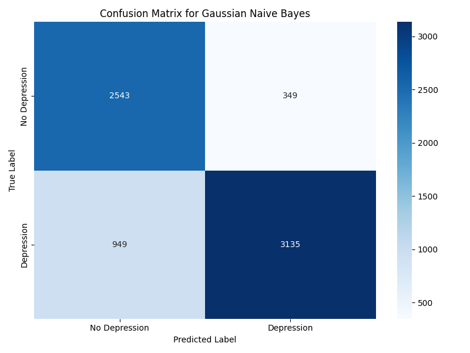
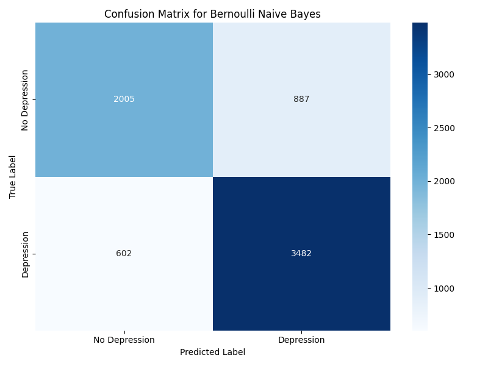
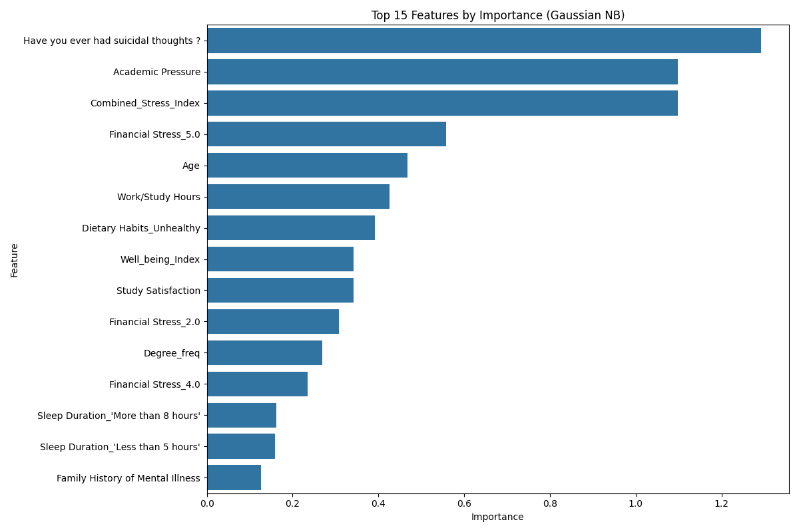

# گزارش طبقه‌بندی بیز ساده برای پیش‌بینی افسردگی دانشجویان
## روش احتمالاتی برای تحلیل داده‌های افسردگی دانشجویان

### مقدمه
در این گزارش، نتایج استفاده از الگوریتم‌های بیز ساده (Naive Bayes) برای پیش‌بینی افسردگی در دانشجویان را ارائه می‌دهیم. بیز ساده یک روش یادگیری با نظارت و مبتنی بر احتمالات است که از قضیه بیز با فرض استقلال بین ویژگی‌ها استفاده می‌کند. در این مطالعه، دو نوع مختلف از طبقه‌بندی‌های بیز ساده را بررسی کرده‌ایم: بیز ساده گاوسی (Gaussian Naive Bayes) برای متغیرهای پیوسته و بیز ساده برنولی (Bernoulli Naive Bayes) که برای متغیرهای باینری مناسب است.

### الگوریتم‌های بیز ساده

#### بیز ساده گاوسی (Gaussian Naive Bayes)
این الگوریتم فرض می‌کند که مقادیر مربوط به هر ویژگی از یک توزیع نرمال (گاوسی) پیروی می‌کنند. برای هر کلاس، میانگین و واریانس توزیع هر ویژگی را محاسبه کرده و از آنها برای محاسبه احتمال تعلق یک نمونه جدید به هر کلاس استفاده می‌کند.

#### بیز ساده برنولی (Bernoulli Naive Bayes)
این الگوریتم مناسب برای داده‌هایی است که ویژگی‌های آن باینری (صفر و یک) هستند. این مدل فراوانی رخدادها را در هر کلاس محاسبه می‌کند و از آن برای پیش‌بینی کلاس نمونه‌های جدید استفاده می‌کند.

**مزایای بیز ساده:**
- سادگی پیاده‌سازی و سرعت بالا در آموزش و پیش‌بینی
- عملکرد خوب با داده‌های با ابعاد بالا
- نیاز به داده‌های آموزشی کمتر نسبت به مدل‌های پیچیده‌تر
- مقاوم در برابر ویژگی‌های نامربوط
- ارائه احتمالات به جای پیش‌بینی‌های قطعی

**محدودیت‌های بیز ساده:**
- فرض استقلال بین ویژگی‌ها که در دنیای واقعی اغلب صادق نیست
- حساسیت به نحوه بیان ویژگی‌ها
- عملکرد ضعیف‌تر در صورت وجود همبستگی قوی بین ویژگی‌ها

### آماده‌سازی داده‌ها

مشابه با گزارش قبلی درخت تصمیم، از داده‌های پیش‌پردازش شده افسردگی دانشجویان استفاده کرده و متغیر هدف 'Depression' را به یک متغیر دودویی تبدیل کردیم. تفاوت در پیش‌پردازش داده‌ها برای بیز ساده، استفاده از MinMaxScaler به جای StandardScaler است، زیرا این روش برای الگوریتم‌های احتمالاتی مانند بیز ساده مناسب‌تر است و شکل توزیع داده‌ها را حفظ می‌کند.

```python
# استاندارد کردن ویژگی‌ها با MinMaxScaler
scaler = MinMaxScaler()
X_train_scaled = scaler.fit_transform(X_train)
X_test_scaled = scaler.transform(X_test)
```

### نتایج بیز ساده گاوسی

بیز ساده گاوسی را با پارامترهای پیش‌فرض اجرا کردیم:

```python
gnb = GaussianNB()
gnb.fit(X_train_scaled, y_train)
```

#### نتایج ارزیابی بیز ساده گاوسی

**معیارهای عملکرد:**
- دقت (Accuracy): 81.4%
- صحت (Precision): 90%
- فراخوانی (Recall): 77%
- F1-Score: 83%
- AUC: 0.91

**ماتریس اغتشاش:**



این نتایج نشان می‌دهد که مدل بیز ساده گاوسی با دقت خوبی عمل می‌کند. صحت بالای مدل (90%) نشان‌دهنده این است که وقتی مدل افسردگی را پیش‌بینی می‌کند، اغلب درست است. با این حال، فراخوانی نسبتاً پایین‌تر (77%) نشان می‌دهد که مدل برخی از موارد افسردگی را تشخیص نمی‌دهد.

### نتایج بیز ساده برنولی

بیز ساده برنولی را نیز با پارامترهای پیش‌فرض اجرا کردیم:

```python
bnb = BernoulliNB()
bnb.fit(X_train_scaled, y_train)
```

#### نتایج ارزیابی بیز ساده برنولی

**معیارهای عملکرد:**
- دقت (Accuracy): 78.7%
- صحت (Precision): 80%
- فراخوانی (Recall): 85%
- F1-Score: 82%
- AUC: 0.85

**ماتریس اغتشاش:**



بیز ساده برنولی دقت کلی کمتری نسبت به مدل گاوسی دارد، اما فراخوانی بالاتری (85%) نشان می‌دهد. این بدان معناست که این مدل نسبت به مدل گاوسی، موارد بیشتری از افسردگی را شناسایی می‌کند، هرچند با صحت کمتر.

### اعتبارسنجی متقابل

برای ارزیابی بهتر عملکرد مدل‌ها و اطمینان از قابلیت تعمیم آنها، از اعتبارسنجی متقابل 5-لایه استفاده کردیم:

- بیز ساده گاوسی: دقت 71.2% ± 12.9%
- بیز ساده برنولی: دقت 78.6% ± 0.9%

انحراف معیار بالا در نتایج بیز ساده گاوسی نشان می‌دهد که این مدل ثبات کمتری دارد و عملکرد آن به توزیع داده‌ها در مجموعه آموزشی وابسته است. در مقابل، بیز ساده برنولی ثبات بیشتری نشان می‌دهد.

### منحنی‌های ROC

منحنی ROC نشان‌دهنده تعادل بین نرخ مثبت واقعی (True Positive Rate) و نرخ مثبت کاذب (False Positive Rate) در آستانه‌های مختلف تصمیم‌گیری است:


- بیز ساده گاوسی: AUC = 0.91
- بیز ساده برنولی: AUC = 0.85

AUC بالاتر برای بیز ساده گاوسی نشان می‌دهد که این مدل قدرت تشخیص بهتری بین کلاس‌ها دارد.

### اهمیت ویژگی‌ها

برخلاف درخت تصمیم، بیز ساده به طور مستقیم اهمیت ویژگی‌ها را ارائه نمی‌دهد. با این حال، می‌توان با محاسبه تفاوت میانگین ویژگی‌ها در دو کلاس، نرمال‌سازی شده با واریانس آنها، میزان تأثیر هر ویژگی را تخمین زد:



**10 ویژگی مهم در بیز ساده گاوسی:**
1. آیا تا به حال افکار خودکشی داشته‌اید؟
2. فشار تحصیلی
3. شاخص استرس ترکیبی
4. استرس مالی (5.0)
5. سن
6. ساعات کار/مطالعه
7. عادات غذایی ناسالم
8. شاخص سلامت
9. رضایت از تحصیل
10. استرس مالی (2.0)

مشابه با درخت تصمیم، "افکار خودکشی" همچنان مهم‌ترین ویژگی برای پیش‌بینی افسردگی است، که نشان‌دهنده همبستگی قوی بین این دو پدیده است.

### مقایسه با درخت تصمیم

مقایسه نتایج بیز ساده با درخت تصمیم بهینه‌شده (از گزارش قبلی):

| مدل | دقت (Accuracy) | دقت اعتبارسنجی متقابل | AUC |
|-----|----------------|------------------------|-----|
| درخت تصمیم | 82.7% | غیر قابل دسترس | غیر قابل دسترس |
| بیز ساده گاوسی | 81.4% | 71.2% | 0.91 |
| بیز ساده برنولی | 78.7% | 78.6% | 0.85 |

درخت تصمیم بهینه‌شده دقت بالاتری نسبت به هر دو مدل بیز ساده دارد. با این حال، بیز ساده گاوسی با AUC بالای 0.91 نشان‌دهنده قدرت تشخیص خوبی است. همچنین، ثبات بالای بیز ساده برنولی در اعتبارسنجی متقابل نشان‌دهنده قابلیت تعمیم خوب آن است.

### تفاوت‌های بیز ساده و درخت تصمیم

1. **رویکرد احتمالاتی در مقابل قطعی**:
   - بیز ساده: مدلی احتمالاتی که احتمال تعلق به هر کلاس را محاسبه می‌کند
   - درخت تصمیم: مدلی قطعی که بر اساس قوانین تصمیم‌گیری عمل می‌کند

2. **فرض استقلال**:
   - بیز ساده: فرض استقلال شرطی بین ویژگی‌ها
   - درخت تصمیم: بدون فرض استقلال و قادر به یادگیری تعاملات بین ویژگی‌ها

3. **قابلیت تفسیر**:
   - بیز ساده: تفسیر نسبتاً پیچیده‌تر و بر اساس احتمالات
   - درخت تصمیم: تفسیر بسیار ساده و قابل فهم با قوانین «اگر-آنگاه»

4. **نیاز به داده**:
   - بیز ساده: نیاز به داده‌های آموزشی کمتر
   - درخت تصمیم: معمولاً نیاز به داده‌های آموزشی بیشتر برای عملکرد بهتر

### کاربردهای عملی

بر اساس نتایج بیز ساده، می‌توان چندین کاربرد عملی را پیشنهاد داد:

1. **سیستم هشدار اولیه**: با توجه به فراخوانی بالای بیز ساده برنولی (85%)، این مدل می‌تواند برای شناسایی اولیه دانشجویان در معرض خطر افسردگی استفاده شود.

2. **پیش‌بینی احتمالاتی**: برخلاف درخت تصمیم، بیز ساده احتمال دقیق‌تری از وقوع افسردگی ارائه می‌دهد که برای ارزیابی ریسک مفید است.

3. **تریاژ روانشناختی**: با استفاده از بیز ساده می‌توان دانشجویان را بر اساس احتمال افسردگی اولویت‌بندی کرد و منابع محدود مشاوره را به مؤثرترین شکل تخصیص داد.

4. **ترکیب با مدل‌های دیگر**: ترکیب پیش‌بینی‌های بیز ساده با درخت تصمیم می‌تواند به سیستمی با دقت بالاتر منجر شود.

### تابع پیش‌بینی

برای استفاده عملی از مدل بیز ساده، یک تابع پیش‌بینی ایجاد کرده‌ایم:

```python
def predict_depression_nb(sample_data, model=best_nb_model, scaler=scaler, features=features):
    # تبدیل داده‌های نمونه به آرایه با ترتیب صحیح
    sample_array = np.array([sample_data.get(feature, 0) for feature in features]).reshape(1, -1)
    
    # مقیاس‌بندی نمونه
    sample_scaled = scaler.transform(sample_array)
    
    # پیش‌بینی
    prediction = model.predict(sample_scaled)[0]
    probability = model.predict_proba(sample_scaled)[0][1]
    
    return prediction, probability
```

### محدودیت‌ها و پیشنهادات برای بهبود

1. **بهبود فرض استقلال**:
   - استفاده از روش‌های پیشرفته‌تر مانند شبکه‌های بیزی (Bayesian Networks) که روابط بین ویژگی‌ها را در نظر می‌گیرند
   - پیش‌پردازش داده‌ها برای کاهش همبستگی بین ویژگی‌ها

2. **ترکیب مدل‌ها**:
   - استفاده از روش‌های ensemble مانند voting یا stacking برای ترکیب بیز ساده با درخت تصمیم
   - ایجاد مدل‌های مختلف برای زیرگروه‌های مختلف دانشجویان

3. **بهبود ویژگی‌ها**:
   - تبدیل ویژگی‌های پیوسته به گسسته برای بهبود عملکرد بیز ساده برنولی
   - انتخاب هوشمندانه‌تر ویژگی‌ها برای کاهش اثر ویژگی‌های همبسته

4. **ارزیابی جامع‌تر**:
   - استفاده از معیارهای ارزیابی بیشتر مانند Brier score برای ارزیابی کیفیت احتمالات پیش‌بینی شده
   - ارزیابی عملکرد مدل در زیرگروه‌های مختلف دانشجویان

### نتیجه‌گیری

در این گزارش، عملکرد دو نوع طبقه‌بندی بیز ساده (گاوسی و برنولی) را برای پیش‌بینی افسردگی در دانشجویان بررسی کردیم. بیز ساده گاوسی با دقت 81.4% و AUC 0.91 عملکرد قابل قبولی داشت، هرچند در مقایسه با درخت تصمیم بهینه‌شده (82.7%) کمی ضعیف‌تر عمل کرد. بیز ساده برنولی با فراخوانی بالاتر (85%) و ثبات بیشتر در اعتبارسنجی متقابل، گزینه مناسبی برای سیستم‌های هشدار اولیه است.

تحلیل اهمیت ویژگی‌ها در بیز ساده نیز مشابه با درخت تصمیم، اهمیت "افکار خودکشی"، "فشار تحصیلی" و "شاخص استرس ترکیبی" را در پیش‌بینی افسردگی تأیید کرد. این همگرایی نتایج از دو روش مختلف، اعتبار یافته‌ها را افزایش می‌دهد.

رویکرد احتمالاتی بیز ساده مکمل خوبی برای رویکرد قطعی درخت تصمیم است و ترکیب آنها می‌تواند به درک بهتر و مدیریت مؤثرتر افسردگی در دانشجویان کمک کند. همچنین، سادگی و سرعت بالای بیز ساده آن را برای استفاده در سیستم‌های بلادرنگ و محیط‌های با منابع محاسباتی محدود مناسب می‌سازد. 