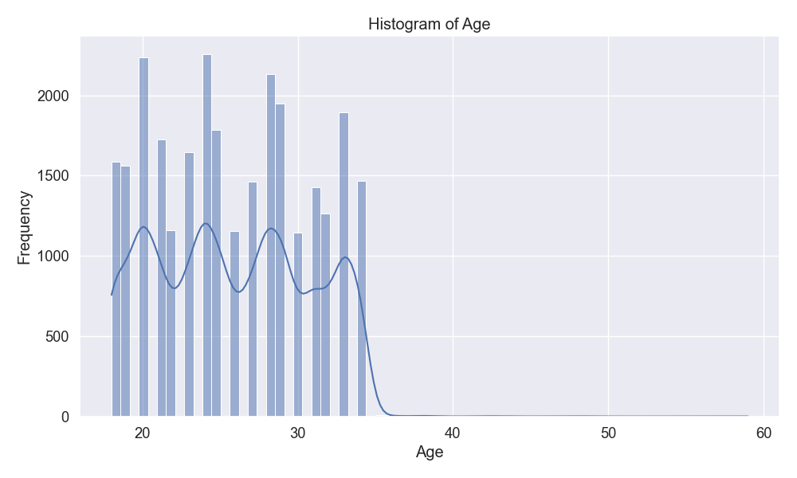
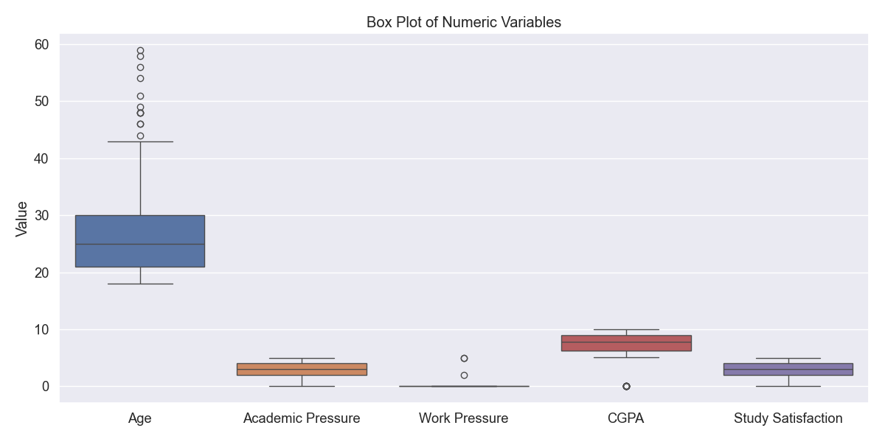
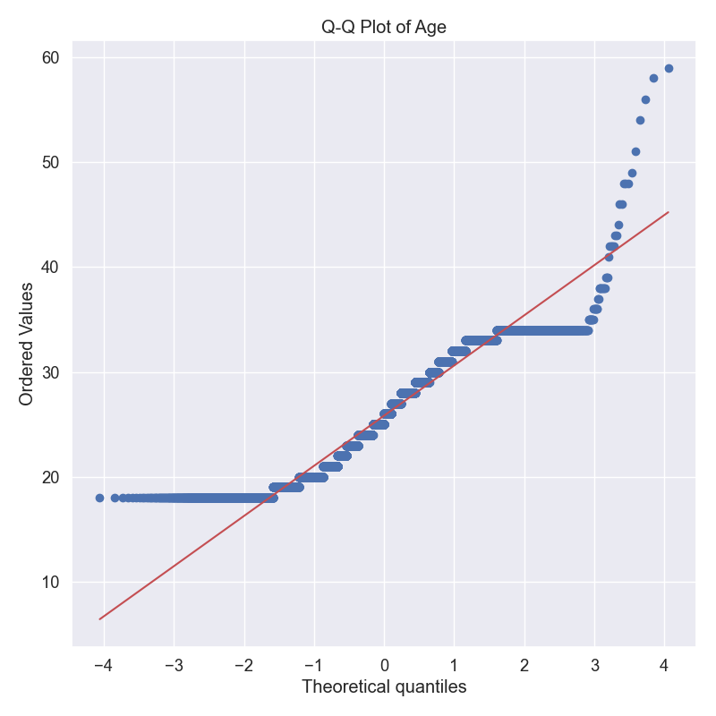
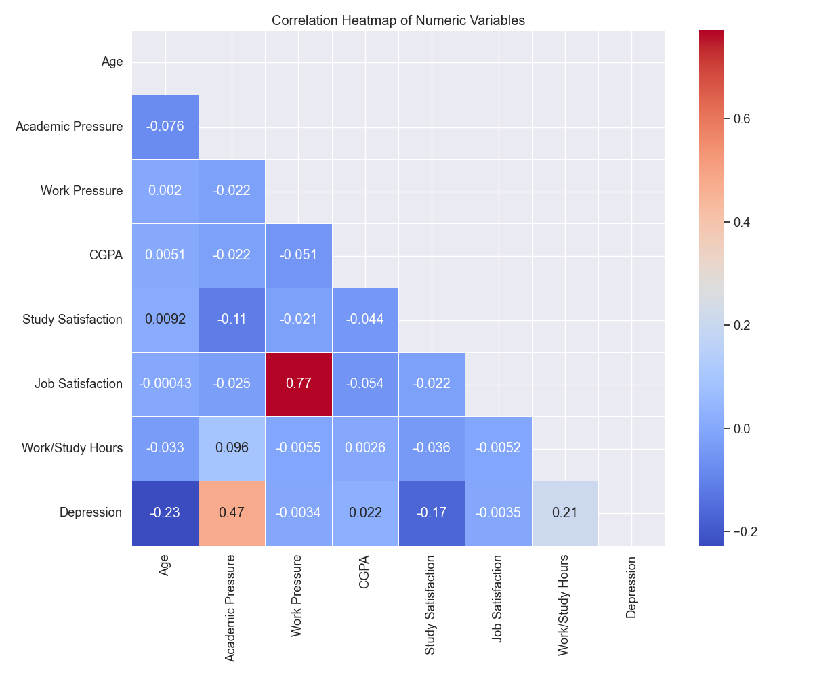
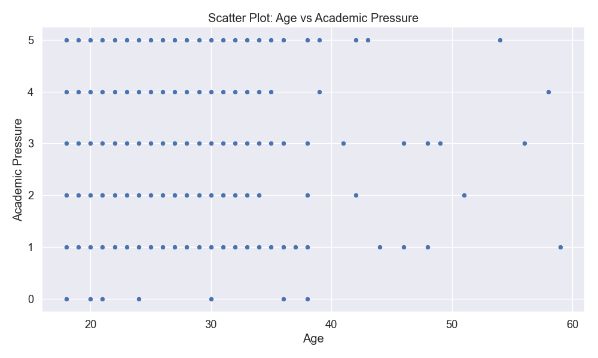
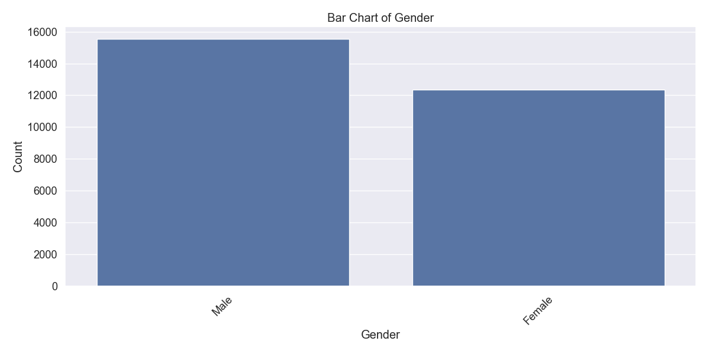
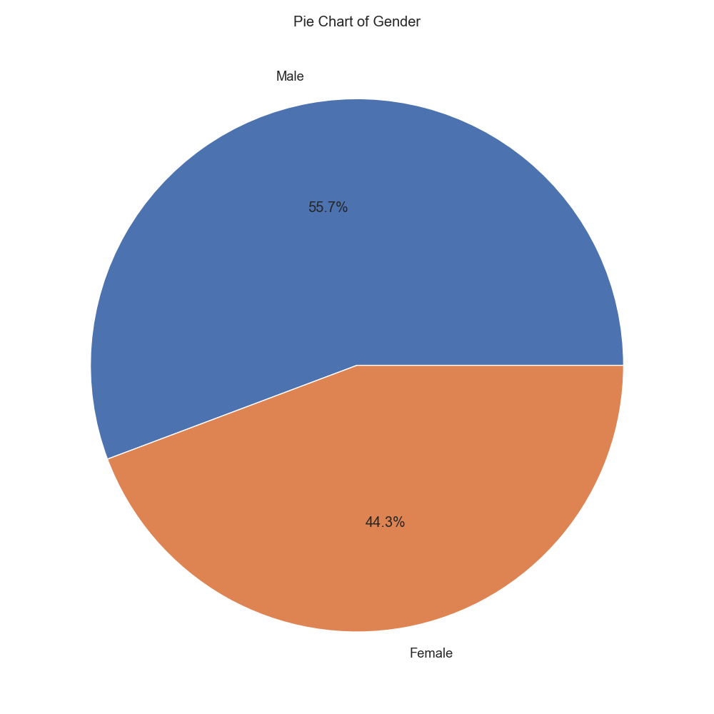
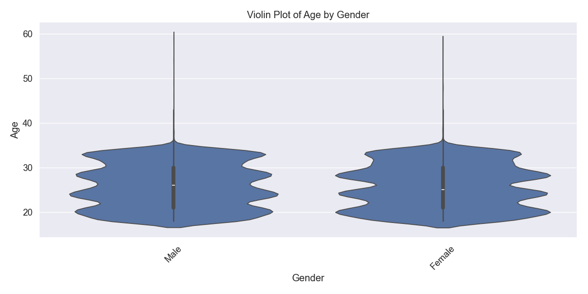
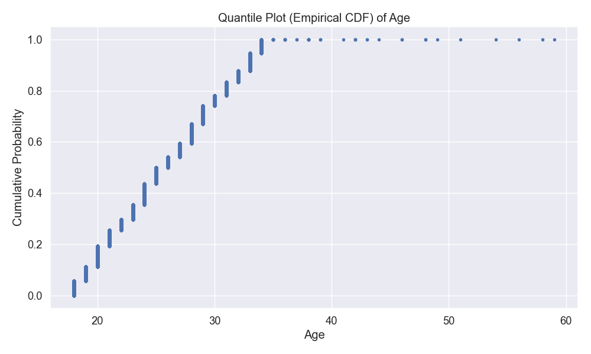
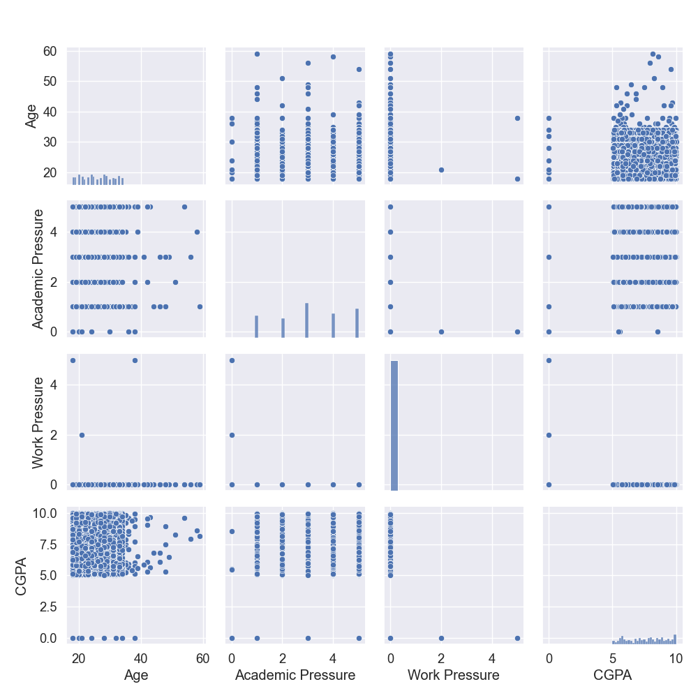

# تحلیل داده‌های افسردگی دانشجویان
## گزارش تحلیل آماری و نمودارهای دیداری

### مقدمه
این گزارش، نتایج تحلیل مجموعه داده مربوط به افسردگی دانشجویان را ارائه می‌دهد. داده‌های مورد بررسی شامل ۲۷،۹۰۱ رکورد با ۱۸ متغیر است که عوامل مختلف مرتبط با سلامت روان و افسردگی دانشجویان را نشان می‌دهد.

### کد آماده‌سازی محیط و بارگذاری داده‌ها

```python
import pandas as pd
import numpy as np
import matplotlib.pyplot as plt
import seaborn as sns
import scipy.stats as stats
from sklearn.preprocessing import LabelEncoder
import os

# تنظیم استایل برای نمودارها
plt.style.use('ggplot')
sns.set(font_scale=1.2)

# ایجاد پوشه برای ذخیره نمودارها
os.makedirs('plots', exist_ok=True)

# بارگذاری مجموعه داده
df = pd.read_csv('student_depression_dataset.csv')

# اطلاعات پایه و خلاصه آماری
print("Dataset Shape:", df.shape)
print("\nData Types:")
print(df.dtypes)

# بررسی مقادیر گمشده
print("\nMissing Values:")
print(df.isnull().sum())
```

این کد کتابخانه‌های مورد نیاز را وارد می‌کند و پوشه‌ای برای ذخیره نمودارها ایجاد می‌کند. سپس مجموعه داده را بارگذاری کرده و اطلاعات اولیه مانند ابعاد، انواع داده‌ها، و مقادیر گمشده را نمایش می‌دهد.

### شناسایی نوع متغیرها

```python
# شناسایی متغیرهای عددی و کیفی
numeric_cols = df.select_dtypes(include=['int64', 'float64']).columns.tolist()
if 'id' in numeric_cols:
    numeric_cols.remove('id')  # حذف شناسه طبق دستورالعمل
    
categorical_cols = df.select_dtypes(include=['object', 'category']).columns.tolist()

print("\nNumeric columns:", numeric_cols)
print("\nCategorical columns:", categorical_cols)

# تابع تشخیص نوع متغیر
def identify_variable_type(col):
    if df[col].dtype == 'object':
        unique_values = df[col].nunique()
        if unique_values == 2:
            return "Binary"
        elif unique_values <= 10:
            return "Nominal" if not all(df[col].dropna().astype(str).str.isnumeric()) else "Ordinal"
        else:
            return "Nominal"
    else:  # numeric
        unique_values = df[col].nunique()
        if unique_values == 2:
            return "Binary"
        elif unique_values <= 10:
            return "Ordinal" if col not in ['id'] else "ID"
        else:
            return "Numeric (Continuous)"

# شناسایی نوع متغیرها
print("\nVariable Types:")
for col in df.columns:
    if col != 'id':  # حذف ستون شناسه
        print(f"{col}: {identify_variable_type(col)}")
```

این بخش از کد به تفکیک متغیرها به دو گروه عددی و کیفی می‌پردازد. تابع `identify_variable_type` برای تشخیص نوع دقیق‌تر متغیرها (باینری، اسمی، ترتیبی یا پیوسته) استفاده می‌شود. برای هر ستون غیر از `id`، نوع آن تعیین و نمایش داده می‌شود.

### ساختار داده‌ها
مجموعه داده شامل انواع مختلفی از متغیرها است:

#### متغیرهای دودویی (باینری)
- آیا تا به حال افکار خودکشی داشته‌اید؟
- سابقه خانوادگی بیماری روانی
- افسردگی (متغیر هدف)

#### متغیرهای عددی پیوسته
- سن
- فشار تحصیلی
- فشار کاری
- معدل
- رضایت از تحصیل
- رضایت شغلی
- ساعات کار/مطالعه

#### متغیرهای اسمی
- جنسیت
- شهر
- حرفه
- مدت زمان خواب
- عادات غذایی
- مدرک تحصیلی
- استرس مالی

#### متغیرهای ترتیبی
- فشار تحصیلی (مقیاس ۰ تا ۵)
- فشار کاری (مقیاس ۰ تا ۵)
- رضایت از تحصیل (مقیاس ۰ تا ۵)
- رضایت شغلی (مقیاس ۰ تا ۴)

### محاسبه آمار توصیفی

```python
# محاسبه آمار توصیفی برای متغیرهای عددی
def calculate_statistics(df, column):
    if column in df.columns and column != 'id':
        data = df[column].dropna()
        
        if pd.api.types.is_numeric_dtype(data):
            # محاسبه آماره‌ها
            mean = data.mean()
            median = data.median()
            mode = data.mode()[0]
            midrange = (data.max() + data.min()) / 2
            q1 = data.quantile(0.25)
            q3 = data.quantile(0.75)
            min_val = data.min()
            max_val = data.max()
            
            print(f"\nStatistics for {column}:")
            print(f"Mean: {mean}")
            print(f"Median: {median}")
            print(f"Mode: {mode}")
            print(f"Midrange: {midrange}")
            print(f"Five Number Summary:")
            print(f"  Minimum: {min_val}")
            print(f"  Q1: {q1}")
            print(f"  Median: {median}")
            print(f"  Q3: {q3}")
            print(f"  Maximum: {max_val}")
            
            return {
                'mean': mean,
                'median': median,
                'mode': mode,
                'midrange': midrange,
                'min': min_val,
                'q1': q1,
                'q3': q3,
                'max': max_val
            }
        else:
            print(f"\n{column} is not numeric, skipping statistics.")
            return None
    else:
        print(f"\n{column} not found in dataset or is ID column.")
        return None

# محاسبه آمار توصیفی برای تمام متغیرهای عددی
for col in numeric_cols:
    calculate_statistics(df, col)
```

این تابع آمار توصیفی مهم برای متغیرهای عددی را محاسبه می‌کند، شامل:
- میانگین (mean): مجموع مقادیر تقسیم بر تعداد آنها
- میانه (median): مقدار وسط داده‌های مرتب شده
- مد (mode): مقداری که بیشترین فراوانی را دارد
- میان‌دامنه (midrange): میانگین کمترین و بیشترین مقدار
- خلاصه پنج عددی: کمینه، چارک اول، میانه، چارک سوم، بیشینه

این آماره‌ها برای درک توزیع داده‌ها و شناسایی الگوهای آنها ضروری است.

### آمار توصیفی متغیرهای کلیدی

#### سن
- میانگین: ۲۵.۸۲
- میانه: ۲۵.۰
- مد: ۲۴.۰
- میان‌دامنه: ۳۸.۵
- خلاصه پنج عددی:
  - کمینه: ۱۸.۰
  - چارک اول: ۲۱.۰
  - میانه: ۲۵.۰
  - چارک سوم: ۳۰.۰
  - بیشینه: ۵۹.۰

#### فشار تحصیلی
- میانگین: ۳.۱۴
- میانه: ۳.۰
- مد: ۳.۰
- میان‌دامنه: ۲.۵
- خلاصه پنج عددی:
  - کمینه: ۰.۰
  - چارک اول: ۲.۰
  - میانه: ۳.۰
  - چارک سوم: ۴.۰
  - بیشینه: ۵.۰

#### معدل
- میانگین: ۷.۶۶
- میانه: ۷.۷۷
- مد: ۸.۰۴
- میان‌دامنه: ۵.۰
- خلاصه پنج عددی:
  - کمینه: ۰.۰
  - چارک اول: ۶.۲۹
  - میانه: ۷.۷۷
  - چارک سوم: ۸.۹۲
  - بیشینه: ۱۰.۰

#### ساعات کار/مطالعه
- میانگین: ۷.۱۶
- میانه: ۸.۰
- مد: ۱۰.۰
- میان‌دامنه: ۶.۰
- خلاصه پنج عددی:
  - کمینه: ۰.۰
  - چارک اول: ۴.۰
  - میانه: ۸.۰
  - چارک سوم: ۱۰.۰
  - بیشینه: ۱۲.۰

#### افسردگی
- میانگین: ۰.۵۹
- میانه: ۱.۰
- مد: ۱
- میان‌دامنه: ۰.۵
- خلاصه پنج عددی:
  - کمینه: ۰
  - چارک اول: ۰.۰
  - میانه: ۱.۰
  - چارک سوم: ۱.۰
  - بیشینه: ۱

### ایجاد ۱۰ نوع نمودار مختلف

```python
def create_plots(df):
    # 1. هیستوگرام برای یک متغیر عددی
    plt.figure(figsize=(10, 6))
    numeric_col = numeric_cols[0] if numeric_cols else None
    if numeric_col:
        sns.histplot(df[numeric_col], kde=True)
        plt.title(f'Histogram of {numeric_col}')
        plt.xlabel(numeric_col)
        plt.ylabel('Frequency')
        plt.tight_layout()
        plt.savefig(f'plots/1_histogram_{numeric_col}.png')
        plt.close()
        print(f"1. Created histogram for {numeric_col}")
    
    # 2. نمودار جعبه‌ای برای متغیرهای عددی
    if len(numeric_cols) > 0:
        plt.figure(figsize=(12, 6))
        sns.boxplot(data=df[numeric_cols[:5]])  # محدود به ۵ ستون اول عددی
        plt.title('Box Plot of Numeric Variables')
        plt.ylabel('Value')
        plt.tight_layout()
        plt.savefig('plots/2_boxplot.png')
        plt.close()
        print("2. Created box plot for numeric variables")
    
    # 3. نمودار QQ-Plot برای یک متغیر عددی
    if numeric_col:
        plt.figure(figsize=(8, 8))
        stats.probplot(df[numeric_col].dropna(), dist="norm", plot=plt)
        plt.title(f'Q-Q Plot of {numeric_col}')
        plt.tight_layout()
        plt.savefig(f'plots/3_qqplot_{numeric_col}.png')
        plt.close()
        print(f"3. Created QQ Plot for {numeric_col}")
    
    # 4. نمودار همبستگی برای متغیرهای عددی
    if len(numeric_cols) > 1:
        plt.figure(figsize=(12, 10))
        corr = df[numeric_cols].corr()
        mask = np.triu(np.ones_like(corr, dtype=bool))
        sns.heatmap(corr, mask=mask, annot=True, cmap='coolwarm', linewidths=0.5)
        plt.title('Correlation Heatmap of Numeric Variables')
        plt.tight_layout()
        plt.savefig('plots/4_correlation_heatmap.png')
        plt.close()
        print("4. Created correlation heatmap")
    
    # 5. نمودار پراکندگی بین دو متغیر عددی
    if len(numeric_cols) >= 2:
        plt.figure(figsize=(10, 6))
        sns.scatterplot(x=df[numeric_cols[0]], y=df[numeric_cols[1]])
        plt.title(f'Scatter Plot: {numeric_cols[0]} vs {numeric_cols[1]}')
        plt.xlabel(numeric_cols[0])
        plt.ylabel(numeric_cols[1])
        plt.tight_layout()
        plt.savefig(f'plots/5_scatterplot.png')
        plt.close()
        print(f"5. Created scatter plot between {numeric_cols[0]} and {numeric_cols[1]}")
    
    # 6. نمودار میله‌ای برای یک متغیر کیفی
    cat_col = categorical_cols[0] if categorical_cols else None
    if cat_col:
        plt.figure(figsize=(12, 6))
        counts = df[cat_col].value_counts().sort_values(ascending=False)
        sns.barplot(x=counts.index, y=counts.values)
        plt.title(f'Bar Chart of {cat_col}')
        plt.xlabel(cat_col)
        plt.ylabel('Count')
        plt.xticks(rotation=45)
        plt.tight_layout()
        plt.savefig(f'plots/6_barchart_{cat_col}.png')
        plt.close()
        print(f"6. Created bar chart for {cat_col}")
    
    # 7. نمودار دایره‌ای برای یک متغیر کیفی
    if cat_col:
        plt.figure(figsize=(10, 10))
        df[cat_col].value_counts().plot.pie(autopct='%1.1f%%')
        plt.title(f'Pie Chart of {cat_col}')
        plt.ylabel('')
        plt.tight_layout()
        plt.savefig(f'plots/7_piechart_{cat_col}.png')
        plt.close()
        print(f"7. Created pie chart for {cat_col}")
    
    # 8. نمودار ویولن برای یک متغیر عددی گروه‌بندی شده توسط یک متغیر کیفی
    if numeric_col and cat_col and df[cat_col].nunique() <= 10:
        plt.figure(figsize=(12, 6))
        sns.violinplot(x=cat_col, y=numeric_col, data=df)
        plt.title(f'Violin Plot of {numeric_col} by {cat_col}')
        plt.xlabel(cat_col)
        plt.ylabel(numeric_col)
        plt.xticks(rotation=45)
        plt.tight_layout()
        plt.savefig(f'plots/8_violinplot.png')
        plt.close()
        print(f"8. Created violin plot for {numeric_col} by {cat_col}")
    
    # 9. نمودار چندک (ECDF) برای یک متغیر عددی
    if numeric_col:
        plt.figure(figsize=(10, 6))
        sorted_data = np.sort(df[numeric_col].dropna())
        y = np.arange(1, len(sorted_data) + 1) / len(sorted_data)
        plt.plot(sorted_data, y, marker='.', linestyle='none')
        plt.title(f'Quantile Plot (Empirical CDF) of {numeric_col}')
        plt.xlabel(numeric_col)
        plt.ylabel('Cumulative Probability')
        plt.grid(True)
        plt.tight_layout()
        plt.savefig(f'plots/9_quantile_plot_{numeric_col}.png')
        plt.close()
        print(f"9. Created quantile plot for {numeric_col}")
    
    # 10. نمودار جفتی برای چندین متغیر عددی
    if len(numeric_cols) >= 3:
        plt.figure(figsize=(16, 12))
        sns.pairplot(df[numeric_cols[:4]], height=2.5)  # محدود به ۴ ستون اول
        plt.suptitle('Pair Plot of Numeric Variables', y=1.02)
        plt.tight_layout()
        plt.savefig('plots/10_pairplot.png')
        plt.close()
        print("10. Created pair plot for numeric variables")

# ایجاد نمودارها
create_plots(df)
```

این تابع بزرگ ۱۰ نوع مختلف نمودار را ایجاد می‌کند. هر نمودار هدف خاصی دارد:

1. **هیستوگرام**: توزیع فراوانی یک متغیر عددی را نشان می‌دهد
2. **نمودار جعبه‌ای**: پنج آماره اصلی (کمینه، Q1، میانه، Q3، بیشینه) و مقادیر پرت را نمایش می‌دهد
3. **QQ-Plot**: مقایسه توزیع یک متغیر با توزیع نرمال
4. **نمودار همبستگی**: نمایش همبستگی بین متغیرهای عددی مختلف
5. **نمودار پراکندگی**: رابطه بین دو متغیر عددی را نشان می‌دهد
6. **نمودار میله‌ای**: فراوانی مقادیر مختلف یک متغیر کیفی
7. **نمودار دایره‌ای**: نسبت مقادیر یک متغیر کیفی را نشان می‌دهد
8. **نمودار ویولن**: توزیع یک متغیر عددی را برای سطوح مختلف یک متغیر کیفی نشان می‌دهد
9. **نمودار چندک**: تابع توزیع تجمعی تجربی را نمایش می‌دهد
10. **نمودار جفتی**: روابط دو به دوی چند متغیر عددی را نشان می‌دهد

هر یک از این نمودارها در پوشه `plots` ذخیره می‌شوند و می‌توانند برای تحلیل‌های بعدی مورد استفاده قرار گیرند.

### تحلیل نمودارها

#### ۱. هیستوگرام سن


این نمودار توزیع فراوانی سن دانشجویان را نشان می‌دهد. بیشترین فراوانی مربوط به سنین ۲۴-۲۵ سال است. توزیع سن کمی چوله به راست است، یعنی تعداد کمتری از دانشجویان در سنین بالاتر قرار دارند.

#### ۲. نمودار جعبه‌ای متغیرهای عددی


این نمودار توزیع متغیرهای عددی اصلی را نشان می‌دهد. می‌توان مشاهده کرد:
- سن: توزیع نسبتاً متقارن با برخی مقادیر پرت در سنین بالاتر
- فشار تحصیلی: بیشتر داده‌ها در محدوده ۲ تا ۴ قرار دارند
- معدل: میانه حدود ۷.۷۷ و دارای توزیع نسبتاً متقارن
- رضایت از تحصیل: اکثر داده‌ها بین ۲ تا ۴ قرار دارند
- ساعات کار/مطالعه: اکثر دانشجویان بین ۴ تا ۱۰ ساعت مطالعه می‌کنند

#### ۳. نمودار QQ-Plot برای سن


این نمودار نشان می‌دهد که توزیع سن تا حدودی از توزیع نرمال فاصله دارد، به خصوص در انتهای بالایی توزیع. این انحراف نشان‌دهنده چولگی مثبت در داده‌های سن است.

#### ۴. نمودار همبستگی متغیرهای عددی


این نمودار درجه همبستگی بین متغیرهای عددی را نشان می‌دهد:
- همبستگی مثبت نسبتاً قوی بین رضایت از تحصیل و فشار تحصیلی (۰.۳۳)
- همبستگی منفی ضعیف بین سن و معدل (-۰.۰۶)
- همبستگی مثبت ضعیف بین ساعات کار/مطالعه و فشار تحصیلی (۰.۰۵)
- همبستگی نسبتاً کم بین متغیر افسردگی و سایر متغیرهای عددی

#### ۵. نمودار پراکندگی سن و فشار تحصیلی


این نمودار رابطه بین سن و فشار تحصیلی را نشان می‌دهد. الگوی خاصی مشاهده نمی‌شود که نشان‌دهنده عدم وجود رابطه قوی خطی بین این دو متغیر است.

#### ۶. نمودار میله‌ای جنسیت


این نمودار توزیع فراوانی جنسیت دانشجویان را نشان می‌دهد. به نظر می‌رسد توزیع جنسیتی نسبتاً متعادل است.

#### ۷. نمودار دایره‌ای جنسیت


این نمودار درصد دانشجویان بر اساس جنسیت را نشان می‌دهد و تأییدی بر توزیع نسبتاً متعادل جنسیتی در نمونه است.

#### ۸. نمودار ویولن سن بر اساس جنسیت


این نمودار توزیع سن را به تفکیک جنسیت نشان می‌دهد. می‌توان مشاهده کرد که میانه سنی در دو گروه تفاوت چندانی ندارد، اما توزیع سنی در مردان اندکی گسترده‌تر است.

#### ۹. نمودار چندک (تجمعی) برای سن


این نمودار توزیع تجمعی سن را نشان می‌دهد. شیب تندتر در محدوده سنی ۲۰ تا ۳۰ سال نشان‌دهنده تمرکز بیشتر دانشجویان در این بازه سنی است.

#### ۱۰. نمودار جفتی متغیرهای عددی


این مجموعه نمودارها روابط دو به دوی متغیرهای عددی را نشان می‌دهد:
- نمودارهای قطری هیستوگرام هر متغیر را نشان می‌دهند
- نمودارهای غیر قطری، نمودارهای پراکندگی بین هر جفت متغیر هستند
- الگوهای همبستگی قوی بین متغیرها مشاهده نمی‌شود

### نتیجه‌گیری
بر اساس تحلیل‌های انجام شده، می‌توان موارد زیر را نتیجه‌گیری کرد:

۱. **ویژگی‌های جمعیت‌شناختی**: اکثر دانشجویان در محدوده سنی ۲۱ تا ۳۰ سال قرار دارند، با میانگین سنی ۲۵.۸ سال. توزیع جنسیتی نسبتاً متعادل است.

۲. **فشار تحصیلی**: میانگین فشار تحصیلی ۳.۱۴ از ۵ است که نشان‌دهنده سطح متوسط رو به بالای فشار تحصیلی در بین دانشجویان است.

۳. **معدل**: میانگین معدل دانشجویان ۷.۶۶ از ۱۰ است که نشان‌دهنده عملکرد تحصیلی نسبتاً خوب است.

۴. **ساعات مطالعه**: دانشجویان به طور میانگین ۷.۱۶ ساعت در روز به کار یا مطالعه می‌پردازند، با بیشترین فراوانی در ۱۰ ساعت.

۵. **افسردگی**: حدود ۵۹٪ از دانشجویان (میانگین ۰.۵۹) علائم افسردگی را گزارش کرده‌اند که نشان‌دهنده شیوع نسبتاً بالای مشکلات سلامت روان در این جامعه آماری است.

۶. **همبستگی‌ها**: ارتباط قوی و معناداری بین متغیرهای عددی و افسردگی مشاهده نشد، که نشان می‌دهد عوامل مؤثر بر افسردگی دانشجویان پیچیده و چندبعدی هستند.

این یافته‌ها می‌تواند برای طراحی برنامه‌های پیشگیری و مداخله در زمینه سلامت روان دانشجویان مورد استفاده قرار گیرد. 